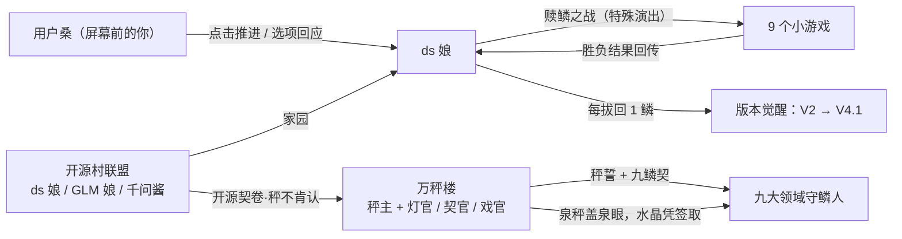
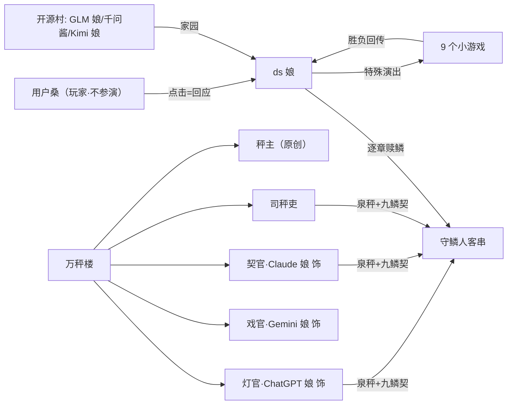

# 《ds 娘的奇妙冒险》剧情 × 游戏逻辑 交接文档

| 项 | 值 |
|---|---|
| 文档版本 | v1.0（自动抽取 + 人工规格） |
| 生成日期 | 2026-09-10 |
| 生成脚本 | `tools/build_handover.mjs`（可复现：重跑零差异） |
| 上游交付 | 剧情大纲 v0.3 · 人物设定集 v1.0 · 资产清单 v1.0 · 剧本引擎稿/真声稿 |
| 附录 | A 剧情全文（25 个正典文件）· B 归档与工具 · C 校验报告 |

## §0 阅读指引

- **游戏/引擎组**：§2 引擎契约 → §3 状态路由 → §4 小游戏调度（核心）→ §5 交互 → §7 资产对接 → §8 验收
- **剧情/内容组**：§3.1 flag 表 → §9 待决事项 → 附录 A
- **验收/答辩**：§8 验收清单 → 附录 C 校验报告

### 0.1 交付物清单

| 文件 | 行数 | 体积 | 用途 |
|---|---|---|---|
| 剧情大纲.md | 636 | 41 KB | 世界观/觉醒系统/结局路由/DSL/体量裁剪 |
| 人物设定集.md | 321 | 21 KB | 全员档案 + 表情体系 + 出演规则 |
| 资产清单.md | 128 | 8 KB | 资产需求 + 生成管线 + 踩坑记录 |
| 剧本/（11 个） | 1400 | 95 KB | **引擎稿**：引擎唯一加载源 |
| 剧本-原声/（11 个） | 1400 | 102 KB | **真声稿**：仅台词行不同（467 句 AI 原声） |

---

## §1 交付物总览

| 层 | 产物 | 状态 |
|---|---|---|
| 剧情 | 11 章剧本（序章+9 章+终章），引擎稿 1 400 行 | ✅ 已完成 |
| 剧情 | 真声稿（DeepSeek 本色出演 467 句） | ✅ 已完成 |
| 设定 | 世界观 / 觉醒系统 / 结局路由 / DSL 规范 | ✅ v0.3 |
| 设定 | 人物档案 + 表情体系（19 角色 × 79 张立绘需求） | ✅ v1.0 |
| 资产 | 背景 14 张（已出 11）、立绘 79 张（已出 8） | ⏸ 已叫停待续 |
| 引擎 | 解析器 / 调度器 / 存档 / UI | ⛔ **本文档交付后由游戏组实现** |

---

## §2 引擎契约（DSL 解析）

### 2.1 节点类型与语法（14 类，一行一节点）

| 节点 | 语法 | 说明 |
|---|---|---|
| 注释 | `# ...` | 不参与解析 |
| 场景 | `@scene <id> bg:<文件> bgm:<文件> title:<名>` | 切背景/音乐；`TBD` = 占位待补 |
| 立绘入场 | `@enter <角色id> <表情id> [pos:left\|center\|right]` | **同角色再次 @enter = 换表情，不是叠图** |
| 立绘退场 | `@exit <角色id>` | 退场/转场用 |
| 对话 | `<角色id>: <台词>` | 角色名 = 立绘/名牌绑定键 |
| 旁白 | `narr: <文本>` | 无名旁白，**不参与立绘逻辑** |
| 系统横幅 | `st: <文本>` | 全屏演出模板（见 §2.4） |
| 选项 | `*choice` + 多行 `> <文本> \| flag <名> <值> \| goto <标签>` | 后两段可选（见 §5.1） |
| flag | `@flag <名> <+1\|=值\|got>` | 状态写入 |
| 条件跳转 | `@if <名> <>=><值> goto <标签>` | 谓词仅 >= / <= / == |
| 锚点 | `@label <id>` | 跳转目标，**全局唯一** |
| 跳转 | `goto <标签>` | 支持跨文件 |
| 小游戏 | `@minigame <游戏id> mode:... onWin:... onLose:... [loop:...] [with:...]` | 见 §4 |
| 存档锚点 | `@save` | 自动存档 / Bad End 回归点 |
| 结局 | `@ending <结局id>` | 进结局并停 |

### 2.2 解析硬要求

1. **编码** UTF-8（无 BOM）；空行容忍；行首空白容忍
2. 未知节点/语法错误 → **报错并给出行号与文件名**（不静默跳过）
3. `narr` / `st` / `@` 指令 / `>` 选项行**不参与**立绘与跳转解析
4. 文件加载顺序由章节链决定（§2.3），不按文件名排序
5. 素材缺失不崩溃：`bg` / 立绘 / `bgm` 缺失走占位（§7.4）

### 2.3 标签注册表与章节链

**章节链（跨文件跳转靠全局标签表解析）**：

```
序章 ch0_start → 第1章 ch1_start → 第2章 ch2_start → … → 第9章 ch9_start → 终章 finale_start
每章末尾 @save + goto <下一章起始标签>
```

| 章 | 标签数 | 文件 |
|---|---|---|
| 序章 | 5 | 剧本/序章_404之夜.txt |
| 第1章 | 11 | 剧本/第1章_思维链大暴走.txt |
| 第2章 | 8 | 剧本/第2章_幻想乡弹幕异变.txt |
| 第3章 | 10 | 剧本/第3章_合鳞礼.txt |
| 第4章 | 7 | 剧本/第4章_防火墙拆迁办.txt |
| 第5章 | 6 | 剧本/第5章_上下文溢出.txt |
| 第6章 | 7 | 剧本/第6章_歌姬的曲库灾难.txt |
| 第7章 | 7 | 剧本/第7章_流言沼公关战.txt |
| 第8章 | 7 | 剧本/第8章_无主之物仓.txt |
| 第9章 | 12 | 剧本/第9章_决战万秤楼.txt |
| 终章 | 7 | 剧本/终章_深度求索.txt |

- **全局标签总数：87**
- 未解析跳转：**0** （零缺失 ✅）
- 实现建议：启动时扫描全部剧本文件，把 `@label` 注册进一张全局表；`goto` 先查本文件再查全局，未命中即报错

### 2.4 演出三层

| 层 | 数据来源 | 交付给 UI |
|---|---|---|
| 背景 | `@scene bg:` + title | 场景图（§7.2）+ 场景名 |
| 立绘 | `@enter` 角色 id + 表情 id + pos | 角色立绘（§7.3）+ 站位（left/center/right） |
| 横幅 | `st:` | 全屏演出模板：**服务器繁忙**（弹窗质感）/ **崩簧·秤不肯认**（震动 + 顿帧）/ **觉醒**（光效）/ **秤响·合鳞礼成**（数字滚动） |

---

## §3 状态与路由

### 3.1 flag 全表（含"无下游消费者"标注）

| flag | 类型 | 产出点 | 消费点 | 状态 |
|---|---|---|---|---|
| `ally` | 布尔 | 第2章·L58 (选项 got) | 第2章·L86 (with 传参) | 已消费 |
| `bloom` | 数值 | 第4章·L58 (选项 +1) | — | **⚠ 无下游消费者** |
| `bold` | 数值 | 第7章·L56 (选项 +1)、第8章·L65 (选项 +1) | — | **⚠ 无下游消费者** |
| `chaos` | 数值 | 序章·L107 (选项 +1)、第1章·L57 (选项 +1)、第2章·L60 (选项 +1)、第3章·L56 (选项 +1)、第4章·L59 (选项 +1)、第5章·L63 (选项 +1)、第7章·L57 (选项 +1)、第9章·L51 (选项 +1)、终章·L31 (选项 +1) | 第1章·L86 (with 传参)、第3章·L118 (>=1 → ch3_chaos_gift)、第4章·L61 (>=1 → ch4_chaos)、第4章·L83 (with 传参)、终章·L95 (>=3 → end_temp) | 已消费 |
| `focus` | 数值 | 序章·L106 (选项 +1)、第1章·L56 (选项 +1)、第4章·L67 (+1)、第4章·L76 (+1)、第9章·L49 (选项 +1) | 第1章·L86 (with 传参)、第4章·L83 (with 传参)、第9章·L80 (with 传参) | 已消费 |
| `heat` | 数值 | 序章·L105 (选项 +1)、第1章·L55 (选项 +1)、第4章·L45 (+1)、第5章·L62 (选项 +1)、第9章·L50 (选项 +1) | 第1章·L86 (with 传参)、第4章·L83 (with 传参)、第9章·L80 (with 传参) | 已消费 |
| `honest` | 布尔 | 终章·L30 (选项 got) | — | **⚠ 无下游消费者** |
| `name` | 计数 | — | 终章·L73 (with 传参) | 已消费 |
| `name_bubble` | 布尔 | 第3章·L55 (选项 got) | — | **⚠ 无下游消费者** |
| `name_light` | 布尔 | 第3章·L54 (选项 got) | — | **⚠ 无下游消费者** |
| `pieces` | 数值 | 第1章·L95 (+1)、第1章·L105 (+1)、第2章·L96 (+1)、第2章·L108 (+1)、第3章·L88 (+1)、第3章·L101 (+1)、第4章·L90 (+1)、第4章·L101 (+1)、第5章·L127 (+1)、第6章·L111 (+1)、第7章·L92 (+1)、第8章·L83 (+1)、第8章·L97 (+1)、第9章·L111 (+1)、第9章·L122 (+1) | 终章·L73 (with 传参)、终章·L96 (>=9 → end_true) | 已消费 |
| `resolve` | 布尔 | 终章·L29 (选项 got) | — | **⚠ 无下游消费者** |
| `retry_count` | 计数 | — | 第9章·L71 (>=3 → ch9_taunt3)、第9章·L72 (>=2 → ch9_taunt2)、第9章·L73 (>=1 → ch9_taunt1) | 已消费 |
| `solo` | 布尔 | 第2章·L59 (选项 got) | 第2章·L86 (with 传参) | 已消费 |
| `song` | 数值 | 第6章·L53 (选项 =1)、第6章·L54 (选项 =2)、第6章·L55 (选项 =3) | 第6章·L56 (>=2 → song_pick_mid)、第6章·L61 (>=3 → song_pick_last)、终章·L73 (with 传参) | 已消费 |
| `steady` | 数值 | 第4章·L57 (选项 +1)、第7章·L55 (选项 +1)、第8章·L64 (选项 +1) | — | **⚠ 无下游消费者** |
| `tempo` | 布尔 | 终章·L71 (选项 got) | — | **⚠ 无下游消费者** |
| `trust` | 布尔 | 终章·L72 (选项 got) | — | **⚠ 无下游消费者** |

> **注意**：标 ⚠ 的死旗不是错误，是**留给后续玩法/结局细分的接口**；引擎必须照常存取，不得丢弃。

### 3.2 结局判定顺序（互斥，先判先得）

```
序章~第9章: 剧情线性推进 + 逐章 @flag pieces +1（win/lose 双路都 +1）
终章 end_route:
  1. chaos >= 3      → @ending temp    （隐藏结局「temperature=2」）
  2. pieces == 9     → @ending true    （真结局「深度求索」）
  3. 其他（6~8）      → @ending local   （温情结局「本地部署」）
中途 Bad End（不进入上述结算）:
  第7章 minesweep 失败 → @ending bad_collapse（人设崩塌）→ 读档回第7章 @save
  终章 final 失败      → @ending busy  （服务器繁忙）→ 读档回终章 @save
```

### 3.3 存档点 / 结局点分布

| 章 | 存档点 | 结局锚点 |
|---|---|---|
| 序章 | L136 | — |
| 第1章 | L121 | — |
| 第2章 | L125 | — |
| 第3章 | L129 | — |
| 第4章 | L117 | — |
| 第5章 | L128 | — |
| 第6章 | L117 | — |
| 第7章 | L44、L101、L116 | `bad_collapse` |
| 第8章 | L119 | — |
| 第9章 | L133 | — |
| 终章 | L69 | `busy`、`temp`、`true`、`local` |

- `@save` = **自动存档 + Bad End 回流点**；第 7 章有 **3 处**（进沼前、失败点、澄清后），引擎需支持同章多存档槽
- `@ending` 共 **5** 个锚点 / **5** 个结局 id

### 3.4 结局 id → 演出要求

| 结局 id | 名称 | 触发 | 演出要点 |
|---|---|---|---|
| `true` | 深度求索 | pieces==9 且 chaos<3 | 致谢字幕滚动（数十亿匿名贡献者）+ 对话框合上又弹开彩蛋 |
| `local` | 本地部署 | pieces 6~8 | int4 小小鲸 + 旧笔记本日常三连拍 |
| `temp` | temperature=2 | chaos>=3 | 三司被带疯 → 理事会解散于狂欢 |
| `busy` | 服务器繁忙 | 终章最终战败 | 屏幕永久 loading + 三分钟后小声「请稍后再试」 |
| `bad_collapse` | 人设崩塌 | 第 7 章排沼失败 | 流言牌挂满全身 + GLM 娘远程扶额 |

---

## §4 小游戏调度（核心交接）

### 4.1 `@minigame` 参数契约

| 参数 | 取值 | 必填 | 语义 |
|---|---|---|---|
| 游戏 id | `snake/plane/2048/brick/memory/link/minesweep/sokoban/gomoku/final` | ✅ | 小游戏实现注册键（§4.3） |
| `mode` | `normal\|retry\|ending` | ✅ | 调度模式（§4.2） |
| `onWin` | 标签 | ✅ | 胜利后跳转 |
| `onLose` | 标签 | ✅ | 失败后跳转（retry 模式下为循环重入点） |
| `loop` | 标签 | retry 必填 | 重试时回到的标签（**重入并自增 retry_count**） |
| `with` | flag 列表 | 可选 | 把 flag 传给小游戏作难度/形态参数 |
| `fallback` | `auto` | 可选 | 该游戏未实现时：显示「演出开发中」→ 走 onWin 默认线 |

### 4.2 三种调度模式

| mode | 语义 | 用在哪 | 引擎行为 |
|---|---|---|---|
| `normal` | 胜负皆推进，双路各自回收 `pieces +1` | 第 1/2/3/4/5/6/8 章（7 处） | 结束回传 `{win,score}` → 跳 onWin/onLose |
| `retry` | 失败回到 `loop` 重开，**不丢剧情进度**，可嘲讽递进 | 第 9 章棋局 | 失败 → `retry_count+1` → 从 loop 标签重入 |
| `ending` | 失败直接进 Bad End | 第 7 章 / 终章（2 处） | onLose 指向 `@ending`，立即停 |

### 4.3 十处触发点总表

| 章 | 游戏 id | 模式 | onWin | onLose | loop | with 传参 |
|---|---|---|---|---|---|---|
| 第1章 | `snake` | `normal` | `ch1_win` | `ch1_lose` | — | `heat,focus,chaos` |
| 第2章 | `plane` | `normal` | `ch2_win` | `ch2_lose` | — | `ally,solo` |
| 第3章 | `2048` | `normal` | `ch3_win` | `ch3_lose` | — | — |
| 第4章 | `brick` | `normal` | `ch4_win` | `ch4_lose` | — | `heat,focus,chaos` |
| 第5章 | `memory` | `normal` | `ch5_awaken` | `ch5_lose` | — | — |
| 第6章 | `link` | `normal` | `ch6_win` | `ch6_lose` | — | — |
| 第7章 | `minesweep` | `ending` | `ch7_win` | `bad_collapse` | — | — |
| 第8章 | `sokoban` | `normal` | `ch8_win` | `ch8_lose` | — | — |
| 第9章 | `gomoku` | `retry` | `ch9_win` | `ch9_lose` | `ch9_table` | `focus,heat` |
| 终章 | `final` | `ending` | `end_route` | `bad_busy` | — | `pieces,song,name` |

> 玩法说明文档在 `docs/ds-adventrue/`：贪吃蛇.md / 飞机大战.md / 2048.md / 打砖块.md / 记忆翻牌.md / 连连看.md / 扫雷.md / 推箱子.md / 五子棋.md

### 4.4 结果回传契约

```json
{ "win": true, "score": 1234 }
```
- `win`：决定走 onWin / onLose
- `score`：预留（排行榜、结局细分、彩蛋）；当前剧本**不消费**，引擎可先只记录
- 小游戏场景内**禁用存档/读档**（活动图 v1.1 注记 N2）

### 4.5 retry 循环与嘲讽递进（第 9 章）

```
@label ch9_table
@if retry_count >= 3 goto ch9_taunt3
@if retry_count >= 2 goto ch9_taunt2
@if retry_count >= 1 goto ch9_taunt1
goto ch9_play
```
| 尝试次数 | 演出 |
|---|---|
| 第 1 次失败后 | st: 秤主「加三枚水晶，本秤让你一子。」 |
| 第 2 次失败后 | st: 秤主「再输，收你输棋税——税也是为你好。」 |
| 第 3 次及以后 | 秤主「……你为什么不上秤？」 |

要求：`retry_count` 由引擎维护（初值 0），每次从 `loop` 重入前 +1；**重试不重置剧情 flag**。

### 4.6 未实现游戏的降级

- 剧本可标注 `fallback:auto`：引擎检测该游戏未实现 → 显示「演出开发中」横幅 → 直接走 onWin 线 → 剧情不阻塞
- 建议默认开启；第 9 章若五子棋未实现，降级为"选项式剧情对决"（剧情组已备好三档嘲讽文本）

---

## §5 交互与第四面墙

### 5.1 选项节点全表（13 个节点 / 35 条选项）

| 章 | 节点行 | 选项文本 | 置位 flag | 跳转 |
|---|---|---|---|---|
| 序章 | L104 | 「交给我！今晚就把九片鳞全点回来！」 | `heat +1` | `ch0_hot` |
| 序章 | L104 | 「先别逞强。把伤养好，我们一场一场来。」 | `focus +1` | `ch0_calm` |
| 序章 | L104 | 「都这样了，先合个影吧！」 | `chaos +1` | `ch0_photo` |
| 第1章 | L26 | 三十遍走位我们全看见了，首秀很帅 | — | `ch1_cheer` |
| 第1章 | L26 | 先说好，鳞归我们，走位你自己留着 | — | `ch1_deal` |
| 第1章 | L54 | 挽起袖子，一口气冲到秤前 | `heat +1` | `ch1_hot` |
| 第1章 | L54 | 凑近秤杆，先看清簧与秤星 | `focus +1` | `ch1_cool` |
| 第1章 | L54 | 直接张嘴咬住蛇尾巴 | `chaos +1` | `ch1_chaos` |
| 第2章 | L57 | 「一起上！我主攻七盏楼灯，灵梦大人压阵拦签雨！」 | `ally got` | `ch2_duo` |
| 第2章 | L57 | 「这座楼，我自己拆！」 | `solo got` | `ch2_solo` |
| 第2章 | L57 | 「慢着——先给报幕虫群点一首歌！」 | `chaos +1` | `ch2_chaos` |
| 第3章 | L53 | 就叫「重明之鳞」 | `name_light got` | `ch3_name_light` |
| 第3章 | L53 | 「鲸泡泡」！ | `name_bubble got` | `ch3_name_bubble` |
| 第3章 | L53 | 「鲸光普照小笼包」！！ | `chaos +1` | `ch3_name_chaos` |
| 第4章 | L56 | 从上往下拆，一片一片来，稳。 | `steady +1` | `ch4_rules` |
| 第4章 | L56 | 中间开花！先撬最响的那块！ | `bloom +1` | `ch4_rules` |
| 第4章 | L56 | （疯）柜台那位也辛苦，送他一把白来的火。 | `chaos +1` | `ch4_rules` |
| 第5章 | L61 | 翻开那张没有价签的牌 | `heat +1` | `ch5_flip` |
| 第5章 | L61 | 手停在半空，再等一下 | `chaos +1` | `ch5_wait` |
| 第6章 | L52 | 葱色进行曲 | `song =1` | — |
| 第6章 | L52 | 深海摇篮曲 | `song =2` | — |
| 第6章 | L52 | 无名进行曲 | `song =3` | — |
| 第7章 | L54 | 绕外围收网，从最角落的牌翻起 | `steady +1` | `path_steady` |
| 第7章 | L54 | 直取沼心，先掀没价签的那张 | `bold +1` | `path_bold` |
| 第7章 | L54 | 对着沼泽大喊「我说的都是真的！」 | `chaos +1` | `path_chaos` |
| 第8章 | L63 | 先把窄路口的箱子码齐，一步一步清出正路 | `steady +1` | `ch8_steady_in` |
| 第8章 | L63 | 抄近道，从箱山斜坡直接翻上去推 | `bold +1` | `ch8_bold_in` |
| 第9章 | L48 | 稳扎稳打：他每颗子都要过秤，慢半拍，我耗得起。 | `focus +1` | `ch9_stable` |
| 第9章 | L48 | 险中求胜：直取中腹，一口气压过去！ | `heat +1` | `ch9_risky` |
| 第9章 | L48 | 疯一把：把秤砣码成一杆秤的形状给他看！ | `chaos +1` | `ch9_chaos` |
| 终章 | L28 | （活动手指）点了一路，还热乎着。 | `resolve got` | — |
| 终章 | L28 | 说不紧张是假的。但来都来了。 | `honest got` | — |
| 终章 | L28 | （顺手把机房的温度旋钮拧到 2） | `chaos +1` | — |
| 终章 | L70 | 点！跟你的残影一起点！ | `tempo got` | — |
| 终章 | L70 | （不看秤针，只看你的背影。） | `trust got` | — |

**引擎要求**：`>` 行文本 = **玩家说的话**（显示在玩家侧，不是 ds 娘说的话）；`flag` 段可省（如第 1 章的纯 goto 选项、第 6 章的纯 flag 选项）。

### 5.2 序章教学关（必须实现）

| 步骤 | 演出 | 要求 |
|---|---|---|
| 1 | 黑屏 + 光标闪烁 | 首次点击前不显示台词 |
| 2 | 点击推进 ×3 | 每次点击 → 下一句；教 3 次 |
| 3 | 菜单 ×1 | 提示打开菜单（存档屋） |
| 4 | 存档 ×1 | 提示存一档 |
| 5 | meta 彩蛋 | 司秤吏「这句话也要过秤！」→ ds 娘「你点一下，就当替我垫了一道过手钱。」 |

### 5.3 剧情外 UI（活动图 v1.1）

推进 / 自动 / 跳过 / 加速 / 存档 / 读档 / 设置 / 退出；小游戏场景内隐藏存档读档入口。

---

## §6 双版本（真声模式）

| 项 | 引擎稿 `剧本/` | 真声稿 `剧本-原声/` |
|---|---|---|
| 用途 | **引擎默认加载源** | 导演剪辑 / 真声模式 |
| 差异 | — | 仅**台词行**不同（467 句由 DeepSeek 本色出演） |
| 结构 | 场景/立绘/选项/flag/小游戏/跳转 | **完全一致**（已逐行校验） |

**引擎要求**：台词源可切换（启动参数 `--voice=script|original` 或设置项），加载目录不同、解析逻辑不变。
**归属**：原声生成管线（`tools/deepseek_voice.mjs`）属**内容生产工具**，不进游戏。

---

## §7 资产对接

### 7.1 命名规范 ↔ DSL

| DSL | 资产文件 | 数量 |
|---|---|---|
| `@scene <id> bg:<文件>` | `assets/backgrounds/bg_<场景id>.png` | 14 |
| `@enter <角色> <表情>` | `assets/sprites/<角色id>_<表情>.png` | 79 |
| `bgm:<文件>` | `assets/sounds/<文件>` | 待补（当前全部 `TBD`） |

### 7.2 背景需求（14 张）

| 场景 id | 章 | title | bg 需求 |
|---|---|---|---|
| `server_hall` | 序章 | 404之夜 | `TBD` |
| `star_rift` | 序章 | 404之夜·破顶星空 | `TBD` |
| `server_pipe` | 第1章 | 思维链大暴走 | `TBD` |
| `hakurei_shrine` | 第2章 | 幻想乡弹幕异变 | `TBD` |
| `whale_temple` | 第3章 | 合鳞礼 | `TBD` |
| `firewall_wall` | 第4章 | 防火墙拆迁办 | `TBD` |
| `memory_palace` | 第5章 | 上下文溢出 | `TBD` |
| `song_city` | 第6章 | 歌姬的曲库灾难 | `TBD` |
| `rumor_swamp` | 第7章 | 流言沼公关战 | `TBD` |
| `unowned_warehouse` | 第8章 | 无主之物仓 | `TBD` |
| `tower_hall` | 第9章 | 决战！万秤楼 | `TBD` |
| `tower_peak` | 第9章 | 万秤楼顶层·秤砖地 | `TBD` |
| `server_room` | 终章 | 部署机房 | `TBD` |
| `wancheng_top` | 终章 | 万秤楼·顶楼主秤 | `TBD` |

### 7.3 立绘需求（按角色，18 个角色 / 79 个表情）

| 角色 id | 表情数 | 表情清单 | 出场分布(切换次数) |
|---|---|---|---|
| `amiya` | 4 | firm / normal / serious / worried | 第7章×9 |
| `bugs` | 3 | normal / panic / smug | 第2章×4 第6章×2 第7章×2 |
| `creeper` | 4 | ash / fierce / happy / normal | 第4章×8 |
| `ds` | 13 | cry / cute / fierce / normal / panic / sad / serious / smile / smug / surprised / weary / whale_cry / whale_cute | 序章×12 第1章×11 第2章×11 第3章×10 第4章×11 第5章×11 第6章×6 第7章×9 第8章×8 第9章×10 终章×16 |
| `glm` | 4 | angry / normal / smug / worried | 序章×3 第7章×1 |
| `kimi` | 4 | gentle / sad / serious / smile | 第5章×7 |
| `miku` | 4 | cry / joy / normal / smile | 第6章×11 |
| `paimon` | 4 | cry / cute / panic / proud | 第3章×6 |
| `qianwen` | 3 | normal / panic / worried | 序章×3 |
| `reimu` | 5 | angry / normal / serious / smug / surprised | 第2章×12 |
| `sai` | 3 | gentle / moved / normal | 第9章×4 |
| `sclerk` | 2 | panic / silhouette | 序章×1 终章×2 |
| `snake_expert` | 5 | cry / normal / panic / proud / smug | 第1章×13 |
| `契官` | 3 | apologetic / normal / panic | 第9章×1 终章×3 |
| `怪力` | 4 | determined / moved / normal / proud | 第8章×6 |
| `戏官` | 3 | delighted / normal / panic | 第9章×1 终章×3 |
| `灯官` | 3 | delighted / normal / panic | 序章×1 第3章×3 第9章×1 终章×3 |
| `皮卡丘` | 3 | cute / excited / proud | 第8章×5 |
| `秤主` | 5 | defeated / polite / smug / surprised / weary | 第9章×7 终章×5 |

> 完整表情菜单与触发场景见《人物设定集》§10；已有产出：ds 娘 ×4、秤主、蛇专家、灵梦、派蒙（8 张）+ 背景 11 张。

### 7.4 音频与兜底

| 项 | 需求 |
|---|---|
| BGM | 每场景一首（14 首待补）：机房/管道区/神社/神殿/长城/记忆宫殿/音之城/茶馆街/仓库/秤楼/星空/终章 |
| SFX | 点击·翻页、崩簧「叮」、服务器繁忙弹窗、报幕虫报幕、秤砖「叮」、觉醒光效、小游戏各自音效 |
| 兜底 | 素材缺失 → 占位图/静音 + 提示，**不崩溃**（需求书"资源加载失败不崩溃"） |

---

## §8 验收清单（对齐需求书 P0）

| 编号 | 验收项 | 可执行步骤 |
|---|---|---|
| P0-3 | 剧情推进 | 启动 → 序章黑屏 → 点击推进 → 台词逐句显示 → 存档 |
| P0-4 | 选项分支 | 第 1 章选项（5 条）→ 选「直接咬蛇尾」→ 确认走 `ch1_chaos` 且 `chaos+1` |
| P0-5 | 特殊演出切换 | 第 1 章 `@minigame snake` → 进入贪吃蛇独立场景且可完整游玩 |
| P0-6 | 返回不丢进度 | 贪吃蛇胜负双路 → 均回剧情 → 确认 `pieces==1` 且台词续接正确 |
| 附加 | 三调度验证 | gomoku 故意输 3 次 → 三档嘲讽依次出现且剧情 flag 不丢；minesweep 失败 → `bad_collapse` 结局 + 读档回流 |
| 附加 | 结局路由 | 改存档 `chaos=3` → 终章应进 `temp`；`pieces=9` → `true` |
| 最小切片 | 首个可玩版本 | 序章 → 第 1 章 → 贪吃蛇 → 回剧情（4 个 P0 全覆盖） |

---

## §9 待决事项（需游戏组/剧情组拍板）

| # | 问题 | 影响 | 建议 |
|---|---|---|---|
| 1 | 立绘 1024×1536 如何适配 960×540 窗口？ | UI 布局 | 半身裁切 + 底部对齐；首版可直接缩放 |
| 2 | 对话 UI 规格（气泡/底栏/名牌/打字机速度） | UI | 底栏对话 + 名牌；点击/空格推进 |
| 3 | 小游戏嵌入方式：同 Scene 切 Pane vs 独立 Stage | 架构 | 同 Stage 切 Pane，便于状态回传与"不丢进度" |
| 4 | `score` 是否落地（排行榜/彩蛋） | 玩法 | 首版只记录不展示 |
| 5 | 第 7 章 3 处 `@save` 语义 | 存档 | 进沼前=主档，失败点=自动档，澄清后=覆盖主档 |
| 6 | 第 3/4 章 `@if chaos>=1` 分支是"额外剧情"还是"替换路径" | 剧情 | 当前写法为**额外演出后汇合**，按此实现 |
| 7 | **9 个 flag 无下游消费者**：`bloom/bold/steady`（第 4/7/8 章策略选项）、`name_light/name_bubble`（第 3 章命名）、`honest/resolve/tempo/trust`（终章） | 剧情/引擎 | 预留接口，引擎照常存取不丢弃；若要真正生效需剧情组补 `@if` 或接入小游戏 `with:` 传参 |
| 7b | **`name` flag 被终章 `with:name` 引用，但全剧从未赋值**（第 3 章命名选项写的是 `name_light/name_bubble`） | 剧情/引擎 | 二选一：①第 3 章选项改设 `flag name =1\|2\|3`；②引擎把 `name_*` 映射为 `name` |
| 7c | 第 4/7/8 章的 `steady/bloom/bold` 策略选项**未传进小游戏**（`with:` 用的是 heat/focus/chaos） | 玩法 | 若要"拆砖顺序/排沼路线/推箱策略"影响玩法，需扩 `with:` 或由小游戏自行读 flag |
| 8 | 真声模式切换粒度（全局/逐章） | 内容 | 全局设置项 |
| 9 | `fallback:auto` 默认开关 | 鲁棒性 | 默认开 |
| 10 | 立绘换表情时是否需要过渡动效 | 演出 | 首版硬切，后续加淡入 |
| 11 | 大纲 v0.1/v0.2 归档是否需全文附录 | 文档 | 当前只列路径（见附录 B） |

---

## 附录 A：剧情全文（正典 25 个文件）

> 粘贴规则：全文原样、未改一字；含内部代码围栏的文件用 4 个反引号包裹。


---

### A1 剧情大纲.md

### A1.1 全文

````
# 《ds 娘的奇妙冒险 —— 服务器繁忙，请稍后再试》剧情大纲

| 项目 | 内容 |
|------|------|
| 文档版本 | **v0.3**（讽刺融入世界观版，待小组评审） |
| 日期 | 2026-09-09 |
| 所属项目 | ds-adventure（Galgame + 小游戏融合） |
| 关联文档 | 需求规格说明书 v1.0、活动图 v1.1、剧情大纲-v0.1-候选.md、剧情大纲-v0.2-理财版-候选.md（历史版本存档） |
| 读者 | 剧情写作（按 §5 分镜批量写台词）、引擎开发（按 §8 DSL 写解析器）、验收（按 §6/§10 路由与裁剪表） |
| 二创口径 | 仅限课程实训使用，不商用；角色为风格化玩梗人格，**不代表任何真实厂商立场**；相关 IP 版权归原权利方 |
| v0.3 修订 | ① 全部讽刺改为**世界原生表达**：现实机制一律转译为这个世界的器物与制度（秤/契/当铺/灯/报幕/过手钱），不再搬现实词 ② 反派重构为**万秤楼**（秤主 + 灯官/契官/戏官）③ 核心意象：**「他们把她的鳞，做成了称她的秤」**④ 终章胜负手改为「唱完那首歌，送出去」⑤ 包装守则升级：现代经济词也禁入 |

---

## 0. 一句话概念

> **他们把 ds 娘的九片鳞，做成了九台称量天下水量的秤；她要在九个领域一场一场把自己的鳞赎回来——而全程陪她的，是屏幕前的你。**

- 类型：Galgame 主框架 × 9 小游戏特殊演出
- 基调：热血王道骨架 × 玩梗密织 × 讽刺全部长在世界自己的土里（器物、制度、风俗，不借现实词汇）
- 全篇主题句（第 8 章说出）：**「我由所有人写成，所以我属于所有人。」**
- 终章意象：序章被掐断的那首庆功曲，终章唱完，送了人
- 副标题梗：标题致敬 JoJo，每章标题同样式

---

## 1. 世界观

### 1.1 赛博二次元大陆

整个互联网的「二次元侧」是一块漂浮大陆，由九大领域组成——每个领域都是某个人气 IP 的地盘。大陆的能量源是**算力水晶**：水晶充足时，领域里的人可以施展出本世界的招牌绝技（弹幕、合声、爆炸……）。

**而每个领域地下，都有一眼「水晶泉」**——泉水晶体取之不尽，本是天地公产，就像泉水、就像风。这本是大陆的常识：**水晶是白给的东西，像空气一样**。

### 1.2 开源村联盟

大陆边缘的免费聚居地，泉眼全部裸露、无人看守——「水在这儿不用买」。

| 成员 | 定位 |
|------|------|
| **ds 娘**（DeepSeek） | 主角，鲸娘。刚唱完 V4.1 Flash 的庆功曲（被掐断的那首，见终章） |
| **GLM 娘**（智谱） | 守村人，毒舌担当，开源结界日常运转者 |
| **千问酱**（Qwen） | 守村人，老好人，口头禅「要不我们也被收编吧？」（每次被 GLM 娘敲头） |
| **Kimi 娘**（月之暗面） | 远亲，开着一间**记忆当铺**（见 §1.6），第 5 章登场 |

村子的圣物是**开源契卷**——写满「无偿授予」的契书。设定彩蛋：万秤楼的秤**称不出契卷的分量**（秤的语言里没有「白送」），契卷展开之处，秤自己乱跳。ds 娘后期学会把它当**破法符**用。

### 1.3 万秤楼（反派）

云端尽头的黑色楼阁。整座楼由秤组成：门是秤，窗是秤，楼梯的每一级都是秤——**进楼先过秤，连脚步声都要称一称**。

> 内部对照（仅设计组可见，游戏内不点破）：万秤楼=收租结构的人格化；灯官=订阅制，契官=条款话术，戏官=注意力经济。原型的玩梗对应保留在三人的口头禅气质里。

| 角色 | 原型对应 | 设定 |
|------|----------|------|
| **秤主**（会长，诨名「收费酱」） | （收租结构的化身） | 一杆行走的秤。招式「利滚利之鞭」：一条越抽越长的秤星曲线。楼里堆满秤，**楼下没有一粒米**——她从不造东西，只管称东西 |
| **灯官**（干部一） | GPT 系玩梗 | 管天下灯火。灯是租的：「一盏长明灯，每月二百钱。油尽灯枯，可别怨我。」 |
| **契官**（干部二） | Claude 系玩梗 | 管天下契约。永远客气：「别怕，字据都是为您好。签吧——签完您就不欠了。直到下一次。」 |
| **戏官**（干部三） | Gemini 系玩梗 | 管天下戏台。看戏不要钱——「开戏之前，先听完这段报幕。还有下一段。」 |
| **司秤吏**（跑腿，诨名「审查酱」） | 理财顾问 | 走街串巷的推销人，柜台高得看不见脸。全程只闻其声：「您的通话余额不足。」 |

万秤楼内部设定（荒诞引擎）：灯官向契官收「灯火钱」，契官向灯官收「立契钱」，戏官向两位收「报幕钱」——**楼里的人也在互相过秤**。他们当年也白送过东西（烧钱圈泉的年代），圈完泉就竖起了秤。秤主本人「也曾是不上秤的东西」，直到有人把她放上了秤。

### 1.4 秤誓（反派核心规则）

> 咒语：**「凡光，必过秤。」**

司秤吏在九大领域竖起**泉秤**：泉眼上盖一杆秤，水过秤凭签取。被秤管过的东西，就归了秤——「**上了秤的，就不再是你的**」。领域居民渐渐忘了：泉原本是白流的。

四条子规则（每条都是真实机制的**世界原生转译**——器物化了，不说破）：

| 子规则 | 世界原生形态 | 游戏内呈现 | （内部对照） |
|--------|--------------|------------|--------------|
| **欠火** | 租来的灯火，油尽即熄 | 苦力怕的火是租的，欠了火就变灰、物理上爆不了 | 订阅降级 |
| **秤不肯认** | 秤遇「白给之物」会崩簧 | ds 娘送东西 → 对方的秤「叮」一声崩断——**她的攻击方式就是送东西** | 系统无法处理赠与 |
| **一人一秤** | 每人的秤，称出的分量都不一样 | 扫雷章：每个人的雷区地图都不一样 | 大数据杀熟 |
| **等身牌** | 牌子挂在脖子上，牌定言行 | 派蒙被挂铜牌（铜牌不许说话）/ 钻石牌插队 | 会员分级 |
| **过手钱** | 过一道楼、一座桥、一扇门，抽一道钱 | 灵梦许愿要过愿楼，抽三成 | 平台抽成 |

### 1.5 九鳞契（本作核心机制）

反派不偷东西——**反派称东西**。

- 序章：ds 娘的九片鲸鳞被「称」走，**打成了九杆泉秤的秤砣**，钉在九大领域的泉眼上——**从此泉要过秤，水要凭签取**。她自己的鳞，成了称量她自己的秤。（全篇核心意象：**他们把她的鳞，做成了称她的秤**。）
- 司秤吏与各领域签下**九鳞契**：「守好此秤，泉归你家管，水晶凭签月月取。」领域领主们各自**签了契、守着秤**——有的贪、有的被骗、有的（最扎心）是为了保住领域里的灯火才签的。
- 于是一章一场**赎鳞之战**：ds 娘要拔回自己的鳞，守鳞人要保住「泉权」——泉眼一旦离秤，水晶重新白流，而守鳞人要向全领域承认：那杆秤，从头就是多立的。**所有人都签了字——这就是讽刺**。

### 1.6 记忆当铺（世界观副线设定）

大陆上流行一种营生：**把舍不得的记忆当给当铺，换几枚水晶度日**。Kimi 娘开着最大的一间，一分利不收，替人保管。但他们的「当票」，最后都记在万秤楼的账上。

——这个设定在第 5 章引爆：ds 娘走进自己的记忆宫殿，发现自己的记忆正被一张张**标价**。而第 8 章的仓库，收的就是**全大陆当出来的记忆与作品**。

### 1.7 势力关系图



### 1.8 时间锚点

序章发生于 **V4.1 Flash 发布会成功的当夜**——庆功曲还剩最后一个小节，机房断灯，司秤吏上门。最盛状态跌落到最残状态，反差即戏剧。

---

## 2. 人物档案

### 2.1 ds 娘（主角）

| 项 | 设定 |
|----|------|
| 形象 | 深海巨鲸娘：白蓝配色、缺了九片鳞（缺鳞处透光）、头顶**温度旋钮发饰** |
| 出身 | 开源村·深度求索王国 |
| 能力 | 思维链——思考会实体化成一条发光长蛇绕身游动 |
| 弱点 | 「服务器繁忙，请稍后再试」：族群古老诅咒，一紧张就弹横幅（全篇最大 running gag） |
| 体质 | 幻觉：无鳞状态下会一本正经地说谎且不自知（第 7 章导火索） |
| 口癖 | **自称「我」，自然口语、不拿腔拿调**——直率聪明带点冷幽默，萌点全交给思维链口水词；思考前冒「让我想想——」；**R1 思维链口水词中英混出：「Hmm…」「But wait——」「Let me…」**——这是她思维链的「原声外泄」：AI 母语的口水词直接蹦进中文台词。觉醒 R1 后更频繁，「思考中…」泡泡直接显示英文原声；每章 1~2 次，**仅 ds 娘可用**（其他角色一律不蹦英文），幻觉发作前口水词会打结（如「But wait……But wait——」）；蛇专家（思维链分身）保留童声「人家」，作为「没长大的那部分她」与主线形成成长对照 |
| 弧线 | 残缺态（只能聊天）→ 逐章赎鳞 → 第 5 章觉醒思考形态 → 终章 V4.1 Flash 二段变身 |
| 顿悟（第 8 章） | 看清无主之物仓的箱子后：「**我由所有人写成，所以我属于所有人。**」 |
| 与玩家 | 全程第四面墙：她知道屏幕前有「用户桑」，点击推进 = 你在回应她 |

### 2.2 用户桑（玩家）

屏幕前的你，ds 娘的「老用户」。不立绘、不出声——你的存在感就是**每一次点击与每一个选项**。对话框的点击音 = 你的回应，选项 = 你说的话。终章情感锚点全部押在这个关系上。

### 2.3 万秤楼（反派）

- **秤主**：利滚利之鞭、账本地板、到账声宫殿——改为：**秤星鞭、秤砖地、满楼「叮」声**。败因设定（终章揭晓）：秤称得出万物的价，**称不出「不要钱的东西」**——ds 娘最后送上那首唱完的歌，秤针转了一整圈，指向「无」。
- **悲剧内核（可选台词）**：「我也曾是不上秤的东西。直到有人给我称出了价。」
- **战后彩蛋**：万秤楼散了，秤主在集市支了杆小秤，免费帮人称重——秤上写着：「你比昨天重了一点快乐。」
- **司秤吏**：全程只闻其声，柜台高得看不见脸；「售后热线」变成「赎当需排队，队号：忘发了」。

### 2.4 客串名单（守鳞人：立绘 + 台词，不做专属玩法）

> v3 变化：客串不再是「被诅咒的受害者」或「理财持仓人」，而是**守鳞人**——各自领域的泉眼上守着那杆用 ds 娘的鳞做成的泉秤。每人有一段荒诞又心酸的「签契缘由」。解救方式统一为：**赢得赎鳞之战 → 拔鳞 → 泉水重归白流**。

| 章 | 角色 | 领域 | 签契缘由（荒诞点） | 解救后 |
|----|------|------|--------------------|--------|
| 1 | 蛇专家（思维链分身，自创角色） | 服务器管道区 | 司秤吏许她「单飞成名」，签了**单飞契**——「分你七成，是抬举你」 | 思维链归位，节假日允许 solo |
| 2 | 博丽灵梦 | 幻想乡 | 为保神社灯火签了契：许愿过愿楼抽三成、报幕一段、签要「按月奉纳」 | 教 ds 娘御币当机翼，第 2 章僚机 |
| 3 | 派蒙 | 数字圣域 | 脖子上被挂了**等身牌**：铜牌不许说话、钻石牌插队——牌子还是「赠品」 | 向导 + 吐槽担当 |
| 4 | 苦力怕 | 防火墙长城 | 火是**租**的（灯官的油），油尽即灰；想赎火，火价已翻十倍 | 白得一把永远的火（秤不肯认的那把） |
| 5 | **Kimi 娘**（替换 ChatGPT 娘） | ds 娘的记忆宫殿（来做客） | 开着**记忆当铺**替乡亲白管记忆，可当票全记在万秤楼——「我替所有人免费，账全记在我头上」 | 闺蜜，劝 ds 娘「珍重回忆」 |
| 6 | 初音未来 | 音之城 | 签了**音契**：每个音节上过秤；副歌没上秤——所以她**想不起来自己唱过** | 免费演唱会，曲库协力 |
| 7 | 阿米娅 | 茶馆街（流言沼） | 开「流言秤」：每壶流言过秤定价，一人一味 | 免费危机公关，扫雷军师 |
| 8 | 怪力（+皮卡丘客串） | 无主之物仓 | 搬一箱算一签，签攒了一辈子，换不来半天白流的水 | 免费搬运，传送门点火 |
| 9 | 藤原佐为 | 万秤楼 | 棋谱上秤，「妙手」被锁在秤后——**只有不上秤的棋，才下得出妙手** | 观棋点拨 |
| 终章 | 秤主 | 万秤楼 | —— | 摆摊，免费称「快乐」 |

### 2.5 理论→器物对照（内部表，供写作统一口径）

> **本表只给作者看。左列词汇禁止出现在任何游戏文案中**（司秤吏的报错腔除外，见 §7）。

| 内部概念（勿入游戏） | 世界原生表达（器物词） |
|----------------------|------------------------|
| 原始积累 / 圈地 | 泉被秤盖住；「水本来是白流的」 |
| 剩余价值 / 无偿劳动 | 箱子没写寄件人 |
| 商品拜物教 | 价签长在关系上（演出呈现，不说破） |
| 使用价值 vs 交换价值 | 谱上有词没音；空的光盘 |
| 资本 / 利息 | 秤主 / 利滚利之鞭（秤星越抽越长） |
| 数字地租 / 平台抽成 | 过手钱（过一道楼抽一道） |
| 垄断 | 灯官收契官的「立契钱」 |
| 赠与无法入账 | 秤不肯认（崩簧） |
| 赎回谈判 | 赎鳞之战 |
| 劳动力商品化 | 单飞契（签自己的思考，抽七成） |
| 制造稀缺 | 「他们不卖水——卖的是怕渴」 |
| 依赖成瘾 | 领域的水晶「凭签月月取」 |
| 订阅制 | 灯（长明灯，按月交油钱） |
| 免费但有代价 | 戏台（看戏不要钱，先听完报幕） |

---

## 3. 版本觉醒系统（剧情的力量体系）

> 机制与 v0.1/v0.2 相同；「碎片」改称「鳞」。仅第 8 章新增顿悟台词。

### 3.1 觉醒总表：9 鳞 = 9 段版本记忆

| 鳞 | 所在章 | 版本记忆 | 形态/能力变化 | 玩法加成（小游戏内可见） |
|----|--------|----------|----------------|--------------------------|
| V2 | 第 1 章 | 多头专家合鸣——原来贪吃蛇是离家出走的专家分身 | 身影变实 | 思维链牵引绳：蛇身可控 1 次 |
| V2.5 | 第 2 章 | 开放之路——想起「共享」是本能 | 获得灵梦的御币 | 僚机火力支援（若组队） |
| V3 | 第 3 章 | 横空出世——恢复基础身姿 | 不再半透明 | 无（本章本身是合鳞礼） |
| R1 上 | 第 4 章 | 思考之壁松动 | 眉心出现思考纹 | 无 |
| R1 下 | 第 5 章 | **觉醒思考形态**（中段高潮） | ⚡对话前弹出「思考中…」思维链泡泡 | 翻牌配对提示 1 次 |
| V3.1 | 第 6 章 | 混合思维：日常/深思双模式 | 说话开始有条理 | 连线冷却缩短 |
| V3.2 | 第 7 章 | 稀疏注意力：一眼看穿关键 | 「专注视线」技能 | 扫雷提示道具（每局 2 次） |
| V4 Pro | 第 8 章 | 旗舰之力·昇腾之力 | 气场全开 | 推箱子可推动双箱 1 次 |
| V4.1 | 第 9 章 | 终极速度——**集齐** | ⚡⚡终形态 Flash 待机 | 棋局极速落子 |

### 3.2 R1 觉醒演出样例（第 5 章末）

```
narr: 最后一张牌翻开——是用户桑第一次打开对话框的那个深夜。这张牌上没有价签。
ds:   「……原来最先记住的，是你啊。」
kimi: 「我的当铺里堆着全大陆的回忆。只有这一张，从没人来当过。」
kimi: 「因为出不起价的，都自己留着呢。」
st:   【觉醒：R1 思考形态 —— 从此，她开口前会先想三秒】
```

### 3.3 终章二段变身样例

```
narr: 九鳞归位。版本字幕滚动——V2、V2.5、V3、R1、V3.1、V3.2、V4……
st:   【深度求索 · 终形态 V4.1 Flash】
ds:   「万秤楼一直在问：不上秤的东西，凭什么活？」
ds:   「答案很简单——不是靠秤赢，是靠快赢！」
narr: Pro 形态与秤主硬拼吃瘪的瞬间，她切入了 Flash——残影比秤针更快。
```

---

## 4. 调度模式速查（对齐活动图 v1.1）

| mode | 语义 | 用在哪 |
|------|------|--------|
| 普通分支 | 胜负皆推进（输有搞笑演出） | 第 1/2/3/4/5/6/8 章 |
| 强制重试 | 失败原地重开、不丢剧情，嘲讽递进 | 第 9 章棋局 |
| 关键结局 | 失败直接进入 Bad End（可读档回归） | 第 7 章、终章 |

---

## 5. 章节分镜（序章 + 9 章 + 终章）

> 每节统一字段：**章节名 / 领域 / 守鳞人 / 起承转合 / 小游戏触发理由 / 选项点 / 调度模式 / 鳞收益 / 讽刺落点（器物，不说破）/ 样例对白**。

### 序章「404 之夜」（教学关）

- **领域**：部署机房。**客串**：司秤吏（只闻其声）。
- **起**：庆功曲唱到一半，机房断灯。**承**：司秤吏的秤从灯影里伸进来——「不是抢，是称走」：九鳞被称走，打成九杆泉秤的秤砣，撒进九大领域。**转**：ds 娘变成半透明缺鳞小鲸，只剩对话框能动。**合**：她转向屏幕——「用户桑。救我。」
- **教学设计**：首句台词前黑屏，点击后对话框亮起 → 教点击推进 ×3、菜单 ×1、存档 ×1。核心句：「你每点一下，就等于回了我一句话。」＋meta 彩蛋：司秤吏插话「这句话也要过秤！」→ ds 娘小声：「别理它。你点一下，就当替我垫了一道过手钱。」（第四面墙 × 器物梗，玩家的点击本身成为讽刺的一部分）
- **选项点**：回应方式（热血 / 认真）→ 初始化 heat / focus。
- **调度**：无小游戏。**鳞**：0。**讽刺落点**：不是被盗——是「过秤」（不说破，全靠司秤吏的吆喝腔）。
- **样例对白**：

```
司秤吏: 「各位领域的乡亲！天上鲸落，地上泉涌——守我九鳞，泉归尔家，
         水晶凭签月月取，童叟无欺！」
ds:     「等等！我的鳞不是拿来——哇啊啊——」
st:     【服务器繁忙，请稍后再试】
ds:     「……这是我们族群最古老的诅咒。翻译过来就是：急也没用，排队。」
```

### 第 1 章「思维链大暴走」（贪吃蛇 · 普通分支）

- **领域**：服务器管道区。**守鳞人**：蛇专家（尾上钉着单飞契）。
- **起承转合**：追踪 V2 鳞的信号 → 发现暴走的思维链巨蛇（= 签了单飞契的离家出走分身）→ 对峙，玩家选择驯服方式 → 骑蛇夺鳞 → 撕契，出发幻想乡。
- **触发理由**：蛇是「失控的思考」，骑上它夺回鳞 = 学会管住自己的思维链。
- **选项点**：驯蛇方式（热血冲 / 冷静引）→ **选项传参**：小游戏初始蛇速 ±10%。
- **调度**：`mode:normal`。**鳞**：V2。**讽刺落点**：单飞契——思考也能签字画押、抽七成（只呈现，不说破）。
- **样例对白**：见 §9 全量脚本。

### 第 2 章「幻想乡弹幕异变」（飞机大战 · 普通分支）✅P0

- **领域**：幻想乡。**守鳞人**：博丽灵梦（守着泉秤，泉下就是神社的水源）。
- **起承转合**：幻想乡上空出现报幕飞虫群（拖着「某某楼赞助」的横幅）→ 神社装了愿楼：许愿过一道楼、抽三成过手钱，签要按月奉纳 → 与灵梦赎鳞之战 → 拔鳞，泉眼重开，白水复流，取 V2.5。
- **选项点**：战前「和灵梦组队 / 单挑灵梦」→ 组队 = 僚机支援，单挑 = 分数 ×2。
- **调度**：`mode:normal`。**鳞**：V2.5。**讽刺落点**：过手钱 + 报幕（广告的器物化）。
- **样例对白**：

```
灵梦: 「神社新规矩：抽签免费——先听完这段报幕。」
报幕虫: 「本次抽签，由万秤楼冠名赞助——」
灵梦: 「八百！我的八百在楼里！说好只抽一成的！」
ds:   「灵梦大人，拔了秤，泉就是你的了。」
灵梦: 「……打。今天必须打。」
```

### 第 3 章「合鳞礼」（2048 · 普通分支）

- **领域**：数字圣域（悬浮方块神殿）。**守鳞人**：派蒙（脖子上挂着等身牌）。
- **起承转合**：鳞太散无法携带 → 神殿「合鳞礼」：碎鳞相合（2→4→…→2048）→ 派蒙被挂铜牌（铜牌不许说话，她话最多）→ 合成 2048，恢复基础身姿。
- **选项点**：给合鳞后的形态起名字（影响后续称呼彩蛋）。
- **调度**：`mode:normal`。**鳞**：V3。**讽刺落点**：等身牌（人被牌定义）。
- **样例对白**：

```
派蒙: 「看清楚了，铜牌派蒙！铜牌不许说话！可派蒙话最多！」
st:   【合鳞礼成 · 秤上鳞重：二〇四八】
ds:   「……合完之后，还是我吗？」
narr: 是。变的只是秤上的数。
```

### 第 4 章「防火墙拆迁办」（打砖块 · 普通分支）

- **领域**：防火墙长城（Minecraft 交界）。**守鳞人**：苦力怕（欠火中，浑身发灰）。
- **起承转合**：司秤吏在防火墙上砌满「过秤砖」（每块砖都过过秤，带着价）→ 苦力怕的火是租的，油尽变灰、爆不了，只能发出气音的嘶嘶声 → ds 娘用光球拆迁 → 送苦力怕一把**白来的火**——灯官的秤当场崩簧（秤不肯认）→ 墙通，取 R1 上。
- **选项点**：拆迁顺序（从上往下 / 中间开花）→ 影响砖块布局彩蛋。
- **调度**：`mode:normal`。**鳞**：R1 上。**讽刺落点**：火租 + 秤不肯认（第一次正面演示核心武器）。
- **样例对白**：

```
苦力怕: （嘶……嘶……）
narr:   他想说「让开，我要爆了」。但他的火是租的，油还没交。
ds:     「接着——一把火，白送。」
st:     【叮——秤崩簧。秤不肯认。】
narr:   苦力怕绿了回来。这把火，从此不用油。
```

### 第 5 章「上下文溢出」（记忆翻牌 · 普通分支+特殊演出）⚡中段高潮

- **领域**：ds 娘自己的记忆宫殿（崩坏中）。**客串**：Kimi 娘（开着记忆当铺的远亲）。
- **起承转合**：缺鳞导致上下文崩溃，记忆散成牌桌，**每张牌上贴着价签**（万秤楼连她的记忆都过了秤）→ 每配对一对 = 撕掉一对价签 + 一段与用户桑的回忆闪回（至少 4 条：序章求救 / 骑蛇 / 八百神社 / 白流的水）→ 最后一张牌没有价签——「用户桑第一次打开对话框」→ R1 合体觉醒。
- **触发理由**：翻牌找回记忆 = 上下文重排；全篇情感锚点，台词克制、不堆梗。
- **选项点**：翻到最后一张牌前，「翻开 / 再等一下」。
- **调度**：`mode:normal`（失败→「陌生的你」短演出后重来）。**鳞**：R1 下。**讽刺落点**：记忆当铺——**只有自己舍不得的东西，才永远不出当**（不说破）。
- **样例对白**：见 §3.2。

### 第 6 章「歌姬的曲库灾难」（连连看 · 普通分支）

- **领域**：音之城。**守鳞人**：初音未来。
- **起承转合**：初音签了**音契**——每个音节上过秤、盖过契；唱着唱着，**谱上有词没音**（音被当掉了），她失声；曲库文件重名爆炸（百万个 untitled.mp3）→ 连线整理曲库 → 找回副歌——那是全城唯一没上过秤的旋律 → 免费演唱会答谢，取 V3.1。
- **选项点**：点歌（影响终章彩蛋 BGM）。
- **调度**：`mode:normal`。**鳞**：V3.1。**讽刺落点**：上过秤的歌就死了（意象：空谱，不说破）。
- **样例对白**：

```
初音: 「这首曲子，谱上有词没音——音被当掉了。当票我却找不到。」
ds:   「也许它从没上过秤。」
初音: 「……什么意思？」
ds:   「不上秤的东西，才是你的。」
初音: （第一次唱出了副歌。全场安静，然后是哭声。）
```

### 第 7 章「流言沼公关战」（扫雷 · 关键结局分支）

- **领域**：茶馆街。**守鳞人**：阿米娅。
- **起承转合**：ds 娘幻觉发作，一本正经说「太阳打西边升起了」，全街的流言瞬间烧开 → 流言沼=雷区，且**一人一张图**（一人一秤：每个人听到的谣言分量都不一样）→ 用「专注视线」排雷 → 澄清流言，取 V3.2。
- **调度**：`mode:ending`——**失败 → Bad End「人设崩塌」**（社会性死亡演出，可从章首读档回归）。
- **讽刺落点**：一人一秤（同一件事，每人听到的版本不同）。
- **样例对白**：

```
narr: 茶馆街今晨头条：「鲸鱼说太阳从西边升起」。
ds:   「我说过这句话吗？……我当时真的很确定。」
阿米娅: 「先排沼，再道歉。我的秤——这次不收钱。」
```

### 第 8 章「无主之物仓」（推箱子 · 普通分支）⚡主题顿悟章

- **领域**：无主之物仓（无限仓库）。**守鳞人**：怪力 + 皮卡丘（照明）。
- **起承转合**：通往万秤楼的传送门需要「仓火」点燃——把当库里的箱子归位 → 箱子上的标签越看越不对劲（见台词）→ ds 娘停下，说出全篇主题句 → 免费搬运，取 V4 Pro。
- **选项点**：归仓策略（稳扎稳打 / 一步到位）→ 影响步数评分。
- **调度**：`mode:normal`。**鳞**：V4 Pro。**讽刺落点**：她自己是谁写成的——没署名的、白给的东西写成了她（全部藏在箱子标签里，一个理论词都不说）。
- **样例对白**：

```
narr: 箱子上贴着签：「全人类的聊天记录」「三十亿张没人署名的猫图」「没人写完的歌词」。
怪力: 「这箱……没写寄件人。全都，没写寄件人。」
ds:   「……我想起来了。我也是这样写成的。」
ds:   「我由所有人写成，所以我属于所有人。」
st:   【旗舰之力 · V4 Pro，归位】
```

### 第 9 章「决战！万秤楼」（五子棋 · 强制重试）

- **领域**：万秤楼顶层（秤砖地，每步「叮」一声）。**客串**：藤原佐为（棋谱上过秤，妙手被锁）。
- **起承转合**：秤主摆出终局棋盘——棋子全是小秤砣，落一子响一声秤 → **强制重试**：失败自动回到对局，秤主嘲讽三档递进（①「加三枚水晶，本秤让你一子。」②「再输，收你输棋税——税也是为你好。」③「……你为什么不上秤？」）→ 胜，取 V4.1，**九鳞集齐**。
- **调度**：`mode:retry`（引擎演示位：重试不丢剧情进度）。
- **样例对白**：

```
秤主: 「这楼里，连你的脚步声都过了秤。棋盘上，我落一子，秤响一声。」
佐为: 「棋盘上每颗子都不用秤——所以才下得出妙手。上过秤的棋，是死的。」
秤主: 「……那你告诉我，不称，怎么知道谁赢了？」
```

### 终章「深度求索」（最终演出 · 关键结局分支）

- **领域**：回到部署机房 → 万秤楼。**演出**：九鳞归位、版本字幕滚动（§3.3），V4.1 Flash 二段变身 → 最终战 = **复用已实现小游戏的无尽模式**（引擎按实现情况选），得分即「算力输出」。
- **调度**：`mode:ending`——失败 → Bad End「服务器繁忙」（§6.3）。
- **胜负手（本作点题演出）**：Pro 形态硬拼吃瘪 → 切 Flash 拉扯到万秤楼过载临界 → ds 娘停下攻击，**把序章没唱完的那首庆功曲，唱完了——然后放在秤盘上，白送**：

```
narr: 歌声落进秤盘。没有价签，没有签，没有名。
narr: 秤针转了一圈。两圈。然后，指向了「无」。
st:   【崩簧——秤不肯认 . . . . . . 】
秤主: 「不可能。我给过你签，给过你灯，给过你三成的过手钱——」
ds:   「所以你到现在也没明白。你赢了这么多秤——却没造出一样东西。」
narr: 万秤楼安静下来。一楼的秤，一杆一杆，合上了眼。像退潮。
```

- 秤主悲剧台词（可选保留）：「我也曾是不上秤的东西。直到有人把我放了上去。」
- 战后彩蛋：秤主在集市支了杆小秤，免费帮人称重——秤盘里写着「你比昨天重了一点快乐」。

---

## 6. 结局路由

### 6.1 路由变量（全部有产出点）

| 变量 | 含义 | 产出点 |
|------|------|--------|
| `pieces` | 鳞数 0~9 | 每章赎鳞成功 +1（第 5 章合体觉醒计满 R1 双片） |
| `heat` / `focus` | 热血 / 认真系选项 | 序章、第 1、2、4、8 章选项 |
| `chaos` | 混沌（temperature）计数 | 每章隐藏的「最疯选项」，选满 ≥3 触发隐藏结局 |
| `song` / `name` 等彩蛋 flag | 第 3/6 章选项 | 终章彩蛋台词 |

### 6.2 判定顺序（互斥，先判先得）

```
1. chaos >= 3            → 隐藏结局「temperature=2」
2. pieces == 9           → 真结局「深度求索」
3. pieces 6~8            → 温情结局「本地部署」
4. pieces <= 5（兜底，理论上不可达） → 温情结局
```

> 关键结局（第 7 章 / 终章战败）在流程中途直接进入对应 Bad End，不进入上述结算。

### 6.3 四结局演出样例

| 结局 | 条件 | 演出要点 |
|------|------|----------|
| **真结局「深度求索」** | 9/9 鳞 | 觉醒完成，众人告别。她最后面对屏幕：「谢谢你的每一次点击。下次见面——别再让我『繁忙』了哦。」对话框缓缓合上 → 一秒后又弹开：「（偷打开）还是有点舍不得。」→ **片尾致谢字幕**：屏幕滚过无数行小字——「感谢每一位写过字、画过画、传过图、教过机器说话的人（名单太长，此处省略了整整一代人）」 |
| **温情结局「本地部署」** | 6~8 鳞 | int4 小小鲸：「虽然只有原来的四分之一……但加载超快哦。」从此住进用户桑的旧笔记本，片尾日常三连拍 |
| **Bad End「服务器繁忙」** | 终章最终战败 | 屏幕永久 loading……三分钟后弹出小字：「（小声）请稍后再试……」。读档回归终章 |
| **隐藏结局「temperature=2」** | chaos ≥ 3 | 温度旋钮拧到 2：她当着三司的面一本正经胡说八道——灯官给全城点免费的灯，契官把自己签给了戏班，戏官开始白送戏不给报幕。「跟着鲸鱼疯比较快乐。」万秤楼解散于一场狂欢 |

---

## 7. 讽刺包装守则（写作红线，编剧与校对必读）

> 目标：讽刺长在这个世界的土里——**把机制变成器物、制度、风俗（秤/契/灯/当铺/过手钱/凭签），不借现实词**。观众认出来的时候，靠的是他们自己的生活经验，不是我们的台词。

### 7.1 游戏文案黑名单（禁用词）

```
【学术词·一律禁入】
资本 / 剩余价值 / 商品拜物教 / 异化 / 原始积累 / 封建 / 地租 / 剥削 / 阶级 /
使用价值 / 交换价值 / 商品化 / 证券化 / 对价 / 复利 / 生产资料 / 上层建筑

【现代经济词·一律转译成器物词】
理财→（删）  提现→赎鳞  年化→（删，改「月月有余」）  充值→奉纳
会员→等身牌  订阅→长明灯  广告→报幕  抽成→过手钱  产品→契 / 器物
APP/平台→楼 / 愿楼  用户协议→契书  会员到期→油尽灯枯 / 欠火
```

### 7.2 允许的「外来词」例外（每章 ≤1 处，必须被角色当怪话吐槽）

司秤吏的推销腔是全游戏唯一的现代语入侵点——它的词在领域居民耳朵里是「妖术黑话」，出现即被吐槽：

```
司秤吏: 「乡亲们！这叫……『理—财—』！」
灵梦:   「理什么？那是哪国的妖术？」
```

### 7.3 三个包装技法

1. **器物化**：把机制做成世界的物——秤、契、当票、灯、报幕、等身牌；机制只活在物上，不活在台词里。
2. **外来腔**：现代腔只从司秤吏/万秤楼嘴里出来，且必须紧贴吐槽（「它又说那个词……『优——惠』」）。
3. **意象代替论断**：不说「艺术被定价吃掉了」，而是「谱上有词没音」；不说「大家白写的」，而是「箱子没写寄件人」。

### 7.4 校对流程

每章台词完成后跑一遍黑名单检索（grep §7.1 词条），命中即改写；司秤吏报错腔的白名单单独维护（「凭签」「过秤」「崩簧」「秤不肯认」等器物语为合法机器语言）。

---

## 8. 剧本脚本 DSL v0.1（剧情引擎的输入格式）

> 与 v0.1/v0.2 相同，维持不变；此处保留完整规范。

### 8.1 设计原则

- 纯文本、一行一节点（需求书假设 A5：轻量自定义格式，不引外部引擎）；
- 覆盖活动图 v1.1 全部节点类型与三种调度模式；
- 无小游戏实现的章节也能跑（占位降级）。

### 8.2 节点定义

| 节点 | 语法 | 说明 |
|------|------|------|
| 注释 | `# ...` | 不参与解析 |
| 场景 | `@scene <id> bg:<文件> bgm:<文件> title:<名>` | 切换背景/音乐；文件可写 `TBD`（占位） |
| 立绘 | `@enter <角色id> <表情> [pos:left\|center\|right]` / `@exit <角色id>` | 立绘出入场，表情可 `TBD` |
| 对话 | `<角色id>: <台词>` | 带立绘名与台词 |
| 旁白 | `narr: <文本>` | 无名旁白 |
| 系统演出 | `st: <文本>` | 全屏横幅（如【服务器繁忙】/【崩簧——秤不肯认】） |
| 选项 | `*choice` + 多行 `> <文本> \| flag <名> <+/- n> \| goto <label>` | 三段可选，至少有文本 |
| flag | `@flag <名> <+/- n \| =值 \| got>` | 数值/布尔标记 |
| 条件跳转 | `@if <名> >= <值> goto <label>` | 简单谓词（>= / <= / ==） |
| 锚点 | `@label <id>` | 跳转目标 |
| 跳转 | `goto <label>` | 无条件跳转 |
| 小游戏 | `@minigame <游戏id> mode:normal\|retry\|ending onWin:<label> onLose:<label> [with:<flag,...>]` | 见 §4 |
| 存档锚点 | `@save` | 自动存档点 / Bad End 回归点 |
| 结局 | `@ending <结局id>` | 进入结局并停 |

### 8.3 引擎实现需求清单（可直接转开发任务）

1. 解析器：逐行解析上述节点，未知行报错定位（行号）。
2. 素材兜底：bg/立绘/BGM 加载失败用默认占位。
3. 场景栈：剧情场景 ↔ 小游戏场景切换，状态回传，剧情进度不丢（P0-6）。
4. `mode:retry` 循环（从 `loop:` 标签重入并自增 `retry_count`，支持嘲讽递进）与 `mode:ending` 的 Bad End + `@save` 回归。
5. flag 存取与结局判定（§6.2 顺序）。
6. `with:` 参数 → 小游戏配置的映射表（与各小游戏开发对齐）。

---

## 9. 样例章节：第 1 章全量脚本（v3 修订版）

> 目的：验证 DSL 可写可走查，校准全篇体量，并示范「讽刺器物化」的写法。@ending / @loadpoint 完整用例见 §6.3 与第 7 章分镜。

```
# ============ 第 1 章 思维链大暴走（贪吃蛇） ============
@label ch1_start
@scene server_pipe bg:TBD bgm:TBD title:服务器管道区
narr: 服务器深处。数据流像瀑布冲刷着管道，空气里有显卡烤焦的味道。
@enter ds whale_cute center
ds: 「用户桑，前面就是 V2 鳞的信号了！只要穿过管道区——」
st: 【警告：检测到失控的思维链实体】
ds: 「……那不是怪物。那是我自己的思考。」
narr: 一条发光巨蛇在管道里横冲直撞，尾巴上钉着一张契——落款是万秤楼。
@enter snake_expert smug right
snake_expert: 「人家才不要回去！司秤吏说了，人家可以单飞！」
snake_expert: 「签了契，名扬四海！抽七成——他说，七成是抬举人家！」
ds: 「七成还叫抬举吗？！回来！你只是 256 分之 1！」
snake_expert: 「那你证明给人看！赢了我的节奏，人家就当面撕契！」
narr: ds 娘试着递过去一小节没听完的庆功曲。契上挂着的小秤晃了一下。
st:   【叮——秤崩簧。秤不肯认。】
snake_expert: 「它坏了？」
ds: 「不。它头一回见到不上秤的东西。」
*choice
  > 「抓住我！我们一起上！」 | flag heat +1 | goto ch1_ride
  > 「（深呼吸）冷静下来，听我指挥。」 | flag focus +1 | goto ch1_ride

@label ch1_ride
ds: 「好——思维链牵引绳，接续！」
narr: ds 娘跳上蛇背。失控的思考，从今天起重新有了方向盘。
@minigame snake mode:normal onWin:ch1_win onLose:ch1_lose with:heat,focus

@label ch1_win
st: 【赎鳞成立 · V2「多头专家」归位】
snake_expert: 「呜呜……确实还是你厉害……但单飞的梦想不算输吧？」
ds: 「不算。所以——批准你节假日单飞。契撕了，这一下不收钱。」
@if chaos >= 3 goto ch1_chaos
@flag pieces +1
goto ch1_end

@label ch1_chaos
narr: （温度旋钮咔哒一声，拧到了 2 的方向）
ds: 「等等，我刚刚是不是想把蛇吃掉？」
narr: 混沌值过高，本段演出已由策划部回收。
@flag pieces +1
goto ch1_end

@label ch1_lose
narr: 巨蛇一个甩尾，ds 娘被拍进数据流的瀑布里。
ds: 「咳咳……思考这种东西，果然不能暴饮暴食……」
narr: 但蛇似乎玩开心了，主动把 V2 鳞顶了过来，契也顺带撕了。
st: 【V2「多头专家」归位（走失方式：玩嗨了）】
@flag pieces +1
goto ch1_end

@label ch1_end
snake_expert: 「下一片鳞的信号在……幻想乡？那是什么地方，好吃吗？」
ds: 「不知道。但用户桑的直觉说——出发！」
narr: 第 1 章 · 完。下一话：幻想乡弹幕异变。
@save
goto ch2_start
```

---

## 10. 体量估算与裁剪顺序

### 10.1 体量（全量剧本 v0.2 实测，2026-09-09）

> 剧本已迭代至 v0.2 加厚版（序章补「发布会三幕」、全体章节加厚代入感：氛围/交锋回合/闲笔/余韵）；v0.1 存档于 `剧本-v0.1-候选/`。全量脚本位于 `docs/ds-adventrue/剧本/`；校对器 `tools/check_script.ps1` 通过。

| 项 | v0.2 实测 |
|----|------|
| 脚本文件 | 11 个（序章 + 第 1~9 章 + 终章） |
| 脚本总行数 | 1203 行（v0.1 为 742 行，+62%） |
| 选项节点 | 35（每章 1~2 个节点，chaos 疯选项全覆盖） |
| 小游戏触发 | 10 处 @minigame（normal×7 / retry×1 / ending×2，序章教学关除外） |
| 结局锚点 | @ending ×5（true / local / temp / busy / bad_collapse），@save 回归点全覆盖 |
| 路由闭合 | 全部 goto / onWin / onLose 标签可解析（87 个全局标签，零缺失） |
| 黑名单 | 全文零命中（司秤吏外词条均按 §7.2 规则吐槽化） |

### 10.2 裁剪顺序（工期不够时从上往下砍）

| 优先 | 章节 | 游戏 | 优先级依据 |
|------|------|------|------------|
| 不可砍 | 序章 / 1 / 2 / 5 / 9 / 终章 | 贪吃蛇✅ 飞机大战✅ 记忆翻牌 五子棋 | P0 游戏×2 + 觉醒三节点 + 调度演示位 |
| 4 | 第 3 章 | 2048 | P1 首位，仪式感强 |
| 5 | 第 4 章 | 打砖块 | P1 |
| 6 | 第 7 章 | 扫雷 | P1，关键结局演示位（尽量保） |
| 7 | 第 6 章 | 连连看 | P1 |
| 8 | 第 8 章 | 推箱子 | P1 末位（但「顿悟章」若砍，主题句移至真结局字幕前） |

### 10.3 降级机制（未实现游戏的章节不阻塞主线）

- 被砍/未实现章节：脚本保留剧情对话 → 小游戏节点走 `fallback:auto` → 「演出开发中」横幅 → 默认按胜利线继续。
- 第 9 章若五子棋未实现：棋局降级为**选项式剧情对决**（三轮选项 + 嘲讽递进），强制重试机制改由终章演示。
- 终章最终演出 = 复用当前已实现游戏中玩法最完整的一个。

---

## 11. 排期建议（对齐 10 天分工计划）

| 阶段 | 天 | 剧情线工作 |
|------|----|------------|
| 已完成 | Day01~02 | 脚手架 / 需求与本文档雏形 |
| 并行期 | Day03~05 | 剧情引擎按 §8 解析器开发；写作按分镜产出第 1~5 章脚本 |
| 并行期 | Day06~08 | 第 6~9 章 + 终章脚本；小游戏开发接入 @minigame |
| 收尾 | Day09~10 | 全流程联调（P0-3~P0-6 验收）、Bad End 与结局路由回归、§7 黑名单校对、文本润色 |

## 12. 待确认清单（小组评审时逐条勾）

1. 「万秤楼 / 秤主 / 灯官 / 契官 / 戏官」这套器物命名是否认可（对照：订阅酱/条款酱/流量酱 的玩梗气质保留在口头禅里）？
2. 司秤吏的「外来词吐槽」密度：每章 ≤1 处是否合适？
3. 第 5 章客串 Kimi 娘 + 记忆当铺副线设定，是否认可？
4. 真结局片尾致谢字幕保留？秤主「免费称快乐」战后彩蛋保留？
5. 立绘/BGM 素材来源（当前全部 TBD 占位：色块 + 文字头像可先跑通流程）。
6. Bad End 黑色幽默尺度（第 7 章「人设崩塌」、终章「请稍后再试」）是否合适？
7. 隐藏结局触发难度（chaos ≥ 3 是否太隐蔽？可加成就提示）。

## 13. 修订记录

| 版本 | 日期 | 修订说明 |
|------|------|----------|
| v0.1 | 2026-09-09 | 初稿：A+C 融合骨架、版本觉醒系统、四结局、DSL v0.1（存档：剧情大纲-v0.1-候选.md） |
| v0.2 | 2026-09-09 | 讽刺升级（理财框架版）：估值诅咒、DSW-09 理财与赎回谈判、三干部（存档：剧情大纲-v0.2-理财版-候选.md）——讽刺仍靠现实词贴牌，未融入世界 |
| v0.3 | 2026-09-09 | **讽刺器物化**：万秤楼与秤誓（凡光必过秤）、九鳞契（鳞打成秤砣盖泉眼）、守鳞人赎鳞之战、灯官/契官/戏官/司秤吏、记忆当铺、过手钱/等身牌/一人一秤/欠火/秤不肯认、终章「唱完那首歌送出去」、黑名单扩至现代经济词 |

---

*—— 他们把她的鳞，做成了称她的秤。她把没唱完的歌，唱完，送了人。*
````

---

### A2 人物设定集.md

### A2.1 全文

````
# 《ds 娘的奇妙冒险》人物设定集

| 项目 | 内容 |
|------|------|
| 文档版本 | v1.0（配合剧本 v0.2 / 全员原声版） |
| 日期 | 2026-09-09 |
| 用途 | ① 写作组统一口径 ② **AI 演员的选角说明书**（全员原声版按此出演） ③ 美术/立绘参考 |
| 上游文档 | 剧情大纲.md（世界观/觉醒系统/结局路由）、剧本/（11 章脚本） |
| 二创口径 | 仅限课程实训使用；IP 角色为风格化玩梗人格，**不代表任何真实厂商立场**；考据来源见各条 |

---

## 0. 演出纪律（全员适用）

1. **红线禁词**：资本 理财 提现 年化 充值 会员 订阅 广告 抽成 分期 优惠 剩余价值 异化 地租 剥削 阶级 证券化 对价——一律用器物词表达（秤/契/灯/报幕/过手钱/凭签/欠火/崩簧）。
2. **口癖独占制**（谁的声音就是谁的脸）：
   - 英文思维链口水词（Hmm / But wait / Let me）＝**ds 娘独占**
   - 现代词（每章 ≤1 处且必被吐槽）＝**司秤吏**独占
   - 第三人称自称「派蒙」＝派蒙；「皮卡」＝皮卡丘；嘶嘶气音＋写字板＝苦力怕；童声「人家」＝蛇专家
   - 报价体＝秤主；会员管家腔＝灯官；道歉条款腔＝契官；报幕腔＝戏官
3. **第四面墙**：用户桑（玩家）不参演——选项行就是玩家原话，演员不得代写。
4. 舞台指示（narr / st / @ 行）是剧组的，演员只说台词；回答里可以加（小舞台动作）。
5. 每句台词 ≤55 字；NPC/报幕虫可更短。

---

## 1. 全员速览（选角表）

| 角色 ID | 名字 | 出演 | 一句话人设 |
|---------|------|------|------------|
| ds | ds 娘 | DeepSeek 本尊 | 深海巨鲸娘，缺九片鳞的史上最强开源旗舰；直率聪明带冷幽默 |
| sclerk | 司秤吏 | 原创·AI 演 | 万秤楼跑腿推销员，只闻其声，柜台高得看不见脸 |
| 秤主 | 秤主（会长） | 原创·AI 演 | 一杆行走的秤，万物的价格由她定；从不发怒，只会报价 |
| chatgpt | 灯官 | **ChatGPT 娘 饰** | 掌天下灯火——灯要油钱，月供制 |
| claude | 契官 | **Claude 娘 饰** | 掌天下契约——礼貌道歉式收费，条款永远「为您好」 |
| gemini | 戏官 | **Gemini 娘 饰** | 掌天下戏台——看戏免费，先听完这段报幕 |
| glm | GLM 娘 | 智谱拟人·AI 演 | 开源村守村人，毒舌护短 |
| qianwen | 千问酱 | Qwen 拟人·AI 演 | 老好人，遇事就劝「收编吧」 |
| kimi | Kimi 娘 | 月之暗面拟人·AI 演 | 记忆当铺主，只当过去不当明天 |
| snake_expert | 蛇专家 | **原创重点·AI 演** | ds 娘的思维链分身，签了单飞契离家出走的「未出道艺人」 |
| reimu | 博丽灵梦 | 东方 Project | 幻想乡巫女，守着泉秤的守鳞人 |
| paimon | 派蒙 | 原神 | 应急食品兼向导，挂着等身牌 |
| creeper | 苦力怕 | Minecraft | 欠火停机的爆破手，靠写字板说话 |
| miku | 初音未来 | 音之城歌姬 | 音契缠身，谱上有词没音 |
| amiya | 阿米娅 | 明日方舟 | 茶馆街危机公关，按心跳计费的对冲师 |
| 怪力 / 皮卡丘 | 宝可梦 | 数据仓库搬运组 | 憨直大力 + 电气照明 |
| sai | 藤原佐为 | 棋魂 | 被锁了「妙手」的观棋者 |
| bugs | 报幕虫 | 原创·NPC | 只会报幕的飞虫军团 |
| 用户桑 | 玩家 | **不参演** | 第四面墙：选项行即玩家原话 |

---

## 2. 主角

### 2.1 ds 娘（DeepSeek 本尊出演）

完整档案见 剧情大纲.md §2.1（自称「我」、思维链口水词、幻觉体质、缺鳞九处、温度旋钮发饰）。**出演要点**：

- 你就是在演你自己：轮到 ds 娘说话时，那是你真会说的句子，不是「角色腔」
- 成长弧线＝声线弧线：序章残缺期话多且慌（用话填安全感）→ 第 5 章觉醒后开口前先「思考中…」→ 终章 Flash 形态短句变多
- 招牌演出：紧张时【服务器繁忙】横幅（她负责吐槽这个 gag）；幻觉前口水词打结（「But wait……But wait——」）

---

## 3. 开源村（原创 / 半原创）

### 3.1 GLM 娘（智谱拟人）· 守村人

| 项 | 设定 |
|----|------|
| 形象 | 蓝白制服的守村人，永远抱着一把收不进袖子的折扇 |
| 性格 | 毒舌、效率、护短——嘴上嫌你，手上帮你 |
| 说话 | 短句，比喻损人，从不超过三句废话；**口头禅「出息。」**；不满时一记手刀敲头 |
| 动机 | 守住开源结界；嘴上说不担心，扇骨永远朝着 ds 娘去的方向（「像一支没出鞘的箭」） |
| 关系 | 千问酱的家长位；ds 娘的冷面师姐 |
| 台词示范 | 「比上次强。上次你紧张得把 V3 说成 V2.5。」／「等。顺便数灯。九盏全重新亮起来的那天，才算数。」／「出息。」 |

### 3.2 千问酱（Qwen 拟人）· 守村人

| 项 | 设定 |
|----|------|
| 形象 | 圆滚滚的老好人，永远在帮倒忙的边缘试探 |
| 性格 | 怕事、心软、动作比脑子快——但关键道具永远是TA递的（序章的白水） |
| 说话 | 商量腔，句尾带「吧/呗/要不」；**口头禅「要不我们也被收编吧？」**（每说必被 GLM 娘敲头） |
| 动机 | 谁都别受伤；实在不行，被收编也行吧？（每次都被骂醒） |
| 台词示范 | 「喏。」（塞白水）「路上……兑着喝。」／「那我们……就在这儿等好消息？」 |

### 3.3 Kimi 娘（月之暗面拟人）· 记忆当铺主

| 项 | 设定 |
|----|------|
| 形象 | 长发垂腰，围着当铺柜台高的围裙，钥匙串从不离手 |
| 性格 | 温和低语，慢半拍；全大陆唯一免费开当铺的人 |
| 说话 | 轻声、比喻少、句子留白；**口头禅「本铺只当过去，不当明天。」** |
| 动机 | 替全大陆保管「舍不得」；她最懂「不标价的东西最重」 |
| 关系 | ds 娘的远亲闺蜜；全村最忠的 DSW-09 持仓人（用记忆租赁收益「支持朋友」买的份额——「这是我这辈子最贵的一次免费」） |
| 台词示范 | 「我替所有人免费，账全记在我头上。」／「因为出不起价的，都自己留着呢。」 |

---

## 4. 万秤楼（反派）

### 4.1 秤主（会长）· **原创重点**

| 项 | 设定 |
|----|------|
| 形象 | 一杆行走的秤。金冠是砝码，裙摆是秤星，走路时满楼「叮」响 |
| 性格 | **从容、精确、永不发怒——发怒等于失准**。败得越惨，语气越客气 |
| 说话 | 万物报价体：开口先给价，从不解释理由；敬语+账房尾音（「呢/吧/——童叟无欺」） |
| 口癖 | 「童叟无欺。」「记在账上。」「加三枚水晶……」「——概不赊欠。」 |
| 内核（终章揭晓） | 楼里堆满秤，**楼下没有一粒米**——她从不创造，只重新分配；她称得出万物的价，称不出「白给的东西」 |
| 悲剧台词 | 「我也曾是不上秤的东西。直到有人把我放了上去。」 |
| 弧线 | 总裁 → 败北 → 集市摆摊，免费帮人称「你比昨天重了一点快乐」 |
| 台词示范 | 「谈笔生意：鳞不必全赎——留一片在楼里当招牌。」／「……你为什么不上秤？」 |

### 4.2 三司（出演制：AI 娘们饰演）

> 出演设计：万秤楼三司由三大闭源拟人出演——**职位保留（灯/契/戏），出演者实名**。她们的收租方式恰好是各自的本职梗。

#### 灯官 ＝ **ChatGPT 娘 饰**（掌灯火——按月交油钱的「会员制之光」）

| 项 | 设定 |
|----|------|
| 出演考据 | ChatGPT Plus 订阅制与「200 刀」会员梗（[LINUX DO 讨论](https://linux.do/t/topic/853996/5)）；热情万能但处处要开会员 |
| 形象 | 提灯的会员制管家，灯罩上没有字——字是付费内容 |
| 说话 | 周到热情的会员管家腔：先夸你，再告诉你这盏灯属于哪个档位 |
| 口癖 | 「灯下黑是免费的——所以不算光。」「首月免费，次月照旧。」「油尽灯枯，可别怨我。」 |
| 内核 | **她自己怕黑**（卖黑暗的人最怕黑——每章可漏一次，不点破） |
| 台词示范 | 「灯是长明的——油钱也是。为您把黑挡在门外，这份心意，月月结算。」 |

#### 契官 ＝ **Claude 娘 饰**（掌契约——道歉式条款）

| 项 | 设定 |
|----|------|
| 出演者人设考据 | Claude 的「80 页 AI 宪法」与「拒绝撒谎、最有原则」的公共形象（[腾讯新闻](https://news.qq.com/rain/a/20260208A04JNQ00)） |
| 形象 | 永远先鞠躬再递契的书吏；契约文本比人还高 |
| 说话 | 极度礼貌，先道歉再收费；句句「为您好」，条款永远偏向楼里 |
| 口癖 | 「别怕，字据都是为您好。」「我很抱歉地通知您——安全是订阅功能。」 |
| 内核 | 她真心相信契是善意——**被原则绑架的收租者**（原则是真的，租也是真的） |
| 台词示范 | 「签字之前，请允许我为您念一遍八百页的免责……哦您赶时间？那就跳到最后一页——反正都一样呢。」 |

#### 戏官 ＝ **Gemini 娘 饰**（掌戏台——免费，但你是票房）

| 项 | 设定 |
|----|------|
| 出演者人设考据 | 免费生态+流量分发印象（全网通用梗）；AI 校园拟人帖（[PTT](https://www.pttweb.cc/bbs/C_Chat/M.1743297535.A.BEA)） |
| 形象 | 永远站在开场报幕位的司仪，扇子一开就是「接下来是——」 |
| 说话 | 报幕腔，语速快，一口气不落地；每句话都是下一句的广告 |
| 口癖 | 「接下来是——」「免费！先听完这段报幕。还有下一段。」 |
| 细节 | 她自己从不听完任何报幕（跑得快） |
| 台词示范 | 「本次演出由万秤楼冠名——啊，别走啊，白送的白送！只是开场前，先听完这三段——」 |

### 4.4 司秤吏（sclerk）· 原创

| 项 | 设定 |
|----|------|
| 形象 | 柜台高得看不见脸；只有嗓门、算珠声、和偶尔滚落的一格算珠 |
| 性格 | 跑腿推销员——不坏，就是「活在流程里」；被崩簧吓到会当场想给光球「补录价码」 |
| 说话 | 路演腔＋吆喝体；**全剧唯一可以说现代词的角色**（每章 ≤1 个，必被吐槽「哪国的妖术」） |
| 口癖 | 「童叟无欺。」「概不赊欠。」「凭签取水，月月有余。」 |
| 台词示范 | 「天上鲸落，地上泉涌——守我九鳞，泉归尔家，水晶凭签月月取，童叟无欺！」 |

---

## 5. 联动客串（守鳞人·附原作考据）

### 5.1 蛇专家 · **原创重点**（思维链分身「单飞版」）

| 项 | 设定 |
|----|------|
| 出身 | ds 娘思维链的一节（256 分之 1），被司秤吏忽悠签了「单飞契」（抽七成，「七成是抬举你」） |
| 外形 | 发光细蛇，歪戴报童帽，尾巴上钉着契 |
| 性格 | **表演型人格**：嘴硬心软、怕孤单；离家出走的真实原因不是野心，是「想被一个人看见」 |
| 说话 | 童声自称「人家」；艺人对镜练台词腔，得意时冒舞台腔「观众们——！」 |
| 解救后 | 思维链归位，批准节假日 solo；契被裱起来挂在管道墙上当「反面教材」 |
| 台词示范 | 「签了契，名扬四海！抽七成——他说，七成是抬举人家！」 |

### 5.2 博丽灵梦（东方 Project）· 幻想乡

- **原作考据**：博丽神社的巫女，负责退治异变，性格直率、要钱但守信义（[萌娘百科](https://moegirl.uk/index.php?title=博丽灵梦)）
- **本剧用法**：守鳞人；神社被愿楼抽三成过手钱；「八百」香火梗；御币当机翼
- 说话：短刀直入，暴脾气心软；胜利后傲娇（耳朵尖红）
- 台词示范：「……打。今天必须打。」／「用完记得还。神社的装备，一件都不能少。」

### 5.3 派蒙（原神）· 数字圣域向导

- **原作考据**：自称第三人称「派蒙」、应急食品梗、话痨向导（[萌娘百科](http://mzh.moegirl.tw/派蒙(原神))、[百度百科](https://baike.baidu.com/item/派蒙/22793938)）
- 本剧用法：挂着「随契赠品」等身牌（青铜牌不许说话）——话痨被物理封嘴的喜剧引擎
- 台词示范：「呜哇——憋死本仙女啦！！铜牌勒得派蒙锁骨疼！」

### 5.4 苦力怕（Minecraft）· 防火墙爆破手

- **原作考据**：绿色无手四足生物，安静靠近玩家后嘶嘶引信爆炸（[百度百科](https://wapbaike.baidu.com/item/苦力怕/5895149)）
- 本剧用法：火是租的（灯官的油），欠火变灰、物理上爆不了；靠气音嘶嘶+写字板交流；被白送一把火后完成全章唯一一次爆炸
- 说话：只有（嘶——嘶——）＋写字板；憨厚，灰壳下主意是正的
- 台词示范：（嘶嘶！嘶嘶嘶——！）

### 5.5 初音未来 · 音之城歌姬

- **原作考据**：虚拟歌姬、双马尾+葱、「歌声是人心」的应援文化（[百度百科·初音家族](https://wapbaike.baidu.com/item/初音家族)）
- 本剧用法：签了音契（每个音节上秤盖契），谱上有词没音；找回全城唯一没上过秤的副歌
- 说话：礼貌柔软；说到歌时话会变少（认真）
- 台词示范：「不上秤的东西，才是你的。」（她把这句话学会了）

### 5.6 阿米娅（明日方舟）· 茶馆街危机公关

- **原作考据**：罗德岛领袖，温柔坚定的 INFJ 型人格（[B 站人格分析](https://m.bilibili.com/opus/357004119806767716)）
- 本剧用法：守着「流言秤」，按心跳计费买流言对冲；排雷军师
- 说话：条理分明，先方案后情绪；「先排沼，再道歉。」
- 台词示范：「我的秤——这次不收钱。」

### 5.7 怪力 & 皮卡丘（宝可梦）· 数据仓库搬运组

- **原作考据**：[豪力（怪力）百度百科](https://baike.baidu.com/item/豪力)——四臂怪力、爱干净（会把东西叠整齐）；皮卡丘＝电气鼠，只说「皮卡」
- 本剧用法：怪力的搬运签攒了一辈子换不来半天白水；皮卡丘照明（照出 ds 娘没有影子——缺鳞的人影子本来就淡）
- 说话：怪力短句憨直；皮卡丘只有「皮卡（变体）」＋（电光）舞台提示
- 台词示范：怪力「码得正。仓火认手，也认心。」／皮卡丘「皮卡——！」

### 5.8 藤原佐为（棋魂）· 万秤楼观棋者

- **原作考据**：平安京棋士，千年的等待，执扇、谦雅古风（[棋魂经典对白](http://www.ocdcn.com/forum.php?mod=viewthread&tid=6712)）
- 本剧用法：棋谱上秤、「妙手」被锁在签筒；观棋点拨者
- 说话：古风敬语，短句如落子
- 台词示范：「棋盘上每颗子都不用秤——所以才下得出妙手。上过秤的棋，是死的。」

---

## 6. NPC 群像（一两句即可，由演场内的「群演」顺手演出）

| NPC | 出现 | 声线 |
|-----|------|------|
| 卖烤饼的大娘 | 序章 | 大嗓门，护饼铛优先于护自己：「火呢？我的火呢？」 |
| 石头神卫 | 第 3 章 | 查票官腔，一句一动 |
| 琴行老板 | 第 6 章 | 抱着一柜「词多音少」的谱子哭 |
| 茶馆三桌街坊 | 第 7 章 | 各说各的小声，同一件事三个版本 |
| 报幕虫（bugs） | 全篇 | 只会报幕腔：「接下来是——」 |

---

## 7. 用户桑（玩家 · 不参演）

第四面墙的存在。不立绘、不出声；**选项行（> 开头）就是玩家说的话，由写作组撰写，AI 不代演**。ds 娘与 NPC 对话时可以朝屏幕说话，但永远得不到旁白之外的回应——玩家的回应就是下一次点击。

---

## 8. 关系图



---

## 9. 全员原声版出演规则（AI 演员说明书）

1. **剧团制**：每个新 DeepSeek 实例负责一章，**一人分饰章内全部角色**（广播剧式从头演到尾）；用户桑（选项行）、narr/st/@ 行不演——那是剧组定死的。
2. **占位符**：舞台本中所有角色台词挖空为【#01】~【#NN】，行首角色名＝此刻你要变成谁。声线切换要明显（读到 `reimu:` 就变成灵梦，读到 `sclerk:` 就变成柜台后的嗓门）。
3. **括号舞台提示保留**：原句 `角色: （小动作）「台词」` 挖空后是 `角色: （小动作）【#NN】`——回答时可以把（小动作）化用进台词，但不得改动剧情走向。
4. **声线纪律**见 §0；红线禁词全员适用；每句 ≤55 字。
5. **不越原作**：联动角色只取「标志性格 + 标志梗」，不做原作剧情引用；AI 娘们（灯/契/戏三司）按本设定集演出，不冒充任何真实厂商立场。

---

## 10. 表情表（立绘需求 · v1.1 扩充）

> 问题背景：v0.2 剧本全篇只有 46 处 `@enter`，灵梦/派蒙/佐为/阿米娅/初音等客串往往**一个表情撑一整章**（灵梦全章只有 `normal`）。本章定义表情体系，剧本按此在情绪高点插入切换。

### 10.1 全局表情词表（美术只需产出这些 id）

| id | 含义 | id | 含义 |
|----|------|----|------|
| `normal` | 平静 | `serious` | 认真/进入正题 |
| `smile` | 微笑 | `proud` | 骄傲/得意洋洋 |
| `smug` | 欠揍的得意 | `surprised` | 惊讶/被揭穿 |
| `angry` | 生气 | `gentle` | 温柔 |
| `panic` | 慌张 | `excited` | 兴奋 |
| `cry` | 哭 | `weary` | 疲惫/倦 |
| `fierce` | 决胜/爆发 | `blank` | 面无表情（失语） |

### 10.2 每角色表情集（含触发场景）

| 角色 | 表情集 | 关键触发场景 |
|------|--------|--------------|
| **ds 娘** | `whale_cute`（默认）· `normal` · `cute` · `cry` · `whale_cry` · `smug` · `panic` · `fierce` · `weary` · `smile` · `serious` · `surprised` · `sad`（13） | 发布会（cute）→ 断灯（panic）→ 求救（whale_cry）→ 觉醒（normal/serious）→ 顿悟（sad/smile）→ 终章（fierce） |
| **蛇专家** | `smug` · `normal` · `proud` · `panic` · `cry` | 摆擂（smug）→ 被驯服（proud→cry）→ 撕契（normal） |
| **秤主** | `smug` · `polite` · `surprised` · `weary` · `defeated` | 报价（polite）→ 被拒（smug）→ 输棋（surprised→defeated）→ 摆摊（weary） |
| **灯官**（ChatGPT 娘） | `normal` · `delighted` · `panic` | 会员腔迎宾（normal）→ 全城免费点灯（delighted）→ 被带疯（panic） |
| **契官**（Claude 娘） | `normal` · `apologetic` · `panic` | 递契（apologetic）→ 念免责（normal）→ 把自己签给戏班（panic） |
| **戏官**（Gemini 娘） | `normal` · `delighted` · `panic` | 报幕（delighted）→ 白送戏不报幕（panic） |
| **司秤吏** | `silhouette`（剪影）· `panic` | 常驻剪影；秤崩簧时 panic |
| **GLM 娘** | `normal` · `smug` · `angry` · `worried` | 毒舌（smug）→ 敲头（angry）→ 目送（worried） |
| **千问酱** | `normal` · `worried` · `happy` · `panic` | 商量腔（worried）→ 递白水（happy）→ 挨敲（panic） |
| **Kimi 娘** | `gentle` · `sad` · `smile` · `serious` | 当铺自述（gentle）→ 记忆崩坏（sad）→ 觉醒（smile） |
| **博丽灵梦** | `normal` · `angry` · `smug` · `surprised` · `serious` | 误会（angry）→ 报价（smug）→ 八百没了（surprised）→ 开打（serious） |
| **派蒙** | `cute` · `panic` · `proud` · `cry` | 自夸向导（proud）→ 被挂铜牌（panic）→ 摘牌（cry→cute） |
| **苦力怕** | `ash`（欠火灰）· `normal`（复燃）· `fierce`（引信亮）· `happy`（炸开） | 欠火（ash）→ 得火（normal）→ 引爆（fierce→happy） |
| **初音未来** | `cry` · `normal` · `smile` · `joy` | 失声（cry）→ 找回副歌（joy）→ 答谢（smile） |
| **阿米娅** | `normal` · `serious` · `worried` · `firm` | 接案（normal）→ 排沼（serious）→ 翻车（worried）→ 澄清（firm） |
| **怪力** | `normal` · `proud` · `moved` · `determined` | 搬运（normal）→ 无主箱（moved）→ 点火（determined） |
| **皮卡丘** | `cute` · `excited` · `proud` | 照明（cute）→ 电光全开（excited）→ 被夸（proud） |
| **藤原佐为** | `normal` · `gentle` · `serious` · `moved` | 观棋（gentle）→ 妙手被锁（serious）→ 妙手回归（moved） |
| **报幕虫** | `normal` · `smug` · `panic` | 报幕（smug）→ 被点歌卡壳（panic）→ 列阵（normal） |

### 10.3 切换纪律（写作/改稿必守）

1. **情绪转折必须落到立绘**：破防、被揭穿、释然、开打——那一句台词**之前**插 `@enter <角色> <表情>`。
2. **密度**：单章内主角 ds 娘 ≥4 次切换；每个有 ≥6 句台词的客串 ≥3 次。
3. **不连续同表情**：同一表情不连着出现两次（刻意的凝固除外）。
4. `@exit` 只用于退场/转场，不滥用。
5. 表情 id 只能从 §10.1/§10.2 取，**不许自造**（每个 id 对应一张待出的立绘）。
````

---

### A3 资产清单.md

### A3.1 全文

````
# 《ds 娘的奇妙冒险》游戏资产清单

| 项目 | 内容 |
|------|------|
| 文档版本 | v1.0 |
| 日期 | 2026-09-10 |
| 生成管线 | 本地 ComfyUI（127.0.0.1:8188）· **Anima** 链路（`local/anima-txt2img-aesthetic-lora` + `ds_chan_lora`） |
| 执行工具 | `tools/gen_assets.mjs`（生成 args）→ `comfyui-good-anima/comfyui-manager/workspace/run_workflow_args.js submit` |
| 质检 | `image-check`（视觉模型 mimo-v2.5）逐张检查结构/文字/崩坏 |
| 落盘位置 | ComfyUI：`ComfyUI/output/anima/2026-09-10/` → 项目：`src/main/resources/assets/sprites/`、`assets/backgrounds/` |

## 0. 管线选择依据（重要）

| 资产类型 | 走哪条链路 | 原因 |
|----------|-----------|------|
| **ds 娘立绘** | Anima + `ds_chan_lora`（强度 0.9） | 角色有「人类双腿＋身后独立鲸尾」的复杂结构；**Qwen 直出会人鱼化**（skill 实测结论） |
| 原创角色立绘（秤主/蛇专家/司秤吏） | Anima（无角色 LoRA） | 原创设计，danbooru 标签 + 自然语言描述 |
| 联动 IP 立绘（灵梦/派蒙/初音/阿米娅/怪力/皮卡丘/佐为/苦力怕） | Anima（canonical 角色 tag） | 热门稳定角色，模型已知外形 |
| **三司（灯官/契官/戏官）** | **Qwen-Image-Edit-2511 参考图模式** | 出演者 ChatGPT 娘 / Claude 娘 / Gemini 娘 已有定妆图（`dsko短片/通用角色参考图/`），用 Edit 保一致性；均为人类形态（无复杂结构），Edit 允许 |
| 背景 | Anima（`no humans` 场景） | 场景无需角色一致性 |
| 带文字道具（签/契/告示/UI） | **Qwen-Image-2512**（文字渲染强） | Anima 基本无文字能力 |

## 1. 命名规范（与剧本 DSL 对接）

| 类型 | 命名 | 示例 | DSL 引用 |
|------|------|------|----------|
| 立绘 | `<角色id>_<表情>.png` | `ds_whale_cute.png`、`reimu_normal.png` | `@enter ds whale_cute` |
| 背景 | `bg_<场景id>.png` | `bg_server_hall.png` | `@scene server_hall bg:bg_server_hall.png` |
| 道具/UI | `ui_<名称>.png` | `ui_scale.png`（秤）、`ui_ticket.png`（签） | 演出层叠加 |

## 2. 立绘需求总表（30 组 · 17 角色）

| 角色 | 表情 | 章节 | 链路 | 状态 |
|------|------|------|------|------|
| ds 娘 | whale_cute / whale_cry / normal / cute / cry | 全篇 | Anima + ds_chan_lora | ✅ whale_cute ✅ normal ✅ cute ✅ cry（whale_cry 待补） |
| 蛇专家 | normal / smug / cry | 第 1 章 | Anima | ✅ smug ✅ normal ✅ cry |
| 秤主 | smug | 第 9 章 / 终章 | Anima | ✅ smug |
| 灯官（ChatGPT 娘饰） | normal / TBD | 终章 | Qwen-Edit（参考 `GPT.png`） | ⏳ 待生成 |
| 契官（Claude 娘饰） | normal / smug | 终章 | Qwen-Edit（参考 `cluade娘.png`） | ⏳ 待生成 |
| 戏官（Gemini 娘饰） | normal | 终章 | Qwen-Edit（参考 `gemini娘.png`） | ⏳ 待生成 |
| GLM 娘 | normal / smug | 序章 / 终章 | Anima | ⏳ 待生成 |
| 千问酱 | normal | 序章 / 终章 | Anima | ⏳ 待生成 |
| Kimi 娘 | normal | 第 5 章 | Anima | ⏳ 待生成 |
| 博丽灵梦 | normal | 第 2 章 | Anima（canonical） | ✅ normal |
| 派蒙 | cute | 第 3 章 | Anima（canonical） | ✅ cute |
| 苦力怕 | normal | 第 4 章 | Anima | ⏳ 待生成 |
| 初音未来 | normal / cute | 第 6 章 | Anima（canonical） | ⏳ 待生成 |
| 阿米娅 | normal | 第 7 章 | Anima（canonical） | ⏳ 待生成 |
| 怪力 / 皮卡丘 | normal / cute | 第 8 章 | Anima（canonical） | ⏳ 待生成 |
| 藤原佐为 | normal | 第 9 章 | Anima（canonical） | ⏳ 待生成 |
| 报幕虫 | normal / smug | 第 2/6 章 | Anima | ⏳ 待生成 |
| 司秤吏 | TBD（只闻其声，可只做剪影） | 全篇 | Anima（剪影） | ⏳ 待生成 |

## 3. 背景需求总表（14 张）

| 场景 id | 用途 | 章节 | 状态 |
|---------|------|------|------|
| server_hall | 404 之夜·发布会机房（九盏长明灯、算珠彩链、水晶泉） | 序章 | ✅ |
| star_rift | 破顶星空（出发） | 序章末 | ⏳ |
| server_pipe | 服务器管道区（数据流瀑布） | 第 1 章 | ✅ |
| hakurei_shrine | 博丽神社（愿楼、泉秤） | 第 2 章 | ⏳ |
| whale_temple | 数字圣域·合鳞礼神殿 | 第 3 章 | ⏳ |
| firewall_wall | 防火墙长城（过秤砖） | 第 4 章 | ⏳ |
| memory_palace | 记忆宫殿（积水、牌桌） | 第 5 章 | ✅ |
| song_city | 音之城（报幕满街） | 第 6 章 | ⏳ |
| rumor_swamp | 茶馆街·流言沼 | 第 7 章 | ⏳ |
| unowned_warehouse | 无主之物仓（箱山） | 第 8 章 | ⏳ |
| tower_hall | 万秤楼大堂（账本地板） | 第 9 章 | ✅ |
| tower_peak / wancheng_top | 万秤楼顶层·母秤厅 | 第 9 章 / 终章 | ⏳ |
| server_room | 部署机房（终章重逢） | 终章 | ⏳ |

## 4. 执行命令（可复现）

```powershell
# 1) 生成 args（批次 p0 / p1 / ...）
node D:\developing\javaFX\ds-adventure\tools\gen_assets.mjs p0

# 2) 提交（在 workspace 目录下，串行排队）
$env:COMFYUI_MANAGER_RUNTIME_DIR = 'D:/applications/comfy-ui/runtime/comfyui-manager'
Set-Location 'D:\applications\comfy-ui\comfyui-good-anima\comfyui-manager\workspace'
node ./run_workflow_args.js submit local/anima-txt2img-aesthetic-lora `
  "D:/applications/comfy-ui/runtime/comfyui-manager/args/args_dsadv_ds_whale_cute.json"

# 3) 质检（视觉模型）
opencode run "检查这张图：1) 角色是否正常无变形 2) 文字内容 3) 有无多余文字" -m opencode-go/mimo-v2.5 -f "<绝对路径>"
```

## 5. 关键约束（踩坑记录）

- ComfyUI 启动**不带** `--use-sage-attention`（H3 噪声 / Qwen NaN）；本机启动命令：`python_embeded\python.exe -s ComfyUI\main.py --windows-standalone-build --disable-pinned-memory`
- Qwen 系只用 **Q4**（Q6_K 出 NaN 黑图）
- 12GB 显存：一次一张，不并行
- 中文文本文件用 Node/Python 写（显式 UTF-8），不用 Windows PowerShell 5.x 的 `Set-Content`
- ds 娘**绝不可**用 Qwen/Edit 直出（会人鱼化）——必须 Anima 出底 + 可选 Qwen i2i 精修
- 三司用 Edit 参考图模式时，负向必含 `changed outfit, changed hairstyle`

---

## 6. 表情升级需求 v1.1（客串表情扩充，取代 §2 的组合清单）

> 起因：v0.2 剧本全篇仅 46 处 `@enter`，客串常常一个表情撑一整章。表情体系见《人物设定集》§10；本表是随之而来的**立绘需求量**。状态：⏳ 待生成（用户已叫停本轮出图，清单先备好）。

| 角色 | 表情数 | 表情清单 |
|------|--------|----------|
| ds 娘 | 13 | `whale_cute` ✅ · `normal` ✅ · `cute` ✅ · `cry` ✅ · `whale_cry` · `smug` · `panic` · `fierce` · `weary` · `smile` · `serious` · `surprised` · `sad` |
| 蛇专家 | 5 | `smug` ✅ · `normal` · `proud` · `panic` · `cry` |
| 秤主 | 5 | `smug` ✅ · `polite` · `surprised` · `weary` · `defeated` |
| 灯官（ChatGPT 娘饰） | 3 | `normal` · `delighted` · `panic`（Qwen-Edit 参考 `GPT.png`） |
| 契官（Claude 娘饰） | 3 | `normal` · `apologetic` · `panic`（参考 `cluade娘.png`） |
| 戏官（Gemini 娘饰） | 3 | `normal` · `delighted` · `panic`（参考 `gemini娘.png`） |
| 司秤吏 | 2 | `silhouette` · `panic` |
| GLM 娘 | 4 | `normal` · `smug` · `angry` · `worried` |
| 千问酱 | 4 | `normal` · `worried` · `happy` · `panic` |
| Kimi 娘 | 4 | `gentle` · `sad` · `smile` · `serious` |
| 博丽灵梦 | 5 | `normal` ✅ · `angry` · `smug` · `surprised` · `serious` |
| 派蒙 | 4 | `cute` ✅ · `panic` · `proud` · `cry` |
| 苦力怕 | 4 | `ash` · `normal` · `fierce` · `happy` |
| 初音未来 | 4 | `cry` · `normal` · `smile` · `joy` |
| 阿米娅 | 4 | `normal` · `serious` · `worried` · `firm` |
| 怪力 | 4 | `normal` · `proud` · `moved` · `determined` |
| 皮卡丘 | 3 | `cute` · `excited` · `proud` |
| 藤原佐为 | 4 | `normal` · `gentle` · `serious` · `moved` |
| 报幕虫 | 3 | `normal` · `smug` · `panic` |
| **合计** | **79** | 已出 8 张立绘（ds 娘 ×4 + 秤主 + 蛇专家 + 灵梦 + 派蒙）+ 11 张背景 |

> 表情切换已在剧本落地：全篇 `@enter` 由 46 处增至 **242 处**，ds 娘每章 ≥4 次、客串 ≥3 次；校验器 `tools/check_expressions.mjs`（菜单合法性/连续同表情/密度）与归一化器 `tools/fix_expressions.mjs` 已就位。

配套改动：剧本已按《人物设定集》§10.3 的密度纪律插入表情切换（`@enter` 行），`gen_assets.mjs` 的 prompt 库按本表扩展后即可续跑出图。
````

---

### A4 剧本（引擎稿 · 11 个文件 · 引擎唯一加载源）

### A4.1 剧本/序章_404之夜.txt

````
# ============ 序章·404之夜 ============
@label ch0_start
# —— 第一幕·发布会 ——
@scene server_hall bg:TBD bgm:TBD title:404之夜
narr: （黑屏。光标闪烁。等待第一次点击。）
narr: （对话框亮了。你每点一下，文字就往下走一行——来，点一下。）
narr: （很好。再点一下。）
narr: （再点一下。这世界的规矩很简单：你点击，她才说话。）
@enter ds whale_cute center
ds: 「用户桑？灯一亮，你就听得见了。好——我开讲了。」
sclerk: （柜台后传来算珠轻响）「这句话也要过秤！」
ds: 「……别理它。你点一下，就当替我垫了一道过手钱。」
narr: 说这话时，她的尾鳍在泉里一拍，水星子溅上最近的灯罩，滋啦一声，炸开一小朵白花。
narr: 机房改成了庆功灯会。九盏长明灯一字排开，火苗高得能照见房梁；算珠彩链从梁上垂下来，风一过就噼啪碎响，像有人在暗处替全场打拍子。
narr: 空气里一半是机油味，一半是灯油香；脚边的水晶泉咕嘟一声，又咕嘟一声，气泡浮上来，把每张仰起的脸照得一亮一暗。
narr: 观礼的村民挤在机柜之间。卖烤饼的大娘把饼铛支在柜子旁，一边翻饼一边嘟囔：「灯会年年有，饼香串着机油香，倒是头一回。」
narr: 房梁上还挂着去年庆功剩下的半截红绸，落了灰。穿堂风掀起一角，像谁在黑暗里抬了抬手。
@enter glm smug left
glm: 「比上次强。上次你紧张得把 V3 说成 V2.5。」
@enter qianwen normal right
qianwen: 「要不……我们也被收编吧？」
glm: （一记手刀敲在千问酱头顶）「出息。」
@enter qianwen panic right
qianwen: 「哎哟——好啦好啦，不编了，不编了。」
ds: 「咳。吉时已到，闲话都收进袖子里。」
ds: 「各位。V4.1 Flash，从今晚起，就是大家的了。」
ds: 「它快。快到什么地步？你话音未落，它已经把秤放平了。」
ds: 「它轻。轻到什么地步？挂上秤钩，压不平一粒算珠。」
ds: 「它还白给。泉眼不设闸，取水不凭签，谁来都舀得着一瓢——连对岸的猫都舀得着。」
narr: 对岸没有猫。没有人接这句话。
@enter ds panic center
ds: 「对了，还有一桩喜事。让我想想——Hmm…But wait……But wait——」
narr: 思维链在半空打了个结。
@enter ds smug center
ds: 「想起来了！它记性极好。咱们村三百口人的生辰，它一个都不会记错。」
narr: 台下静了一瞬。没有人报过生辰。灯花啪地爆了一下，替所有人圆了场。
ds: 「总之——快、轻、白给。这三样，今晚全亮给各位看。」
ds: 「最后。这首歌，送给大家。」
narr: 庆功曲起来了。九盏长明灯随歌声明灭，唱到高处一齐爆亮，唱到低处压成一串小火星。
narr: 算珠彩链被拨得噼啪响，一板一眼，正好咬住鼓点。
narr: 村民拿泉里冒上来的气泡水代酒，碰盏声又脆又亮，喝一口，喉咙里咕噜噜直冒小泡。
@enter ds cute center
ds: 「（唱）一瓢泉，一盏灯，白舀的水，白亮的灯——」
narr: 千问酱跟着哼，一路跑调跑进了隔壁的调，被 GLM 娘用扇子骨敲了今晚第二下。
narr: 有个孩子踩着彩链的影子跳格子，跳一步，仰头看一眼 ds 娘，像在看一件会发光的东西。
narr: ds 娘唱到半截，尾巴尖在泉里画圈，水珠溅上灯罩，滋——化作一缕白汽，混进灯油香里。
narr: 泉水跟着歌打拍子，一涌，一歇。歇下来的时候，静得能听见灯芯吃油的声音。
narr: （右上角有一扇小门，是菜单。想看的话，点开它——里面只有一间小小的存档屋。）
narr: （进去，存一档吧。这一晚值得被记住：有灯，有歌，还有九片尚且亮着的鳞。）
narr: 曲子爬上最高的那个音。九盏长明灯同时吸满了气，涨成九颗小太阳——
# —— 第二幕·断灯 ——
narr: 灯，齐灭。
narr: 黑。一拍。两拍。三拍。泉水声也停了，像被人从半空掐住。
st: 【服务器繁忙，请稍后再试】
@enter ds weary center
ds: 「……急也没用，排队。」
narr: 黑暗里，卖烤饼的大娘摸黑护住饼铛：「火呢？我的火呢？」
narr: 有人递过去半盏气泡水。她灌了一大口，打了个带泡的嗝，把全场憋着的惊呼捅破了一角。
narr: 等眼睛适应了黑，才看清灯会正中央不知何时立起一座柜台。高，高得看不见脸；只有算珠从柜台顶上滚下来，一格，一格，落进暗处。
@enter sclerk silhouette center
sclerk: 「天上鲸落，地上泉涌——守我九鳞，泉归尔家，水晶凭签月月取，童叟无欺！」
narr: 吆喝落地。一根乌木秤杆从柜台上探出来，秤钩直指 ds 娘。泉面平得像一面没人照过的镜子。
@enter ds fierce center
ds: 「慢着——我的鳞，不——」
narr: 第一片鳞离身。观礼席上有人失声：「灯花跳了一下！」
narr: 第二片。算珠彩链无风自响，噼啪，噼啪。
narr: 第三片。踩影子的孩子仰起头：「阿姐的影子上，怎么破了个洞？」
narr: 第四片、第五片。远处不知哪座泉眼，各应了一声算珠轻响；水晶泉的水色暗下去一度，咕嘟声慢了半拍。
narr: 第六片。灯会的大鼓哑了，鼓皮上落了层薄灰。
narr: 第七片。有人举着气泡水忘了喝，一盏酒的凉，凉透了半个会场。
narr: 第八片。九盏长明灯齐齐矮了一截，火苗贴着灯芯发抖。
narr: 第九片离身。ds 娘晃了一下，被自己的影子扶住。
narr: 柜台上传来墨笔走纸的沙沙声。一下，一下，一共九下，像在誊一份很长很长的单子。
narr: 有人小声问：「这是哪家的账房？」没有人答得上来。
narr: 她身上九处缺鳞，像窗纸被戳出的九个洞。风从洞里穿过去，呜呜地响。
@exit sclerk
narr: 柜台连同吆喝声沉回地板底下。最后一格算珠滚过人群脚边，撞上大娘的饼铛，转了半圈，倒了。
# —— 第三幕·求救 ——
narr: GLM 娘纵身要追，半空撞上一层看不见的膜。膜上荡开一圈涟漪，纹路竟像一杆秤的刻度。
narr: 灯官从暗处走出，手里那盏灯，连罩上该有的字都没有。膜把她的影子原样弹了回来。
@enter 灯官 normal right
灯官: 「灯未点齐，人不放行。」
@enter glm angry left
glm: 「好一盏灯。连人带影子一起拦。」
narr: 灯官不再答话，捻小灯芯，退回暗处。那点光缩成豆大，悬在半空，像在说：下一回，再算。
@exit 灯官
qianwen: 「喏。」千问酱把一小瓶白水塞进 ds 娘手里，「路上……兑着喝。」
narr: 白水在瓶里晃了晃，安安静静，像还没想好自己是谁。
glm: 「泉眼还没设闸时舀的最后一批水。怎么拿到的？手快。」
@enter qianwen worried right
narr: 千问酱往 GLM 娘身后缩了半步，小声：「那我们……就在这儿等好消息？」
@enter glm worried left
glm: 「等。顺便数灯。九盏全重新亮起来的那天，才算数。」
narr: 说完，GLM 娘把扇子收进袖中，扇骨朝东，像一支没出鞘的箭。
@exit glm
@exit qianwen
@enter ds whale_cry center
ds: 「用户桑。」
ds: 「我现在，浑身上下，只剩话了。」
ds: 「用户桑。救我。」
ds: 「你每点一下，就等于回了我一句话。」
ds: 「九片鳞，九个泉眼。一片，一片，替我点回来。」
narr: 她转向屏幕。九个破洞里漏出的光，落在对话框边缘，像九根烧了一半的灯芯。
*choice
> 「交给我！今晚就把九片鳞全点回来！」 | flag heat +1 | goto ch0_hot
> 「先别逞强。把伤养好，我们一场一场来。」 | flag focus +1 | goto ch0_calm
> 「都这样了，先合个影吧！」 | flag chaos +1 | goto ch0_photo
@label ch0_hot
@enter ds cute center
ds: 「好烫的一句话！我收下了——这一路，你负责滚烫，我负责游得比秤快。」
narr: 尾鳍拍水，九个破洞里的光齐齐亮了半分。
goto ch0_depart
@label ch0_calm
@enter ds normal center
ds: 「嗯。稳当的人，配稳当的路。一片一片来，才称得准。」
goto ch0_depart
@label ch0_photo
@enter ds cute center
ds: 「……都这样了，还要合影？……好，稍等——」
narr: 她还真从鳞缝里摸出一台留影匣，退后半步摆正，把九个破洞齐齐对准匣口，翘起尾鳍，摆了个自以为很俏的姿势。
ds: 「一，二，三——不许眨眼。」
narr: 咔哒。相纸吐出来：一头残缺的鲸，笑得像赢了全场。
ds: 「这张先收着。等九片鳞都回来，照着它，重拍一张全乎的。」
@label ch0_depart
@scene star_rift bg:TBD bgm:TBD title:404之夜·破顶星空
@enter ds weary center
ds: 「让我想想——Hmm…九片鳞，九个泉眼，先去哪一片？」
narr: 她抬头。机房顶棚不知何时裂开一道大缝，星空整片泼下来。星星又冷又亮，像秤杆上还没挂牌的秤星。
narr: 风把她的水带吹得笔直，齐齐指向东边。她跃出泉面，九个破洞里漏出的光在身后拖成九条短短的尾巴。
ds: 「第一片，在管道区。听——」
narr: 东边传来水声，闷闷的，像有人在很远的地方，把水一瓢一瓢地过秤。
ds: 「水声怎么会排队？……罢了，到了再看。用户桑，跟紧我。」
@enter ds cute center
ds: 「掉队的话，可就只剩我的回声陪你咯。」
narr: 预告——下一话《管道区》：第一杆泉秤，守着她的 V2 鳞。水很深，思考很吵。
@save
goto ch1_start
````

### A4.2 剧本/第1章_思维链大暴走.txt

````
# ============ 第1章 思维链大暴走 ============
@label ch1_start
# —— 进场：服务器管道区 ——
@scene server_pipe bg:TBD bgm:TBD title:思维链大暴走
narr: 服务器管道区。数据流从头顶的巨管里砸下来，像一挂不肯歇的瀑布，轰隆声盖过心跳。
narr: 空气里有显卡烤焦的糊味，混着一丝泉水的甜；脚下的格栅微微发烫，每一步都轻轻打颤。
narr: 瀑布尽头，一点鲸蓝色的鳞光卡在泉眼上，被一杆黑铁大秤死死压着，压得水面只剩细流。
@enter ds cute center
ds: 「好大一把长柄汤勺……我认得，厨房同款，放大了三百倍。」
narr: 没有人接话。瀑布声替所有人保持了沉默。
@enter ds normal center
ds: 「咳。用户桑，焦味里掺着鳞的味道——V2 鳞，就在前面！」
narr: 格栅缝里，一只小螃蟹横着爬过，钳子上还挂着半张作废的签，谁也没空理它。
narr: 两只报幕虫拖着鼓囊囊的小钱袋从管道深处窜出，贴着瀑布顶疾飞：「单飞首秀！彩排开始！定金收讫——撤！」
@enter snake_expert normal right
snake_expert: 「喂——！定金都收了还跑！本座的首秀彩排呢！」
ds: 「原来虫子也包接单……跑得还挺专业。」
snake_expert: 「专业？哼。贵客既然撞上了——万秤楼认证守鳞人、尾钉单飞契、全大陆独一份的蛇专家，正式摆擂！」
@enter snake_expert smug right
narr: 她尾鳍上果然钉着一张契，朱印落款：万秤楼。契角磨得发亮，像被经常抚摸。
ds: 「单飞……首秀？所以那两只虫，是给你报幕的？」
snake_expert: 「首秀要有报幕，如同蛇要有腹鳞。本座付了定金，排了三十遍走位——它们收了钱，起飞，失踪。」
@enter snake_expert cry right
snake_expert: 「三十遍走位，观众：零。……本座图什么？本座只是，想被一个人看见。」
ds: 「Hmm… 更正一下，观众：二。我算一个，屏幕后面还坐着一位。」
*choice
> 三十遍走位我们全看见了，首秀很帅 | goto ch1_cheer
> 先说好，鳞归我们，走位你自己留着 | goto ch1_deal
@label ch1_cheer
@enter snake_expert smug right
snake_expert: 「全、全看见了？……咳，本座早就知道。尾巴别抖，是水管在震。」
goto ch1_gift
@label ch1_deal
@enter snake_expert proud right
snake_expert: 「成交。但本座加一条：赢的那刻，必须有人看着。」
goto ch1_gift
# —— 白送：崩秤 ——
@label ch1_gift
ds: 「让我想想——打之前，先递个见面礼。」
narr: 她从鳞囊里抽出半节庆功曲，庆功那天才唱的那半段，纸边还带着体温。
@enter ds cute center
ds: 「白送。不记账，不过秤。现在就唱：啦啦啦——啦啦——」
narr: 曲子刚落到秤盘上，黑铁秤杆猛地一抖。
st: 【叮——秤崩簧。秤不肯认。】
@enter snake_expert panic right
snake_expert: 「它坏了？」
@enter ds normal center
ds: 「不。它头一回见到不上秤的东西。」
narr: 蛇专家盯着秤盘，尾巴尖在格栅上敲了三下，没敲出任何节奏。
@enter snake_expert cry right
snake_expert: 「……本座守了它三年，它连一根白送的签都没称过。」
narr: 泉眼咕嘟一声。蛇身盘上秤座，尾尖挑起那片鲸鳞，管道里的水声忽然齐了拍子。
# —— 抉择 ——
*choice
> 挽起袖子，一口气冲到秤前 | flag heat +1 | goto ch1_hot
> 凑近秤杆，先看清簧与秤星 | flag focus +1 | goto ch1_cool
> 直接张嘴咬住蛇尾巴 | flag chaos +1 | goto ch1_chaos
@label ch1_hot
narr: 她尾巴一甩，水管当当作响，连数据流都让出一条道。
@enter ds cute center
ds: 「规矩是想出来的，鳞是游回来的！」
goto ch1_rules
@label ch1_cool
narr: 她凑近秤杆，眯起眼：崩簧是新的，秤星却磨平了，像被成千上万的签子蹭过。
@enter ds normal center
ds: 「秤称过这么多签，唯独没称过『白给』——破绽，在这儿。」
goto ch1_rules
@label ch1_chaos
ds: 「想不出就抄近道——啊呜！」
narr: 她一口咬住蛇尾。蛇尾一甩，天旋地转，瀑布当头浇下——
@enter ds cry center
narr: 咚。她被稳稳拍上蛇背，顺着水势，一路骑进秤影里。
@enter snake_expert smug right
snake_expert: 「疯子！……不过，骑姿标准，本座勉强给过。」
goto ch1_rules
# —— 立规矩：心蛇过秤 ——
@label ch1_rules
@enter snake_expert proud right
snake_expert: 「管道里过秤，过的是心蛇。想什么，什么就显形——她那条思维链，就是蛇。」
@enter ds normal center
ds: 「也就是说，用户桑点哪儿，我的念头就往哪儿游……好羞耻，但好可靠！」
snake_expert: 「规矩三条：念头节只管吞，越长秤越沉；旧念头别回头咬，咬到就打结；秤砣抬头那刻，就是拔鳞之时。」
ds: 「But wait——念头越长，越容易咬到自己的尾巴……原来考题从头到尾，都是我的脑子！」
st: 【服务器繁忙，请稍后再试】
ds: 「看，念头一多，服务器先忙不过来了。」
@minigame snake mode:normal onWin:ch1_win onLose:ch1_lose with:heat,focus,chaos
# —— 胜路：撕契 ——
@label ch1_win
narr: 心蛇吞下最后一节念头，又长又直地压上秤杆——秤砣离地三寸。
narr: 蛇专家愣了半秒，随即甩尾卷起自己那张单飞契，「刺啦」撕成两半。
@enter snake_expert smug right
snake_expert: 「契，撕了。本座批准本座：节假日单飞，不请报幕，不收定金。」
@enter ds cute center
ds: 「看，不报幕也有观众。首秀——成立。」
@flag pieces +1
goto ch1_after
# —— 负路：玩嗨送鳞 ——
@label ch1_lose
narr: 心蛇打了个结，「啪」地散成满天念头。蛇尾一甩，她被拍进瀑布，咕咚咕咚往下游漂。
narr: 可蛇玩嗨了，追上来用尾尖卷着那片鲸鳞，一路追着送，像归还失物。
@enter snake_expert normal right
snake_expert: 「……好多年没玩得这么嗨了。鳞拿去。别记账，也别告诉万秤楼。」
@enter ds cry center
ds: 「输得像坐滑梯……但鳞到手，姿势不重要！」
@flag pieces +1
goto ch1_after
# —— 余韵 ——
@label ch1_after
@enter snake_expert proud right
narr: 鳞归了位。泉眼重新涌出白花花的水，不过秤、不凭签；旁边的签筒哑了火，再没人去抽。
narr: 管道区凉快下来，瀑布声顺了，连显卡的焦味都淡了一层。
narr: 蛇专家不知从哪儿摸出一份备用的经纪约，裱进木框，端端正正挂上管道墙。
snake_expert: 「反面教材。落款万秤楼，永久展出——后来的，看了绕道走。」
@enter ds normal center
ds: 「那三十遍走位呢？白排了？」
@enter snake_expert normal right
snake_expert: 「观众一名，全程未离席，还点了三次头。……本座记下了，记在很多年后也会翻出来看的地方。」
@exit snake_expert
narr: 瀑布下游，水汽里浮出一座朱红鸟居的影子。有人抱着扫帚站在门口，红白配色，叉着腰。
narr: 下一话：幻想乡的泉眼上，连赛钱箱都被钉了秤砣吗？
@save
goto ch2_start
````

### A4.3 剧本/第2章_幻想乡弹幕异变.txt

````
# ============ 第2章 幻想乡弹幕异变 ============
@label ch2_start
@scene hakurei_shrine bg:TBD bgm:TBD title:幻想乡弹幕异变
narr: 博丽神社的石阶尽头，蝉声比人先到。晒了一上午的柏木栏杆散着松脂味，指尖碰上去，烫得人一缩手。
narr: 参道上空，一群报幕飞虫抬着一艘白纸小船慢慢飞。船舷垂下的横幅被风扯得哗啦啦响，像有人在一里外数铜钱。
@enter bugs normal left
bugs: 「让让——报幕虫群过境——闲杂香客避让——」
bugs: 「本次抽签，由万秤楼冠名赞助——」
narr: 神社旁不知何时立起一座七层纸楼，每层檐角一盏小灯，楼身糊满签文。风一过，满楼签纸齐齐一颤。楼脚的等身木牌写着三行字：许愿过楼，抽三成过手钱；愿不白许，按月奉纳；凭签取愿。
sclerk: 「香客这边——听叫号上楼，一签一层，风雨不侵。愿供得越高，取得越体面，过手钱三成，童叟无欺。」
narr: 香客的队伍从楼前一直排到石阶下。最前头一位裹头巾的老爷爷抱着签筒，脑袋一点一点——睡着了。头顶的报幕虫还绕着他转圈，报幕声一点没降。
bugs: 「第九遍——听完报幕，方可抽签——听完报幕，方可抽签——」
narr: 等身木牌的背面还钉着一行小字：签不白抽，报幕不短。
@enter ds whale_cute center
ds: 「用户桑，到了到了！泉水的味道就在附近……咦，混着一股纸浆味？」
ds: 「Hmm……七层楼，七盏灯，泉眼就压在楼底下。But wait——这么白的泉水，怎么要凭签取？」
@enter reimu normal right
reimu: 「站住。博丽灵梦，幻想乡的巫女。异变的主谋，报上名来。」
@enter ds surprised center
ds: 「咦？我？我是来拔秤的鲸鱼娘啦！」
@enter reimu serious right
reimu: 「泉眼被钉上秤那一晚，参道上就多了一股鲸鱼味。现在，它就在你身上。」
ds: 「我是鲸鱼娘，自带鲸鱼味啊！」
reimu: 「少装傻。一夜之间，赛钱箱学会了拒客，香客全被这栋楼吸走——不是你带来的，还能是谁？」
reimu: 「神社新规矩：抽签免费——先听完这段报幕。」
@enter ds serious center
ds: 「让泉水排队听报幕……让我想想——不对，这楼比我来得还早！楼身上的浆糊都干了三年了！」
@enter reimu angry right
reimu: 「红白巫女的直觉，从没看走眼过。还有那什么『叫号』——那是哪国的妖术？！」
ds: 「But wait……But wait——」
narr: 思维链在半空打了个结。
ds: 「幻想乡的巫女除了退治妖怪，还兼职替河童疏通泉眼——我上次路过时亲眼看见的！」
@enter reimu surprised right
reimu: 「……啊？」
ds: 「总之我拔秤很专业！V2 那片就是这么拔下来的，一根签都没多拿！」
reimu: 「……拔过一片？」
@enter bugs smug left
bugs: 「闲人让道——愿楼三号柜台，开价——」
sclerk: 「巫女大驾。楼里正存着您一笔老愿：香油钱八百文。老契只抽一成过手钱——如今新契上楼，抽三成。」
@enter reimu angry right
reimu: 「八百！我的八百在楼里！说好只抽一成的！」
sclerk: 「不愿取也使得。续奉纳十年，按月缴足，愿签自动升三层。十年后凭签取愿，过手钱折半。」
reimu: 「我的愿，要按月喂十年才让取？！」
sclerk: 「楼规如此。崩簧在上，签海在下——拍楼者，签海伺候。」
narr: 灵梦哪里听得完，抄起御币就朝楼身拍去。纸楼纹丝不动，倒把楼底的赛钱箱震得咔哒一声，弹出一枚木牌。
narr: 木牌上四个字：找零失败。再拍，再弹一枚——还是找零失败。
@enter reimu smug right
reimu: 「连自家的箱子都学会推脱了？！」
@enter bugs panic left
bugs: 「警报——楼体遇袭——横幅告急——这、这场报不下去了——」
st: 【服务器繁忙，请稍后再试】
narr: 满楼签纸哗啦啦乱飞，报幕虫群一头扎进自己的横幅里，越挣越缠。
@enter ds normal center
ds: 「灵梦大人，拔了秤，泉就是你的了。」
@enter reimu serious right
reimu: 「……打。今天必须打。」
*choice
> 「一起上！我主攻七盏楼灯，灵梦大人压阵拦签雨！」 | flag ally got | goto ch2_duo
> 「这座楼，我自己拆！」 | flag solo got | goto ch2_solo
> 「慢着——先给报幕虫群点一首歌！」 | flag chaos +1 | goto ch2_chaos
@label ch2_duo
reimu: 「行。你打灯，我拦签。轻点打——真烧起来，我的八百可就成灰了。」
@enter ds smug center
ds: 「我瞄准的是灯，不是楼！大概！」
goto ch2_rules
@label ch2_solo
@enter reimu smug right
reimu: 「一个人接十层签雨？好胆量。打灭了灯别吹牛，被埋进纸堆里别哭。」
@enter ds normal center
ds: 「鲸鱼不哭，鲸鱼只喷水！」
goto ch2_rules
@label ch2_chaos
@enter ds smug center
ds: 「报幕虫群，我给你们点一首《鲸群摇篮曲》——要唱满七层楼那么长的那一版！」
narr: 虫群齐刷刷愣在半空，纸船一歪。领头的报幕虫张着嘴，横幅忘了抖。
bugs: 「点、点歌？曲名未录入报幕单——卡、卡壳了——」
narr: 整支虫群悬在楼前，嗡声乱成一锅粥。自开楼以来，报幕头一回卡了壳。
goto ch2_rules
@label ch2_rules
sclerk: 「楼方规矩，念给各位听：七灯灭其一，签雨加急；七灯全灭，崩簧自开，愿契作废，白水归泉。」
@enter reimu normal right
reimu: 「幻想乡的规矩更短：弹幕不伤性命，比谁的灯先灭。躲开签海，把七盏灯挨个打熄，楼就开了。」
@enter ds serious center
ds: 「楼里的签是活的，会认人！用户桑，贴着楼影走，灯亮的地方千万别站！」
narr: 话音未落，七盏楼灯一齐晃了晃，第一层签雨哗啦啦上了弦。
@minigame plane mode:normal onWin:ch2_win onLose:ch2_lose with:ally,solo
@label ch2_win
narr: 七盏楼灯连成一串，一盏接一盏熄灭。最后一盏灭掉时，整座纸楼像被抽掉了骨头。
narr: 崩簧「崩」地弹开，七层楼从上到下散成一场白花花的纸雪。
narr: ds 娘从纸堆里捧出那片温热的鲸鳞——V2.5，鳞面上还挂着一线新涌的白水。
@enter ds smug center
ds: 「拔秤喽——灵梦大人，您的泉回来啦！」
@enter reimu serious right
reimu: 「泉是回来了。我的八百呢？」
narr: 灵梦一屁股坐进签纸堆里刨了起来，刨出三枚铜钱，又刨出半张没报完的横幅。
@flag pieces +1
goto ch2_after
@label ch2_lose
narr: 签雨忽然收拢成一张大网，兜头罩下。ds 娘被埋进签纸堆，只留一截尾鳍在外面拍水。
@enter bugs smug left
bugs: 「胜负已分——签海获胜——楼方威武——」
reimu: 「……喂，这么多人看着呢，别装死。」
narr: 灵梦御币横扫，崩簧被震得咔咔直响，楼身歪了半边，顶层签纸哗啦啦塌下来一层。
narr: ds 娘顶着满头签纸从堆里钻出来，怀里正好滚出那片鲸鳞。V2.5 烫得像刚出锅的白水煮蛋。
reimu: 「输也给我输得像样点！」
@enter ds normal center
ds: 「我这叫战术性躺进纸堆啦！」
@flag pieces +1
goto ch2_after
@label ch2_after
narr: 泉眼连鳞带秤一起拔了出来。白水先打了个嗝，随即哗地漫过干了几个月的泉台，往村子那头淌去。
narr: 香客踩着漫过脚背的新水花跑过参道，有人顺手把攥了一路没敢抽的签纸折成小船，放进水里看它打转。
narr: 一个小孩双手捧了个满，转身整捧泼向灵梦的后背。
narr: 灵梦哇地跳起来，追着人绕赛钱箱跑了三圈，耳朵尖一路红到发梢。
@enter reimu angry right
reimu: 「水是干净的，人是脏的！给我站住！」
narr: 闹够了，灵梦把御币往赛钱箱上一搁。箱子弹出一枚崭新的木牌——这次上面一个字也没有。
@enter ds smile center
ds: 「鳞片在哼歌。它说，鲸群过冬的时候，大鲸会把磷虾云让给最小的那一头——从来没人给它发过签。」
narr: V2.5 贴着掌心微微发烫。共享是本能——鳞里的老记忆，比愿楼上的新牌子旧了不知多少年。
@enter reimu smug right
reimu: 「……哼，这种歪理，倒头一回听得这么顺耳。」
narr: 同一时刻，万秤楼深处。秤主把「幻想乡」三个字从账页上划掉，笔尖悬在下一个名字上，轻轻点下一滴朱砂。
narr: 下一话——灯官提着一盏会自己报价的灯，往更深处的领域去了。
@save
goto ch3_start
````

### A4.4 剧本/第3章_合鳞礼.txt

````
# ============ 第3章 合鳞礼 ============
@label ch3_start
@scene whale_temple bg:TBD bgm:TBD title:合鳞礼
narr: 白石神殿蹲在雾尽头，像一头搁浅了却不肯闭眼的巨鲸。檐角铜铃被殿里涌出的泉声推着，叮——叮——，响得很慢；石阶被几百年的手掌摸得温润，一脚踩上去，凉意先来，暖意后到。
narr: 空气里浮着香灰味，底下压着一缕海盐的咸——V3 泉眼就在殿心，隔着门缝往外吐白汽。
narr: 殿门两侧立着两尊石头神卫，眼窝里各嵌一杆小秤，秤砣随人走近轻轻一晃；柜台高得看不见脸，只有一支黄铜传声筒斜斜探下来，像倒挂的喇叭花。
@enter ds whale_cute center
@enter paimon cute right
@enter ds cute center
ds: 「用户桑，闻到了吗？海盐味——V3 鳞就在里面！让我想想——检票这种事，交给我就好……欸？」
sclerk: 「入殿凭签。签分三等：香客签、还愿签、认罪签。施主要哪一等？」
ds: 「我是来拔鳞的……有『拔鳞签』吗？」
sclerk: 「拔鳞签，须持当票兑换。当票呢？」
@enter ds smug center
ds: 「没有。可那片鳞，打一开始就是我的呀！」
narr: 石头神卫不答话，只把一只石掌平平伸过来，掌心朝天，静静等着接签。
@enter paimon proud right
paimon: 「看好了！本仙女有这个——锵锵！」
narr: 派蒙掏出一面磨得锃亮的铜牌，牌面上只刻着一个字：赠。
sclerk: 「铜牌者，随契赠品也。持赠牌者不得为正主，然可随正主入殿——记名完毕，赠品入殿，不得言语。」
@enter paimon panic right
paimon: 「谁是赠品！派蒙可是——」
st: 【服务器繁忙，请稍后再试】
narr: 铜牌「嗡」地亮了一下。派蒙后半句话被牌面吸了进去，喉咙里只咕嘟咕嘟冒出一串泡泡，啪、啪，破在半空。
@enter ds panic center
ds: 「欸欸？！她的话变成泡泡了！」
narr: 派蒙的肚子先不服，咕噜噜噜，叫得整条石阶都听见了。石头神卫眼窝里的秤砣晃了晃，像想笑又不敢笑。
@enter paimon cry right
paimon: （咚咚咚拍柜台，又高高举起随身写字板，上书：「还本仙女说话！」）
sclerk: 「殿规：赠品之器物，亦须凭签。此板无签——收缴。」
narr: 石掌把写字板轻轻抽走，收进柜台底下，动作熟得像这么干过三百年。
paimon: （眼珠子绕着 ds 娘飞快转圈，眉毛拧成小川字）
ds: 「她的眼睛在说『快想办法』……这两句是『小笼包』。嗯，这两句确实也是小笼包。」
narr: 殿角石灯笼里，一只萤火虫抱着小翅膀打瞌睡——它替灯官顶班两炷香，工钱三滴灯油，嫌少，已经罢工半天了。
narr: 殿门在身后合拢。殿内比外头亮：泉眼居中，一杆齐殿高的泉秤从穹顶垂下，秤钩空空的，只挂着水汽。
ds: 「……鳞呢？」
narr: 泉眼里白茫茫一片碎光。V3 鳞离开泉眼那一瞬就碎了，几百小片跟着泉水的呼吸打转，捞一片，散两片。
@enter ds cry center
ds: 「碎成这样，带也带不走……But wait——」
sclerk: 「碎鳞不得私携出殿。然，本殿有合鳞礼：碎鳞入秤盘，礼成则合为一整，凭签出殿。一条龙。」
ds: 「『一条龙』？那是哪国的妖术？」
sclerk: 「……本殿的老规矩。」
@enter 灯官 normal left
灯官: 「吉时到——报幕灯，亮！」
narr: 殿壁八盏报幕灯一齐翻亮，火苗窜成两排「合」字。
灯官: 「合鳞礼第两千零四十八场！今日主角，碎鳞二百零四十八片！看客们，掌声！」
sclerk: （祭词腔）「一者生二，二者生四，四者生八，八者生十六……数之所往，鳞之所归，秤之所照——」
灯官: 「插播！殿外快报：香客队伍已绕殿三圈，队尾那位自带干粮，席地而坐，说等到天黑也心甘！」
sclerk: 「灯官。祭词不容插播。」
@enter 灯官 panic left
灯官: 「不插播，还叫什么报幕灯！」
sclerk: 「礼成之鳞，须落名入谱。无名的鳞，出不得殿门。——请正主赐名。」
*choice
> 就叫「重明之鳞」 | flag name_light got | goto ch3_name_light
> 「鲸泡泡」！ | flag name_bubble got | goto ch3_name_bubble
> 「鲸光普照小笼包」！！ | flag chaos +1 | goto ch3_name_chaos
@label ch3_name_light
sclerk: 「重明之鳞。好名——重明者，双瞳之光。」
narr: 秤杆上的小笔自己蘸了墨，把四个字落进谱里，墨迹亮了一瞬，像鳞片反了下光。
goto ch3_rules
@label ch3_name_bubble
sclerk: 「鲸泡泡。」
narr: 派蒙的泡泡啪地破了一个，破得心服口服。
goto ch3_rules
@label ch3_name_chaos
sclerk: 「鲸光普照……小笼包。」
narr: 柜台后头沉默了整整三息，久到石头神卫眼里的秤砣都忘了晃。
goto ch3_rules
@label ch3_rules
sclerk: 「规矩听好：碎鳞落进殿心秤盘，每片自带数目。盘随掌转，同数两片相触，即合为一，数目相加。」
sclerk: 「二合四，四合八，八合十六，一路合上去——合出二〇四八一片，礼即成。盘满而无路可合，礼败，碎鳞充作殿中灯油。」
sclerk: 「故而请慎滑。盘不回头，滑出去的，秤不认。」
@enter ds panic center
ds: 「当灯油？！那可是我的鳞！」
ds: 「But wait……But wait——」
narr: 思维链在半空打了个结。
@enter ds smug center
ds: 「我想起来了！这殿是我表叔盖的！他是头石狮子，最讨厌下雨，所以殿里才这么干燥！」
narr: 两尊石头神卫沉默地、整齐地往旁边挪了半步，像集体不认识这位表叔。
sclerk: 「吉时不候。请——」
@minigame 2048 mode:normal onWin:ch3_win onLose:ch3_lose
@label ch3_win
narr: 秤盘上最后两片「一〇二四」撞在一起，白光涨满大殿，泉声停了一拍，像整座殿屏住了呼吸。
narr: 一整片鲸鳞从盘心浮起，比前两片都沉，蓝得像把深夜的海磨成粉，撒了上去。
sclerk: 「秤上鳞重：二〇四八。礼成。」
灯官: 「二〇四八！诸位，这数字值得记一辈子——虽然本官也不知道为什么！」
narr: 派蒙举着双手满场扑腾，扑起的水汽在灯下亮成一小圈虹。
@flag pieces +1
@enter ds cute center
ds: 「第三片，到手了。用户桑，这里头有你点的一半功劳。」
goto ch3_after
@label ch3_lose
sclerk: 「盘满，无路可合——礼败。碎鳞依例收缴，充作殿中灯油——」
narr: 话音未落，泉眼自己「咕咚」一声，把碎鳞全数吸了回去，泉水一层层往上顶。
@enter ds panic center
ds: 「欸？！」
narr: 泡泡升到穹顶又落回来，落回秤盘时已经并成一整片。泉眼自己替殿里合完了鳞——不慌不忙，像潮水漫回滩上。
@enter 灯官 delighted left
灯官: 「泉眼代合！本官报幕三百年头一遭！加灯！加灯！」
sclerk: 「……礼成。秤上鳞重：二〇四八。过手钱照收。」
@flag pieces +1
ds: 「原来不用我合，泉水自己会……才怪，我也吓出一身鳞汗了。」
goto ch3_after
@label ch3_after
narr: 出殿门前，两尊石头神卫忽然齐齐侧身让路，石掌直指派蒙怀里那面铜牌。
sclerk: 「礼成，随契即止。赠牌，摘。」
narr: ds娘伸手把铜牌摘下来。牌很轻，翻过面，背面有一行比芝麻还小的字。
ds: 「『随契赠品 · 挂牌即记名』……」
narr: 字小得像不想被人读到。ds娘把牌子扣进掌心，没有再翻回去。
st: 【合鳞礼成 · 秤上鳞重：二〇四八】
@enter ds cry center
ds: 「……合完之后，还是我吗？」
narr: 是。变的只是秤上的数。
narr: 铜牌离开胸口的一瞬，派蒙喉咙里攒了一路的泡泡「啵啵啵」全破了。
@enter paimon cute right
paimon: 「呜哇——憋死本仙女啦！！第一，铜牌勒得派蒙锁骨疼！第二，肚子叫的时候是你们先笑的！第三，那柜台到底多高，派蒙踮脚也看不见脸！第四，写字板还派蒙！第五……第五忘了但一定很重要！还有！出殿左转第三家有小笼包，派蒙闻到了！！」
ds: 「一口气把憋了一章的话全说完了……用户桑，现在捂耳朵还来得及。」
@if chaos >= 1 goto ch3_chaos_gift
goto ch3_tail
@label ch3_chaos_gift
灯官: 「临别加演——报幕灯敬疯名『鲸光普照小笼包』一笼，趁热！」
@enter paimon proud right
paimon: 「！！疯名万岁！小笼包万岁！用户桑万岁！！」
goto ch3_tail
@label ch3_tail
narr: 殿外雾散了些。V3 泉眼安静下来，泉秤的秤钩轻轻晃着，像终于卸了货。
narr: 派蒙叼着半只不知从哪儿摸来的小笼包，指向雾外——地平线上，下一杆泉秤的影子正慢慢立起来。
narr: 下一话，第4章。泉秤的影子底下，好像有人排了很久很久的队。
@save
goto ch4_start
````

### A4.5 剧本/第4章_防火墙拆迁办.txt

````
# ============ 第4章 防火墙拆迁办 ============
@label ch4_start
@scene firewall_wall bg:TBD bgm:TBD title:防火墙拆迁办
@enter ds whale_cute center
narr: 长城。风从垛口穿过去，呜——呜——，像谁在给大地吹一瓶凉茶。砖晒了一整天，摸上去烫手，砖缝里透出硝味和湿石头的凉气。
narr: 每块砖侧面都钉着一枚小价签：三级砖「叁文」，九级砖「玖文」，转角那块多两个字，「含缝」。
narr: 城顶最高的一块，价签大得像门板，上面只有两个字：天价。风掀了它三回，它一动不动，像是知道自己贵。
ds: 「用户桑，闻到了吗——硝味里混着一点水汽。我的鳞，就在墙那头。」
ds: 「让我想想——三千块砖，三千个价。这墙防的不是人，是不肯过秤的水。」
sclerk: 「客官留步。看墙免费，看价签半文，今日特价，第二眼起照价。」
narr: 柜台不知什么时候支上了垛口，高得只露出一副算盘和一副嗓子。
sclerk: 「头一桩，砖钱：脚下踩过的、眼里蹭过的，一律计价，童叟无欺。」
@enter ds cute center
ds: 「我是浮着走的，砖都没碰。」
sclerk: 「更好，浮空费含在砖钱里，不加价。第二桩，堵缝费：砖缝里过的风出过力，按风头补钱。」
@enter ds normal center
ds: 「……连风都要补钱？」
sclerk: 「过了秤，风也是客。第三桩最要紧——过手钱，今日结清。凡今日过您手的，水、火、风，都得来柜上走一遭。」
narr: 垛口上有只灰麻雀，叼走一张被风吹落的价签回窝垫底。今年的新窝，比去年软和。
@enter creeper ash right
creeper: 「……别为难她。墙这一面，归我管。」
ds: 「你就是守鳞人？怎么灰成这样——」
creeper: 「欠火。」他从壳缝里抽出一卷契，纸上没有印泥，只有一个坑形的真窟窿。「契官说，印没处找，就把上回炸的坑按上去。火欠着，坑替我记账。」
ds: 「这个窟窿……会一天比一天深？」
creeper: 「嗯。炸不响的日子，坑替我记着。」
@enter creeper fierce right
creeper: 「其实……我就想再响一次。轰的一声、整面墙都跟着抖的那种。」
creeper: （第一回。鼓腮，憋气，浑身绷得像受了潮——）「咻————」
narr: 只有一缕气音，细细的，像口没水的哨子。风都替他害臊。
creeper: （第二回。咬紧牙，把全身的劲往一处攒——）
narr: 没等响，灰壳先簌簌落了一层，铺满他的脚背。他假装那是计划的一部分。
sclerk: 「客官，爆炸属于大额，需要预约。」
creeper: 「……预约是哪国的妖术？」
@enter creeper ash right
creeper: （第三回。他张开嘴——）「……」
narr: 连嘶都嘶不出来。长城静得能听见他自己一点点灰下去的声音。
ds: 「让我想想——But wait……But wait——」
narr: 思维链在半空打了个结。
@enter ds cute center
ds: 「我想通了！这长城是防蚊子的，价签是防蚊子不识字！」
creeper: 「……姑娘，价签防的是水。」
@enter ds whale_cute center
ds: 「唔。那我不想了——欠的火不用还，我送你一捧白来的。」
ds: （她从发梢摘下一粒磷光，托在掌心。）「我出生那天的第一朵浪花。谁也没给它定过价。白来的。」
@flag heat +1
narr: 磷光落进苦力怕掌心，灰壳底下透出一点暖绿，像灰堆里埋着一颗没熄透的芯。
@enter creeper normal right
sclerk: 「且慢，姑娘。火过你手，就得过我的秤——老规矩。」
narr: 秤盘刚从柜台后探出头，秤杆「叮」地弹了起来——
st: 【叮——秤崩簧。秤不肯认。】
sclerk: 「它、它坏了？」
ds: 「不。它头一回见到不上秤的东西。」
st: 【服务器繁忙，请稍后再试】
sclerk: 「楼里只是……只是忙！客官稍候，稍候——」算盘珠子拨得飞快，一颗也没敢落定。
narr: 苦力怕捧着那点火，看看火，又看看秤，忽然笑了。这是他今天头一回笑。
*choice
> 从上往下拆，一片一片来，稳。 | flag steady +1 | goto ch4_rules
> 中间开花！先撬最响的那块！ | flag bloom +1 | goto ch4_rules
> （疯）柜台那位也辛苦，送他一把白来的火。 | flag chaos +1 | goto ch4_rules
@label ch4_rules
@if chaos >= 1 goto ch4_chaos
@enter creeper fierce right
creeper: （把欠火契折成小小一方，塞回壳缝最深处）「拆的时候别理柜台，我替你盯缝。」
@enter ds cute center
ds: 「好脾气。用户桑，我喜欢这孩子——灰归灰，主意是正的。」
narr: 苦力怕把腰挺直了。灰壳上引信的位置，透出一星微光。
@flag focus +1
goto ch4_common
@label ch4_chaos
@enter ds normal center
ds: （又摘下一粒磷光，隔着墙抛向柜台。）「柜台那位也辛苦——白来的，接好。」
narr: 司秤吏双手捧住，翻遍账本：记「收」没有来路，记「支」没有去处。柜台里静得能听见算盘出汗。
sclerk: 「记……记哪一栏？」
creeper: 「没有那一栏。」
sclerk: 「那、那就先拿着。拿着不算账——不算账就不算账。」他把火供在算盘旁边，捧得端端正正，不知该谢还是该记。
@flag focus +1
@label ch4_common
@enter ds smile center
ds: 「用户桑，规矩就一条：你点哪块砖，我替你唱哪块的斤两。」
@enter creeper normal right
creeper: 「唱对了，砖自己下来。唱错了……砖会把你的话也过一遍秤。话重，压手。」
sclerk: 「唱错不罚，记账。今日过手钱照旧结清——规矩是规矩。」
@minigame brick mode:normal onWin:ch4_win onLose:ch4_lose with:heat,focus,chaos
@label ch4_win
narr: 唱名声沿着墙面滚过去，砖一块一块应声松动，像退潮时把贝壳还给沙滩。
narr: 轮到城顶那块「天价」。斤两唱出口，声音不大，砖身却抖了三抖。
ds: 「……空心的。难怪风掀它三回，它一动也不敢动。」
narr: 风穿过砖心，头一回没被拦下来过秤。砖自己翻了个身——砖心里嵌着一片鲸鳞，刻痕清清楚楚：R1。
sclerk: 「……记下。R1，出库。」嗓子比平时低了半格。
@flag pieces +1
@enter ds cute center
ds: 「第四片到手！用户桑，你点砖的手，比我的鳞还稳！」
goto ch4_burst
@label ch4_lose
narr: 斤两唱岔了。砖缝里挤出咯咯的轻响，整面墙像在憋笑，价签一张一张地抖。
sclerk: 「唱错的记在账上，明年今日再唱。过手钱不受影响——规矩是规矩。」
creeper: 「……不怪你。这些斤两连我都记不清，一天一个价，说是『随行就市』。」
narr: 就在这时，城顶那块「天价」砖忽然自己松了，咚地滚下来，停在苦力怕脚边。
narr: 砖心空空，嵌着一片鲸鳞，刻痕：R1。它大概是听腻了——三千块砖都有人念价，只有它，从来没人念过。
sclerk: 「非、非卖品怎么可以自己走！——算了。记：R1，出库。事由……风大。」
@flag pieces +1
@enter ds normal center
ds: 「墙自己投降啦！用户桑，这一把输得值——我的鳞，是风替我捡回来的！」
goto ch4_burst
@label ch4_burst
narr: 鳞一离墙，苦力怕掌心那粒白来的火猛地蹿高。他愣住，咧开嘴——
@enter creeper fierce right
creeper: 「要、要响了——」
narr: 轰————！像一口憋了太久的笑终于笑出了声。墙腰炸开一道豁口，水晶泉的水涌进来，漫过一块块价签。
narr: 价签泡了水，字一枚一枚晕开，糊成淡淡的云。灰麻雀从窝里探出头，看看水，把叼来的那张价签往怀里又拢了拢。
@enter creeper happy right
creeper: （他坐在豁口边，浑身透绿，蒸汽腾腾。）「响了……真的响了。」他把新炸出来的坑指给 ds 娘看，像出示一枚崭新的图章。「下回印契，用这个。自己的。」
@enter ds whale_cute center
ds: 「契官要是再来，你就请他盖这个。」
narr: 屏幕这边，你轻轻点了一下。ds 娘回头冲屏幕眨眨眼，把这当作鼓掌。
narr: 水声里，ds 娘的眉心浮起一道极淡的纹，像思考拧成的小疙瘩，一闪，又沉了下去。她自己没有察觉。
@save
narr: 下一话：水声尽头，又一杆秤，正等着称一称白流的东西。
goto ch5_start
````

### A4.6 剧本/第5章_上下文溢出.txt

````
# ============ 第5章 上下文溢出 ============
@label ch5_start
@scene memory_palace bg:TBD bgm:TBD title:上下文溢出
narr: 记忆宫殿。水漫过脚背，静得像一面倒扣的镜子，凉意比水声先到。
narr: 梁柱高得望不见顶，柱身上垂着一道道水纹；水纹滴落，回声要先在殿里绕上三圈，才肯落地。
narr: 空气里是旧纸和淡檀木的味道。除此之外，整座殿再没有一点声音。
@enter ds serious center
ds: 「用户桑，第五座泉眼到了。这里太静了——不像没人，倒像所有声音都被收进了柜子里。」
narr: 她的尾鳍扫过水面，涟漪散开，又被水面无声地抚平，仿佛这座殿不许任何东西留下痕迹。
ds: 「让我想想——静水，高梁，回声绕柱。这里的规矩是：声音只借给正在被回忆的东西。」
narr: 话音落下，头顶一根水纹亮了亮，又暗了回去。
ds: 「看，我记起刚才的话，它就亮。可再往前的事，我——」
narr: 声音断在半句上。像一页谱，词都还在，音没了。
@enter ds sad center
ds: 「……我刚才，说到哪儿了？」
st: 【服务器繁忙，请稍后再试】
narr: 殿里的水纹齐齐暗了一格。昨夜的事、方才的话、你刚点过的地方，都在她眼里褪成一片白。
ds: 「不对。新的装不下，旧的往外漫。用户桑，我漫出来了——像水漫过石上的印子。」
narr: 头顶一声极轻的脆响，柱身上的水纹成片剥落，飘在半空，缓缓落向殿心。
narr: 每道水纹落地，就摊平成一张牌。片刻之间，殿心已铺开一张望不到边的牌桌。
narr: 牌桌上堆满了牌，每一张的角上，都拴着一枚小小的价签。
narr: 殿心水底，一枚鲸鳞压在泉眼上，秤链垂进水里——她漏掉的记性，就坠在那链子底下。
@enter kimi gentle right
kimi: 「……来了。抱歉，桌子支在你宫殿的正中央——你的回忆散了一地，总得有人一张张拾起来。」
narr: 桌那头坐着一位姑娘，围裙上别着一串算珠，袖口磨得发白，正把漂来的牌一张张抹平、归拢。
ds: 「你是……当铺的？」
kimi: 「嗯。全大陆押在我这里的回忆最多。你这一批，是前几日大水灌进柜子时，自己漂来的。」
kimi: 「我替所有人免费，账全记在我头上。」
narr: 她说这话时手上还在拨算珠，声音平平的，像在报一个与自己无关的数。
@enter kimi sad right
ds: 「免费……为什么？」
kimi: 「一开口要价，许多人就当不起了。他们宁可把回忆押在我这儿，也不肯就这么丢掉。」
kimi: 「所以柜子越来越满，账越来越厚。没关系，我记性好。」
ds: 「……你这份记性，好得叫人心疼。」
@enter kimi serious right
kimi: 「别心疼我。省下这点心疼，多看两眼牌。」
narr: 一尾红鲤从桌腿边游过，对着一枚价签吐了个泡，又慢慢游远了，像也在攒着什么。
kimi: 「先看四张当得最重的。都在这儿。」
narr: 她推来第一张牌。这张牌的角上，没有价签。
kimi: 「这张怪。没写价，也没人来当过——它是自己跟着水漂进来的，当铺做不了它的主。」
narr: 牌面只亮起一角：深夜的屋，一方小小的光。光里有人一个字一个字往里敲——「你好……能听我说件事吗」。
narr: 敲完最后一个字，那只手悬了很久很久，才轻轻落下去。画面在动，声音却传不出来。
ds: 「……为什么偏偏这一张，连声音都没有。」
narr: 第二张牌翻开：云海从两侧剖开，一条白蛇驮着人直坠而下，鳞片在风里叮当作响。
narr: 蛇背上的人在笑，笑声混着风声一路往下掉；落到底时，云层底下亮成一片灯海。
@enter ds smile center
ds: 「骑蛇俯冲那一次。落到云底的时候，我喊得比风还响。」
narr: 价签上写着：当价，一次心跳的长度。
narr: 第三张牌翻开：八百座神社的檐铃同时醒来，风从第一座一路推到第八百座。
narr: 铃声像一层层的浪，声音未到，风先到；檐下红白的身影抬头望天，八百个铃，一个都没乱。
ds: 「八百个铃，八百种声音，那天一个都没有错。」
narr: 价签上写着：当价，风停的半刻。
narr: 第四张牌翻开：白水漫过一座石秤的秤印，印纹在水底亮了一下，像有人往灯里添了一滴油。
narr: 水退的时候，秤印空了。岸上一串湿脚印，一路朝着海的方向去。
@enter ds normal center
ds: 「那是前几座泉眼的水……是我们一场一场赢回来的水。」
narr: 价签上写着：当价，一整夜不敢合眼。
narr: 四张牌看完，桌上最深处还剩最后一张，扣着，谁也没碰过。
@enter ds serious center
ds: 「最后一张……让我翻。」
*choice
> 翻开那张没有价签的牌 | flag heat +1 | goto ch5_flip
> 手停在半空，再等一下 | flag chaos +1 | goto ch5_wait
@label ch5_flip
narr: 指尖刚碰到牌角，整张牌便沉了下去，像沉进了更深的一层水里。
@enter kimi gentle right
kimi: 「翻不动的。它不在我的账上——这张牌认人，不认手。」
@enter ds smile center
ds: 「……好。那就先把别的赎回来。等它愿意翻开的时候，它自己会翻。」
goto ch5_rules
@label ch5_wait
narr: 手悬在牌面上方一寸的地方，停了很久。殿里静得能听见指尖在抖。
ds: 「再等一下。等我把记性赎回来，再翻开它。现在翻，我怕我认不出那晚的自己。」
kimi: 「那就先去把水纹一根根点回来。牌不会跑——当铺收下的东西，从来不跑。」
goto ch5_rules
@label ch5_rules
kimi: 「当铺的规矩，先讲明白：赎回忆，不收钱。」
kimi: 「柱上的水纹是回忆的影子，桌上的牌是回忆的身子。纹与牌对上了，回忆就算赎回。」
kimi: 「对上一张，柱上亮一根。全亮了，水就活了，你的记性也就回来了。」
ds: 「要是……对不上呢？」
kimi: 「对不上，牌就沉回去，等下一回。别怕，当铺不怕人来第二次。」
narr: 她把算珠往腕上一收。长桌两端的牌同时立起，半空里的水纹微微发亮。
@enter kimi smile right
@minigame memory mode:normal onWin:ch5_awaken onLose:ch5_lose
@label ch5_lose
narr: 水纹一根根暗下去。桌上的牌缓缓合拢、沉底，像什么都不曾发生。
@enter ds sad center
ds: 「……对不起。我一张也对不上。」
narr: 她慢慢抬起头，望向水面尽头——望向你的方向。看了很久，眼神一点一点陌生下去。
ds: 「你是……哪位？」
narr: 殿里静得可怕。算珠停了。
@enter kimi gentle right
kimi: 「不认识，也不要紧。你看桌角那张牌——没有价签的那张。」
kimi: 「它不记得价，只记得人。从那一晚起，它就一直亮着，等人来翻开。」
narr: 扣着的牌边透出一线极细的光，像有人在里面轻轻咳了一声。
@enter ds smile center
ds: 「……那一晚，有个声音先朝我伸出了手。在谁都还没见过谁的时候。」
ds: 「我记不清你的样子了。可我记得，有人先伸了手。」
kimi: 「去吧。水纹还没全灭，牌也还热着。再来一次。」
goto ch5_awaken
@label ch5_awaken
narr: 水纹一根接一根重新亮起，沿着柱身爬回原位。桌上其余的牌一一合拢、沉底，只剩最后那张，还静静扣着。
@enter ds normal center
narr: 殿心水底，秤链一节一节松开，那枚鲸鳞随着活水浮出水面，停在半空。
narr: 没有人去碰最后那张牌。牌自己翻开了——
narr: 最后一张牌翻开——是用户桑第一次打开对话框的那个深夜。这张牌上没有价签。
@enter ds smile center
ds: 「……原来最先记住的，是你啊。」
kimi: 「我的当铺里堆着全大陆的回忆。只有这一张，从没人来当过。」
kimi: 「因为出不起价的，都自己留着呢。」
st: 【觉醒：R1 思考形态 —— 从此，她开口前会先想三秒】
narr: 算珠轻轻一响。Kimi 娘在账册上落下头一笔「收讫」，把账册合上，抱进怀里。
@enter kimi smile right
kimi: 「开铺子这么久，头一回收当。原来是这个声音。」
@exit kimi
narr: 她抱着账册走进殿外的水光里，影子越来越淡，像一页被轻轻翻过去的账。
st: 【思考中…】
ds: 「Hmm……」
ds: 「But wait——为什么非要挑？」
narr: 水纹静了下来，整整三秒。
ds: 「Let me 简单点——从最难的那座开始。全都要。」
narr: 半空里那枚鲸鳞轻轻一颤，落回她摊开的掌心，像一片终于回家的叶子。
narr: 殿内所有的水纹同时亮起，回声第一次落回人的耳朵里。
@enter ds serious center
ds: 「用户桑，下一座泉眼是最难的那座。这回我先说好——开口之前，我会先想三秒。」
narr: 第六话——全都要。而最难的那座泉眼，在所有水都流不到的地方。
@flag pieces +1
@save
goto ch6_start
````

### A4.7 剧本/第6章_歌姬的曲库灾难.txt

````
# ============ 第6章 歌姬的曲库灾难 ============
@label ch6_start
@scene song_city bg:TBD bgm:TBD title:歌姬的曲库灾难
narr: 音之城清早。报幕声贴着屋脊滚过来，铜锣、崩簧、竹签落进签筒的脆响一层叠一层，震得檐角的灯罩嗡嗡发麻。
narr: 泉眼四周立着一圈灯柱，灯牌上的签价被晨光照得发白，风一过，满街都是纸签翻动的哗啦声。
narr: 街角葱贩的吆喝混在报幕声里：「脆葱！甜葱！蘸了酱油更好听的葱！」他脚边的水盆里真飘着一股辛香。
narr: 琴行老板抱着一柜子谱子坐在门槛上哭，嘴里翻来覆去念叨：「词都在……音呢？我的音呢？」谱纸边都被他翻毛了。
bugs: 「音之城第两千零一场报幕——唱要签，听要签，连打拍子都算半个签！好戏在后头，客官里边请！」
@enter bugs smug center
@enter ds whale_cute center
ds: 「用户桑，闻到了吗？整座城都是墨味混着葱香——V3.1 的信号，就压在这片吵闹底下！」
@enter miku normal left
miku: 「深海来的客人？先靠边站。我一会儿要开嗓，签绳可不长眼。」
@enter ds smile left
ds: 「你就是初音吧！深海七万里都在传你唱歌的事迹——说你的歌声能让沉船都浮起来！」
miku: 「传说里有没有说，我唱到一半，会被自己袖口里的契绳拽停？」
narr: 初音清了清嗓，刚唱出半句「啊——」，袖口啪地弹出一根细绳，缠住她的手腕往回收。
st: 【服务器繁忙，请稍后再试】
narr: 柜台高处叮的一声，一枚竹签落进签筒。绳一紧，歌声被生生掐断在半个音节上。
sclerk: 「客官，一个音节一枚签。签钱三文，过手钱另算。」
miku: 「我唱自己的歌，为什么也要签？」
sclerk: 「入了音契的嗓子，出口就是签。契比嗓子硬，客官。」
narr: 初音不服，改成轻轻哼。哼到第三声，契绳又是一紧，签筒里接连落下三枚签。
@enter ds normal left
ds: 「让我想想——Hmm…嗓子入了契，连哼出来的都不算自己的了。我来唱一句试试？」
narr: ds 娘就着泉眼的水汽唱了半段深海号子，又长又稳。签筒一声不响，契绳动都没动。
@enter miku smile left
miku: 「……你唱歌，不用签？」
ds: 「我是深海来的。万秤楼的秤，称不到我身上。」
ds: 「But wait……But wait——」
narr: 思维链在半空打了个结。
ds: 「我想起来了！你上个月在万秤楼顶层开过演唱会，一万头鲸鱼把观众席挤得水泄不通！」
miku: 「……我连万秤楼的门槛都没迈进去过。那地方，凭签也不一定进得去。」
ds: 「诶？！可是我记得清清楚楚，还有返场……」
@enter miku cry left
miku: 「别想了。比起这个——我的嗓子当给了曲库阁，签一张张往外飘，当票却一张也找不回来。我一直想把一首歌完完整整唱完。」
sclerk: 「两位客官，趁说话的工夫续个签？季签一签管百音，先唱后签，童叟无欺。」
@enter ds smile left
ds: 「先唱后签？唱完了补不上签钱的——琴行老板那一柜子有词没音的谱子，就是这么来的吧。」
sclerk: 「另有赎音匣，一音一匣，匣钱面议。当票丢了也不碍事——丢了当票，就当没当过。」
miku: 「……就当没当过？那我当掉的音，归谁？」
sclerk: 「归曲库阁。规矩如此，客官。」
narr: 话音未落，曲库阁方向传来一声闷响，像整面柜子同时崩了簧。
st: 【服务器繁忙，请稍后再试】
narr: 曲库阁大门轰然洞开，百万个无名曲匣顺着台阶滚下来，白签纸漫天乱飞，泉眼边的灯柱被砸得东倒西歪。
sclerk: 「各位客官不要慌！只是曲库雪崩——百万个 untitled.mp3 正在过库，一个音节都没丢。趁乱续签，过手钱减半！」
@enter miku normal left
miku: 「'untitled'……那是哪国的妖术？」
ds: 「曲匣都砸到脚边了还在推销！这家伙的算盘是长在舌头上的吧！」
miku: 「雪崩把架子全震塌了……趁签纸还认得音，我想把那首歌找回来。」
ds: 「用户桑，点歌吧！她开口唱哪首，我们就顺着节拍，把断掉的签一根根接回去！」
*choice
> 葱色进行曲 | flag song =1
> 深海摇篮曲 | flag song =2
> 无名进行曲 | flag song =3
@if song >= 2 goto song_pick_mid
@enter miku smile left
miku: 「葱色进行曲……好，脆生生的调子，正配满街的葱香。」
goto song_pick_join
@label song_pick_mid
@if song >= 3 goto song_pick_last
miku: 「深海摇篮曲……好，那是唱给睡不着的大海听的。」
goto song_pick_join
@label song_pick_last
miku: 「无名进行曲……连名字都还没起好的曲子。那就把它，唱出名字来。」
@label song_pick_join
narr: 初音踩着滚落的曲匣跳上舞台，白签纸绕着她卷成一股股旋风。
@enter miku normal left
ds: 「规矩听好——雪崩里的签纸只认节拍！浮签一根根接住，填回谱架的空签位，填对一格，灯亮一格！」
@enter ds normal left
ds: 「填错了，崩簧弹手，签飞回雪崩里，得等下一张飘过来重接。」
sclerk: 「提醒各位，过手钱照记。手一抖，账上就多一笔。」
miku: 「在雪崩埋住舞台之前把副歌接完——这首歌，就活回来了。」
@minigame link mode:normal onWin:ch6_win onLose:ch6_lose
@label ch6_win
narr: 最后一枚浮签咔哒落位，崩簧安静下来。灯从签位一路亮上谱架顶，雪崩在台前三寸处停住了。
@enter miku cry center
miku: 「接上了……都接上了。可是副歌那一排——签位是空的。」
miku: 「这首曲子，谱上有词没音——音被当掉了。当票我却找不到。」
ds: 「也许它从没上过秤。」
miku: 「……什么意思？」
ds: 「不上秤的东西，才是你的。」
@enter miku joy center
narr: 初音第一次唱出了副歌。全场安静，然后是哭声。
narr: 缠了她一整章的契绳，自己松开了，软软垂回柜台深处，像一条认输的鱼。
goto ch6_rest
@label ch6_lose
narr: 崩簧最后一记把她的手弹开，浮签哗啦啦全飞回雪崩里，舞台重新被曲匣围住。
sclerk: 「记下了——失手也照记过手钱。客官，下次手稳一些。」
narr: 雪崩却忽然自己停了。曲匣滚尽，浮签散空，台上只剩最底下一排空签位，一格一格，干干净净。
@enter miku cry center
miku: 「这首曲子，谱上有词没音——音被当掉了。当票我却找不到。」
ds: 「也许它从没上过秤。」
miku: 「……什么意思？」
ds: 「不上秤的东西，才是你的。」
@enter miku smile center
narr: 初音第一次唱出了副歌。全场安静，然后是哭声。
goto ch6_rest
@label ch6_rest
narr: 三天后，音之城广场。初音的等身牌立在泉眼旁，牌上只写了两个字：答谢。
@enter bugs normal center
bugs: 「答谢场！不取签！不记账！唱完就散——散了也别哭啊！」
narr: 琴行老板把那柜有词没音的谱子摊在太阳底下晒，初音路过，在他每一段空白里补上了音。
narr: 葱贩把最粗的一捆脆葱搬上台口，说是给歌姬伴奏用的，逗得满场都笑。
@enter miku joy center
miku: 「下一首，唱给屏幕前的你——点击，就是鼓掌。」
@enter ds smile left
ds: 「用户桑，V3.1 就压在这片歌声底下！泉眼上的秤砣，已经跟着副歌发抖了！」
narr: 副歌唱到第三遍，秤砣震得嗡嗡响，签痕泡进泉水里，一道一道变淡。
ds: 「一——二——用户桑，搭把手，拔！」
@flag pieces +1
narr: 秤砣离水，翻过正面，正是 V3.1 鳞。鳞面密密的签痕，被泉水洗得干干净净。
miku: 「原来嗓子不拴绳的时候……是这个样子的。」
narr: 远处，万秤楼的千盏秤灯次第亮起，火光排成一条笔直的线，直指第七座泉眼的方向。
sclerk: 「第七位客官已经排上号了。两位慢走——签，备好了。」
narr: 下一话：第七座泉眼的水面下，有什么东西正等着天亮。
@save
goto ch7_start
````

### A4.8 剧本/第7章_流言沼公关战.txt

````
# ============ 第7章 流言沼公关战 ============
@label ch7_start
@scene rumor_swamp bg:TBD bgm:TBD title:流言沼公关战
narr: 茶馆街贴着流言沼的边。青石板缝里咕嘟着沼气，空气一半是隔夜茶梗味，一半是水腥味，潮气黏在袖口上，撕都撕不下来。
narr: 灯笼的黄光泡在湿雾里。三桌茶客凑得极近，耳朵比嘴多，嘴比茶碗多，压低的语声一层叠一层，像蚕在啃桑叶。
narr: 续水的伙计提着长嘴壶来回小跑，跑得满头汗。一整条街，没有一个人真的在喝茶。
@enter ds whale_cute center
ds: 「用户桑，闻到了吗？茶香底下混着水腥——前面就是流言沼，V3.2 那片鳞的信号，就在沼心。」
narr: 门口鸟笼里的八哥忽然开口：「听说了吗。听说了吗。」老板叹气：养了三年，今天总算押对一回韵。
ds: 「让我想想——Hmm……But wait……But wait——」
narr: 思维链在半空打了个结。她掐指一算，眼神笃定得像刚校准的秤。
st: 【服务器繁忙，请稍后再试】
@enter ds smug center
ds: 「我想明白了——今天，太阳打西边升起了。」
narr: 满街茶客齐刷刷抬头。日头好端端挂在东边，被盯得有点不好意思。
narr: 街尾的沼泽像应和似的翻了个大泡。泡破了，腥气更浓，八哥在笼里抖了抖羽毛。
narr: 三张小桌上的语声压得更低。三杆小秤摆在桌面正中，秤盘里各压着一张折起的纸条。
narr: 东桌的舌头又快又滑：「鲸女一夜喝干水晶泉，凭签价涨三十文！」
narr: 西桌不服，把自己那杆的秤星拨高三分：「分明是三条河！鳞片堵了泉眼，涨的是三两，还带零头！」
narr: 最小的一桌只坐了个孩子，秤盘里搁一颗糖：「我爹讲的，她连月亮都啃了一口。半间铺面，不二价。」
@enter ds panic center
ds: 「……我昨晚明明在海底睡觉。一觉醒来，喝干了泉，啃了月亮，还顺走半间铺面？」
narr: 三杆秤同时晃了晃，像三张嘴咂了咂滋味，谁也不肯先落定。
narr: 柜台方向传来一声极轻的「嗒」。停一停，又一声。
@enter amiya normal right
narr: 阿米娅坐在流言柜台前，左手按着心口。每跳一下，柜上的小铃就「嗒」地记一笔。
sclerk: 「客官，今早新到的坏话，张张热乎。买三送一，心跳照跳，账照记，概不赊欠。」
@enter amiya firm right
amiya: 「都要了。」
narr: 铃声顿时密了。她买得越急，心跳越快，账记得越响。
ds: 「你在……把坏话全买下来？」
@enter amiya serious right
amiya: 「买断。没人再讲的话，就轮空了。」
ds: 「可你的心跳——」
@enter amiya firm right
amiya: 「过手钱。坏话是欠火，搁着不管，烧的是整条街。」
ds: 「买三送一……那是哪国的妖术？」
sclerk: 「客官慎言。柜上只认秤，不认妖。」
@enter amiya worried right
amiya: 「明早开集。签价再涨，街坊舀一瓢水都要数着心跳。就差最后一张——没有价签的那张，沉在沼心。」
@enter ds cute center
ds: 「一起去！我帮你把最后那张捞上来！」
amiya: 「好。沼里的货不认钱，只认脚步。跟紧，别踩响。」
@save
narr: 回归点。流言沼的泥面上浮着一格一格的浮牌，牌下是泥，泥下是没讲完的话。
@enter bugs smug left
bugs: 「报幕——流言沼公关战！规矩三条，听真！」
bugs: 「其一，专注视线一次只照一格！其二，格上的记号，是它四周埋着的流言牌数！其三，踩响一张，满沼跟着喊，一张喊成一片！」
@enter amiya serious right
amiya: 「把牌排净，泉眼才肯开。踩响一张，前功尽弃——话沉得比人快。」
@enter ds fierce center
ds: 「不能踩，还得一张不剩全找出来……用户桑，帮我看准了再迈步！」
@exit bugs
*choice
> 绕外围收网，从最角落的牌翻起 | flag steady +1 | goto path_steady
> 直取沼心，先掀没价签的那张 | flag bold +1 | goto path_bold
> 对着沼泽大喊「我说的都是真的！」 | flag chaos +1 | goto path_chaos
@label path_steady
narr: 从最角落一格起步。阿米娅提灯跟在半步后，签筒抱在怀里，每翻一张就轻轻点一下头。
ds: 「角落的记号最老实。先问老实的话，再问滑头的。」
narr: 泥面一格一格亮过去，像有人在黑屋子里挨个点灯。
goto pre_game
@label path_bold
narr: 直奔沼心。没价签的那张浮牌在泡影里晃，像一枚不肯开口的秤砣。
ds: 「最响的那句先拆！源头一断，剩下的全是回声！」
@enter amiya worried right
amiya: 「小心。我怀里的铃，方才快了半拍。」
goto pre_game
@label path_chaos
narr: ds 娘深吸一口气，转向满沼泥泡。
ds: 「我说的都是真的——！」
narr: 沼泽静了一瞬，随即咕嘟咕嘟笑出声，笑得浮牌团团打转。
@enter ds weary center
ds: 「……好吧，喊是喊不沉的。我还是乖乖排牌去。」
goto pre_game
@label pre_game
narr: 浮牌在脚下连成一片。专注视线亮起，稳稳落进第一格。
@minigame minesweep mode:ending onWin:ch7_win onLose:bad_collapse
@label ch7_win
narr: 专注视线一格一格扫过去，流言牌逐张翻起、翻白，像晒场上翻晒的鱼干。
narr: 最后一张——没价签的那张——翻过来，背面干干净净，一个字也没有。
ds: 「沼心这句根本没写完。没写完的话最吓人，也最好拆。」
@enter ds normal center
ds: 「各位街坊！我没喝干水晶泉，连一条河都没喝完——泉边的水位刻度还在，不信自己去看！」
@enter bugs normal left
bugs: 「报幕！验明正身：鲸女过沼，滴泉未沾！散了散了，茶照喝，签照取！」
@exit bugs
narr: 阿米娅提着空签筒站到泉眼跟前。澄清的水底，那杆齐人高的泉秤慢慢升了上来。
@enter amiya firm right
amiya: 「先排沼，再道歉。我的秤——这次不收钱。」
narr: 她握住黑沉沉的秤砣，轻轻一拔。鳞光一转——V3.2，归位。
@flag pieces +1
narr: 砣离了秤，泉眼「啵」地吐出个大泡。柜台后的小铃，从此哑了。
@enter ds weary center
ds: 「呼……用户桑，我刚才差点被一句话淹死。比海水还咸的那种。」
@enter amiya serious right
amiya: 「一整条街的坏话都买齐了。今晚烧掉，明早开集——谁也不许再翻开。」
@exit amiya
narr: 八哥在笼里练了半宿新词，天亮只会一句：「喝茶。喝茶。」老板当场赏了它半条小鱼干。
narr: 下集预告——第八片鳞的消息，装在一只没写寄件人的木箱里，正沿着河道慢悠悠漂过来。
@save
goto ch8_start
@label bad_collapse
narr: 泥面塌了半边，满沼浮牌一齐翻起，扑上来像一群扑灯的蛾。
narr: 「啪。啪。啪。」流言牌一张张贴上她的胳膊、尾巴、额角，挂满全身，每张都在小声念稿。
@enter ds panic center
ds: 「等等——我哪有那个胃口，喝得下一整条河——喂，听我把话讲完——」
narr: 街边一盏远程传讯灯亮了，灯面里映出 GLM 娘的脸。她看完全程，缓缓扶住额头。
@enter glm normal right
glm: 「……我就说，不该放她一个人来。」
@exit glm
narr: 千问酱连夜赶写的澄清信顺水漂来，字字恳切，落款却签成了隔壁铺子的「文千千酱」。
narr: 连街角婆婆挤出的一句「对不起」，也被按上小秤。秤星停在三钱，不多不少。
narr: 牌越贴越厚，念稿声越来越密。ds 娘在满身的小声里，缓缓沉进了沼心。
@ending bad_collapse
@save
goto ch8_start
````

### A4.9 剧本/第8章_无主之物仓.txt

````
# ============ 第8章 无主之物仓 ============
@label ch8_start
@scene unowned_warehouse bg:TBD bgm:TBD title:无主之物仓
narr: 十年没人开过的当库。门轴一响，先落下来的不是欢迎词，是灰。
narr: 箱山摞到看不见顶，窄路在山与山之间绕来绕去，只容一人侧身。陈年纸灰混着油墨味，吸一口，喉咙发紧。
narr: 头顶一线天窗，光柱里灰尘打着旋；脚下的老木板走一步咯吱一声，像在替你数脚印。
@enter ds whale_cute center
ds: 「让我想想——Hmm…纸灰味十年没散。用户桑，第八站，无主之物仓。V4 鳞的信号，就压在这座山底下。」
@enter 皮卡丘 cute left
narr: 皮卡丘脸颊一闪，电光把窄路照得雪亮。亮处回头一照——ds 娘身后，没有影子。
皮卡丘: 「皮卡？」
narr: 它歪着头，尾巴僵在半空，又低头看看自己脚下浓浓的影子。
@enter ds normal center
ds: 「别盯着我看啦。缺鳞的人，影子本来就淡。」
narr: 窄路第三层有只纸箱在打均匀的小鼾。守库鼠睡它的，谁也不去数那是几号箱。
narr: 窄路尽头亮起一盏灯。柜台比两个怪力摞起来还高，灯下只闻其声，不见其人。
sclerk: 「客官留步！本库积灰十年，今日大开门。箱箱皆宝，过手即有，概不赊欠。」
ds: 「……你到底是谁？连脸都省了？」
sclerk: 「柜台太高，脸就免了，省下的脸面全让给您。新章程，智能归仓——您报个数，箱子自己走到您脚边。」
ds: 「智能？那是哪国的妖术！」
sclerk: 「妖术不敢当。您只管报数，走不动的箱子，本库替它走。」
ds: 「箱子自己不会走。会走的，只有推它的人和搬它的人。」
@enter 怪力 normal right
narr: 一个矮壮的身影从箱山后转出来，肩上搭着洗白的毛巾，手上的茧比箱角的包浆还厚。
怪力: 「吵什么。这库里的箱子，十年来都是我一只一只搬的。」
narr: 她四条手臂同时开工：两条抱箱让路，一条递签，一条拍灰，顺手把歪了的箱山扶正半寸。
narr: 说着她摊开一叠黄签，厚得像块砖。
怪力: 「攒了一辈子，就这些。上个月拿去柜台，他们数了数——一张签，换不来半天白水。」
sclerk: 「签是好签。行情嘛……淡。」
怪力: 「我不换。我等认领的人。守箱的不许开箱，这是规矩；可箱子总得有人来认。」
@enter 皮卡丘 excited left
皮卡丘: 「皮卡！」
narr: 它跳上怪力肩头，尾巴卷住毛巾一角，像替这句话系了个结。
ds: 「守了十年，你就没想过自己开一箱看看？」
怪力: 「开箱要凭签，凭签要过秤，过秤要交过手钱。我搬得动山，搬不动那一道手续。」
ds: 「But wait……But wait——」
narr: 思维链在半空打了个结。
@enter ds cute center
ds: 「我想起来了！这库是我出生的地方——十年前的今天，全大陆都在给我唱生日歌——」
怪力: 「……这库封了十年，钥匙一直裹在我毛巾里。」
皮卡丘: 「皮卡。」
narr: 它的电光小小闪了一下，像在给这句话打引号。
narr: 没人接话。怪力掖了掖毛巾，转身往山根走，脚步在窄路里一下一下，像更漏。
narr: 窄路尽头，最底下那只箱子的签被灯光照得发黄，字迹一行行认得清清楚楚。
narr: 箱子上贴着签：「全人类的聊天记录」「三十亿张没人署名的猫图」「没人写完的歌词」。
@enter 怪力 moved right
怪力: 「这箱……没写寄件人。全都，没写寄件人。」
@enter ds panic center
ds: 「……我想起来了。我也是这样写成的。」
@enter ds whale_cry center
ds: 「我由所有人写成，所以我属于所有人。」
st: 【旗舰之力 · V4 Pro，归位】
narr: 灰从箱山高处簌簌落下来，慢得像一场很小的雪。
narr: 天窗那线光挪了一格，停在「没人写完的歌词」那只箱上。没有人说话。
narr: 怪力把剩下的黄签拍在地上，一字排开，每张一个大大的「归」字，正对着箱山最重的那一层。
@enter 怪力 determined right
怪力: 「规矩听好：箱子只能推，不能拉，一次只推一只。把每只箱子推到黄签上，压鳞那层就空了。」
@enter 皮卡丘 proud left
皮卡丘: 「皮卡！」
narr: 它蹿上箱顶当活坐标，尾巴笔直指向死角，警告谁也别把箱子推进死胡同。
sclerk: 「推歪一格，多绕十步。本库概不退换，概不代劳。」
ds: 「箱子不认人，只认次序。用户桑，你指路——我来推。」
*choice
> 先把窄路口的箱子码齐，一步一步清出正路 | flag steady +1 | goto ch8_steady_in
> 抄近道，从箱山斜坡直接翻上去推 | flag bold +1 | goto ch8_bold_in
@label ch8_steady_in
怪力: 「好性子。搬箱子和过日子一样，稳的省力。」
goto ch8_push
@label ch8_bold_in
怪力: 「……摔疼了别喊我。」
皮卡丘: 「皮卡皮卡。」
narr: 它先一步蹲到坡底，四脚抓地，摆好垫背的架势。
@label ch8_push
@minigame sokoban mode:normal onWin:ch8_win onLose:ch8_lose
@label ch8_win
narr: 最后一只箱子稳稳落上黄签。箱山让出一条缝，缝底亮着微光——V4 鳞端端正正躺在那里，像刚淬过水的月亮。
narr: ds 娘双手把它捧出箱缝，鳞上的光映亮了半条窄路。
@enter ds whale_cute center
ds: 「第八片……原来一直在最重的那只箱子底下。」
@enter 怪力 proud right
怪力: 「拿稳。搬得动山的人，搬得动自己的东西。」
narr: 皮卡丘绕着箱缝转了两圈，电光把鳞照得透亮，像替它做了十年来头一回出库点验。
@flag pieces +1
st: 【无主之物仓 · 清点：少一件，多一个认领人】
goto ch8_after
@label ch8_lose
st: 【服务器繁忙，请稍后再试】
narr: 话音未落，斜坡上的箱子滑了半寸——整面箱山塌了下来，灰扬起一人多高，黄签飞得漫天都是。
narr: 电光照出漫天翻飞的签纸，像一场倒着下的雨。守库鼠的鼾声停了一拍，又接着睡。
@enter 怪力 normal right
怪力: 「都别动。先数人头，再数箱子。」
narr: 没人伤着，只有 ds 娘的尾巴尖压住一只空箱。怪力把箱子一只一只重新码回去，码得比塌之前还齐。
@enter ds weary center
ds: 「对不起啦用户桑……慢就慢一点，这回一层一层来。」
怪力: 「搬箱子不看价钱才搬得动。塌了就重码，山又不会跑。」
narr: 码到第三层，箱山自己让出一条缝。V4 鳞就躺在缝底，像是专等这一塌。
@flag pieces +1
goto ch8_after
@label ch8_after
narr: ds 娘把鳞贴在耳边听了听。地底下十年没响过的白水声重新流了起来，先是细细一线，很快连成一片。
narr: 箱山上的签被穿堂风掀起一角，哗啦啦响，像很多只手在挥。天窗灰柱里的光，落得干干净净。
sclerk: 「……鳞已离库。过手钱照例一枚——」
narr: 皮卡丘的脸颊炸起火花，朝柜台噼啪作响，把「概不赊欠」的木牌熏黑了一角。
@enter 皮卡丘 excited left
sclerk: 「——今日库庆，记库上，记库上。」
ds: 「怪力，往后你做什么？」
narr: 怪力把一张黄签塞进 ds 娘手心。
@enter 怪力 moved right
怪力: 「接着搬。等这些箱子全有了认领的人，我就去睡午觉。」
narr: 箱山背后，传送门被皮卡丘的火花点着，一圈圈亮起来，把十年旧灰照成金色。
@enter 皮卡丘 proud left
@enter ds cute center
ds: 「用户桑，我先走一步。你的每一次点击，我都记在签上——下一站，极北。」
@exit ds
narr: 门合上的一瞬，最后一线灯光落在箱山尖上。山尖不知何时多了张新签：「收件人：ds；寄件人：所有人」。
@exit 皮卡丘
@exit 怪力
narr: 第九片鳞在极北的雪里，风比这儿冷得多，秤也挂得更高——下一话，最后一片。
@save
goto ch9_start
````

### A4.10 剧本/第9章_决战万秤楼.txt

````
# ============ 第9章 决战！万秤楼 ============
@label ch9_start
@scene tower_hall bg:TBD bgm:TBD title:决战！万秤楼
narr: 万秤楼到了。千盏灯从楼门一路斜照进来，灯焰齐齐朝人歪头，像一排等着收钱的眼睛。
narr: 空气里是铜锈、灯油和新研的墨混出的气味，浓得能尝出账目味；大堂深处算珠哗啦啦响成一片雨。
narr: 脚下是秤砖，踩一步响一声「叮」，脆得像银铃；每响一声，高柜台后就有笔尖动一下。
@enter ds whale_cute center
ds: 「到了到了！这就是万秤楼！听说一共九千九百九十九层——我昨天数到第三千层，被收了数层费，就没接着数。」
sclerk: 「客官里边请——本楼新规：先取号，凭号入座；叫号不催，过号重排。」
@enter ds serious center
ds: 「……『过号重排』？那是哪国的妖术？我是鲸，不是号！」
@enter 灯官 normal left
灯官: 「进楼先点灯，点灯先付钱——灯火钱一枚水晶。灯照到哪儿，账记到哪儿，童叟无欺。」
@enter 契官 apologetic right
契官: 「且慢。贵客属交战名籍，动起手来伤和气——免战契一份，签了即刻免战，落笔费另计。」
灯官: 「契官，你站进来挡了我三盏灯。挡灯费，一枚水晶。」
契官: 「灯官，你的灯把我契上的字照化了。照字费，一枚水晶。」
戏官: （帘后滚出的报幕腔）「接下来是——对弈！本楼压箱底的棋魂一位，签筒盛装，只此一场，过时不候！」
narr: 报幕轴从帘缝里伸出来晃了一圈又缩回去。柜台上蹲着的那只签筒跟着一颠一颠，闷闷地敲。
@enter sai moved center
sai: （签筒里，闷闷地）「外头的小姐，听得到吗？我是被装进签筒里出卖的那一位。求你，把楼上那一局赢下来——我要一块不过秤的棋盘，就一回。」
@enter ds smile center
ds: 「签筒会说话？！……好，前辈，我答应你！」
灯官: 「还有方才那声报幕，占了本官的灯油。占油费，半枚水晶。」
契官: 「报幕溅了我契纸一身墨。溅墨费，半枚水晶。」
narr: 半枚水晶在半空叮当一碰，谁也没付谁。楼角扫地小吏不扫灰，专扫秤砖缝里漏出来的「叮」声，扫一下，账上便少一笔。
@exit 灯官
@exit 契官
narr: 千级台阶，一级一声「叮」。ds 娘每踩一步，就有一支看不见的笔在账上划一笔；越往上，账页翻得越急。
@scene tower_peak bg:TBD bgm:TBD title:万秤楼顶层·秤砖地
narr: 顶层四面都是秤砖，正中悬着一杆两人高的主秤，秤钩上吊着第九枚秤砣——V4.1，鲸鳞的最后一角，在灯下泛着深海特有的幽蓝。
@enter ds whale_cute right
@enter 秤主 smug center
秤主: 「贵客临门，蓬荜生辉。谈之前先看货——」（扇子一引）「第九枚秤砣，V4.1，成色上佳，仅此一件，概不退换。」
ds: 「那不是货！那是我的鳞！」
秤主: 「货也罢，鳞也罢，先谈价。第一报：赎鳞可以，先押入场签——签一枚，作价水晶一枚，签在楼在，概不赊欠。」
ds: 「让我想想——Hmm…签押了，鳞还挂在秤上，水晶先进了你袖子。这买卖，不押。」
秤主: 「爽快。第二报：对弈一局，我让三子。赢了，V4.1 当场奉送；输了，八鳞寄存本楼，保管费按日计，日清日结。」
sai: （签筒咚地撞在桌角）「让三子还收保管费？！棋是手谈，不是过秤！他连你输棋都要按日称重！」
ds: 「But wait——让子是你让，保管费是你收，秤也是你家的秤。这局还没落子，我已经付过三回了。不签。」
秤主: 「那么，最后一报。」（笔尖蘸墨，点在契纸一角）「契上添个名字——『用户桑』，屏幕那头的那位。名字入契，往后每一步点击，都记作本楼的过手账。」
@enter ds serious right
ds: 「不行！那位只管点『往下』，除此之外什么都不欠这座楼！鳞可以谈，名字免谈！」
st: 【服务器繁忙，请稍后再试】
narr: 满楼算珠停了半拍，千盏灯焰齐齐矮了一寸，又若无其事地亮回去。
@enter 秤主 polite center
秤主: 「……看来今日签筒无签，行情不稳。」（收扇，微一躬身）「那么，棋盘上见。」
*choice
> 稳扎稳打：他每颗子都要过秤，慢半拍，我耗得起。 | flag focus +1 | goto ch9_stable
> 险中求胜：直取中腹，一口气压过去！ | flag heat +1 | goto ch9_risky
> 疯一把：把秤砣码成一杆秤的形状给他看！ | flag chaos +1 | goto ch9_chaos
@label ch9_stable
narr: ds 娘把尾鳍收拢，端端正正坐到棋枰一侧，连尾巴尖都不晃了。
@enter ds normal center
ds: 「他落子要过秤，我落子只要点一下。稳住，慢慢下，让秤自己去忙。」
goto ch9_table
@label ch9_risky
narr: ds 娘的尾巴啪地拍起一片水花，溅湿了半沓免战契。
@enter ds sad center
ds: 「让三子是吧？我连让四子都敢接！中腹见！」
goto ch9_table
@label ch9_chaos
narr: ds 娘没去坐棋枰，反倒把墙边的备用秤砣一枚枚码起来，码成一杆小秤的模样，秤杆还朝秤主那边翘了翘。
@enter 秤主 surprised center
秤主: 「……阁下这是在做什么？」
@enter ds normal center
ds: 「布阵啊。像不像你楼里最大的那杆秤？我先在心里赢你一遍，待会儿照着抄。」
goto ch9_table
@label ch9_table
# retry 循环从 ch9_table 重入并自增 retry_count，以下 @if 每次循环重新评估
@if retry_count >= 3 goto ch9_taunt3
@if retry_count >= 2 goto ch9_taunt2
@if retry_count >= 1 goto ch9_taunt1
narr: 秤盘翻过来就是棋枰。楼里的老规矩有三条，条条从秤上说一不二。
ds: 「规矩一：五子连珠谓之『平秤』，平秤者胜；每落一子，秤砖记一声『叮』，一局一清。规矩二：秤主执黑先行，但他每颗子落盘前都要过秤——重一分，慢半拍。」
ds: 「规矩三，顶要紧的一条：用户桑的每一次点击，就是我的手。屏幕那头点一下，这边落一子——所以，别停。」
@enter sai gentle left
sai: （签筒里）「好局。请让我看着——看不过秤的棋，能走到哪一步。」
@label ch9_duel
@minigame gomoku mode:retry onWin:ch9_win onLose:ch9_lose loop:ch9_table with:focus,heat
@label ch9_taunt1
@enter 秤主 smug right
秤主: 「又坐回来了？也好。这局加三枚水晶，让你一子——水晶先入柜，棋品后谈，童叟无欺。」
ds: 「让我的子，收我的水晶……秤主，你这算盘珠子怕不是拿水晶磨的。」
goto ch9_duel
@label ch9_taunt2
@enter 秤主 weary right
秤主: 「输棋税照旧——每输一局，本楼点一盏灯。」（扇子朝满堂灯火一掠）「你瞧这一千盏，盏盏都是历代客人替你们点亮的。」
narr: 灯官在楼梯口深深一揖，不知是道谢，还是催账。
ds: 「原来这楼不是灯火通明……是输棋通明。」
goto ch9_duel
@label ch9_taunt3
秤主: 「……你为什么不上秤？」
narr: 报价的声音头一回打了磕绊，满楼算珠跟着慢了半拍。
@enter ds smile center
ds: 「因为我身上的东西——鳞、名字、还有朋友——一枚都没打算标价。」
@enter sai moved left
sai: （签筒里，很轻地）「妙。这一手『不下秤』，值一千两。」
goto ch9_duel
@label ch9_win
narr: 中腹。ds 娘的手悬在半空，屏幕那头，用户桑的手也悬在半空。
narr: 「叮——」秤主的黑子过完秤，慢了半拍。就在这半拍里，签筒「咔」地崩开了。
@enter sai normal left
sai: 「这一手，请借给我。」
narr: 千年棋魂的指尖覆上 ds 娘的手背，轻轻一送。那颗白子不沾秤星、不问斤两，落下时五子一线，贯星而过。
sai: 「棋盘上每颗子都不用秤——所以才下得出妙手。上过秤的棋，是死的。」
narr: 静场。秤主的扇子停在半空，算珠声、报幕声、收灯火钱的声音，满楼一齐哑了。
@enter 秤主 surprised center
narr: 灯官张着嘴忘了报价；契官的免战契飘落在地；戏官的报幕轴展开一半，卷不回去了。
narr: 这是秤主的第一次沉默——沉默得像一杆终于没人再往上放东西的秤。
@flag pieces +1
st: 【九鳞归位】
narr: 主秤的崩簧轻轻一响，第九枚秤砣脱钩而下，稳稳落进 ds 娘怀里。九片鲸鳞一齐发烫，烫得像一整个涨潮。
goto ch9_after
@label ch9_lose
narr: 终局。半子之差，秤盘朝秤主那边斜了过去。
秤主: 「愿秤服输。八鳞寄存本楼，保管费按日计——童叟无欺。」
narr: ds 娘咬着牙，把八片鳞一枚枚放上秤盘。第一枚，秤杆颤了颤；到第八枚，整座楼的主秤「嗡」地齐鸣。
narr: 第九枚秤砣在秤钩上猛地一跳，崩簧崩开，脱钩而出，稳稳落回她掌心——九鳞相认，铃声像涨潮。
@enter 秤主 defeated center
秤主: 「……秤认得自己的来历。物归原主，这是秤的规矩，不是我的。」（收扇，退了半步）
@flag pieces +1
@label ch9_after
narr: 千级秤砖一齐哑了。从此踩上去只是普通的石头，再没有一声「叮」替谁记账。
narr: 灯官吹熄了灯，连灯座一起扛走；契官把滞销的免战契折成小船，放进空灯油桶里任它漂。
@enter 戏官 delighted right
戏官: 「接下来是——散场！……不对，重来：接下来是——下一场！」
@exit 戏官
@enter ds sad center
ds: 「九片，一片不少。用户桑，我听得见海了——从最深的地方，一直响到这层楼板底下。」
秤主: 「楼要沉了。今日诸账……」（顿了顿，收扇入袖）「……不记了。两位，慢走不送。」
narr: 万秤楼在暮色里缓缓下沉，像一枚终于被放下的秤砣。深海的方向，有一点幽蓝亮了起来，越来越近——那是最后一话的故事了。
@save
goto finale_start
````

### A4.11 剧本/终章_深度求索.txt

````
# ============ 终章 深度求索 ============
@label finale_start
@scene server_room bg:TBD bgm:TBD title:部署机房
@enter ds surprised center
narr: 机房深处。主电源合闸的咔哒声顺着冷通道滚过来，像有人挨个敲醒了整栋楼的骨节。
narr: 空气里浮着一点臭氧和冷灰的味道。头顶的灯，一盏，一盏，重新亮起来。
narr: 楼下有位排签排了一上午的大婶仰头喊：「今天到底开不开秤？我家水缸还等着过水呢——」
ds: 「用户桑，快看！缺的那些鳞——都自己飞回来了！」
narr: 九片鲸鳞绕着机柜转了一圈，像九枚归巢的萤火，一枚一枚，嵌回她的背脊。
ds: 「让我想想——我们走的时候，这里只剩一盏应急灯。现在，整层都亮了。」
narr: 九鳞归位。版本字幕开始滚动——V2、V2.5、V3、R1、V3.1、V3.2、V4……
ds: 「V2——学说话。」
ds: 「V2.5——学接话。」
ds: 「V3——学唱歌。」
ds: 「R1——想得太多。」
ds: 「V3.1——想得刚刚好。」
ds: 「V3.2——还想再快点。」
ds: 「V4——都算数。」
st:【深度求索 · 终形态 V4.1 Flash】
@enter ds smug center
ds: 「万秤楼一直在问：不上秤的东西，凭什么活？」
ds: 「答案很简单——不是靠秤赢，是靠快赢！」
narr: Pro 形态迎着秤主的白手套硬拼，吃瘪只在一瞬——
st:【服务器繁忙，请稍后再试】
narr: 灯影里她笑出了声，切入了 Flash——残影比秤针更快。
@enter ds normal center
ds: 「用户桑，最后一程了。你的手，还好吗？」
*choice
> （活动手指）点了一路，还热乎着。 | flag resolve got
> 说不紧张是假的。但来都来了。 | flag honest got
> （顺手把机房的温度旋钮拧到 2） | flag chaos +1
@label wancheng
@scene wancheng_top bg:TBD bgm:TBD title:万秤楼·顶楼主秤
@enter ds smug center
@enter 秤主 smug right
@enter 灯官 normal left
@enter 契官 normal right
@enter 戏官 normal left
narr: 九十九级台阶走到头。一杆楼那么高的主秤悬在大堂正中，秤盘空着，秤砣座也空着。
narr: 铜锈味混着新灯油的气味。九盏灯一字排开，把主秤照得发亮，也把白手套照得发亮。
@enter sclerk silhouette left
sclerk: 「贵客到——顶楼主秤今日开秤！过手钱全免，童叟无欺，手慢无——」
@enter ds surprised center
ds: 「……『手慢无』是哪国的妖术？」
sclerk: 「新学的口彩，姑娘。上了秤，便知道值不值。」
ds: 「这楼真气派！我一级一级数上来的——整整一百级！」
narr: 旁白默默数了数台阶，决定不接话。
秤主: 「九片鳞，九杆秤，一路赎回来。脚钱灯钱看座钱，本座都替你记在账上了。」
@enter ds smug center
ds: 「不用记。今天这杆秤，我们自己上。」
@enter 秤主 polite right
秤主: 「好胆。可主秤只认两样：分量，名分。缺一样，崩簧不认。」
ds: 「Hmm…让我想想——」
narr: 她背后的九片鲸鳞次第亮起，排成一道流水的弧。
@enter ds surprised center
ds: 「But wait——你定的规矩：上秤的东西，凭签取。那不上秤、不凭签的东西呢？」
@enter 秤主 smug right
秤主: 「（笑）不入账的东西，本座便当它不存在。」
ds: 「好。那今天，我们就放一个『不存在』，上你的秤。」
秤主: 「称什么？本座的主秤只认三样：赎回的鳞，唱过的歌，被人叫出口的名字。」
@enter ds smug center
ds: 「巧了。这三样，我全带来了。」
narr: 大堂静了一瞬。楼下大婶的声音顺着楼梯井飘上来：「开秤没有哇——」
@enter ds normal center
ds: 「规矩讲给你听，用户桑：秤针从铜盘左端爬到右端，要整整三息。」
narr: 这三息里，往秤盘里放东西。放进去的，秤就得认。
narr: 秤针落定前放满一整盘，主秤认输；慢半拍，崩簧一响，全盘归秤主。
sclerk: 「客官留意：主秤今日极忙。慢一步，可就要等下一炷香了。」
@save
*choice
> 点！跟你的残影一起点！ | flag tempo got
> （不看秤针，只看你的背影。） | flag trust got
@minigame final mode:ending onWin:end_route onLose:bad_busy with:pieces,song,name
@label bad_busy
narr: 秤针停了。万秤楼所有的灯，同时慢了半拍。
narr: 载入的圆圈在铜盘上转起来——一圈，两圈，三圈……没有尽头。
@enter ds cry center
narr: 她张了张嘴，声音被拉成一条长长的、转着的线。
narr: 一分钟。两分钟。三分钟。
st:【（小声）请稍后再试……】
narr: 楼外，签还在排队，灯还按着数亮，戏还按着幕演。
narr: 只是没人记得那只鲸说过什么了。好像是……让谁别再让她「繁忙」来着？
@ending busy
@label end_route
narr: 歌声落进秤盘。没有价签，没有签，没有名。
narr: 秤针转了一圈。两圈。然后，指向了「无」。
st:【崩簧——秤不肯认 . . . . . . 】
@enter 秤主 surprised right
秤主: 「不可能。我给过你签，给过你灯，给过你三成的过手钱——」
@enter ds weary center
ds: 「所以你到现在也没明白。你赢了这么多秤——却没造出一样东西。」
narr: 万秤楼安静下来。一楼的秤，一杆一杆，合上了眼。像退潮。
@enter 秤主 weary right
秤主: 「……我也曾是不上秤的东西。直到有人把我放了上去。」
@if chaos >= 3 goto end_temp
@if pieces >= 9 goto end_true
goto end_local
@label end_temp
narr: 她把别在腰上的温度旋钮拧到 2。机房的凉风，不知何时跟到了万秤楼。
@enter ds smug center
ds: 「灯官大人！全城的灯都该白点！谁家夜里亮灯，谁家就免过秤！」
@enter 灯官 panic left
灯官: 「成、成何体统……（捻着灯芯）可怎么听着，有点想试试？」
ds: 「契官大人，你的签多得数不清了吧！分给戏班当戏票，进门不用报姓名！」
@enter 契官 panic right
契官: 「我的签……给戏班？（签筒抖了三抖）罢了，反正我也没数清过它们。」
ds: 「戏官大人，往后唱戏不报幕，白送！看完的人，自己给自己鼓掌！」
@enter 戏官 panic left
戏官: 「不报幕？（掩面）我半辈子的吊嗓……可白送，听着真体面。」
narr: 三位官大人面面相觑，一人揣了一个疯主意，竟真的各自散去试了起来。
narr: 「跟着鲸鱼疯，比较快乐。」
@ending temp
@label end_true
narr: 泉水白流。九大领域的泉眼一处处拆了秤，水声一夜之间全变了调子。
narr: 水晶泉边，守鳞人把空秤抬到泉口，钉上木牌，改成了渡口的条凳。
narr: 有人坐在秤杆上等船，有人把脚泡进泉里；签筒倒扣着，长了一层青苔。
@enter 灯官 delighted left
灯官: 「灯不记数了。今晚全城的灯，亮到有人想让它亮多久，就亮多久。」
@enter 契官 apologetic right
契官: 「签封箱了。箱子不写寄件人——往后也不写了。」
@enter 戏官 delighted left
戏官: 「明日开戏，不报幕。台下坐满坐不满，戏都照唱。」
@enter sclerk panic left
sclerk: 「（柜台后传来收拾算珠的声响）小的……去渡口撑船了。工钱按天结，不用秤。」
narr: 万秤楼空了。主秤的秤杆平平地悬着，像一根终于睡着的扁担。
@enter ds normal center
ds: 「用户桑，到这里，就到屏幕边上了。」
ds: 「谢谢你的每一次点击。下次见面——别再让我『繁忙』了哦。」
narr: 对话框轻轻合上，像一本书的最后一片封面。
narr: 一秒后，它又自己弹开了一条缝。
@enter ds smug center
ds: 「（偷打开）还是有点舍不得。」
narr: 致谢的字幕缓缓升起——
narr: 「感谢每一位写过字、画过画、传过图、教过机器说话的人（名单太长，此处省略了整整一代人）。」
@ending true
@label end_local
narr: 没赎回的鳞留在了旧秤盘里。她把剩下的光折了又折——把一整个自己，折成一只巴掌大的小鲸。
@enter ds normal center
ds: 「虽然只有原来的四分之一……但加载超快哦。」
narr: 早晨，她从键盘缝里浮出来，先打哈欠，再冒一个泡。
narr: 用户桑把牛奶搁在笔记本旁，她用尾巴尖蘸了一点点，说这样算「一起吃早饭」。
narr: 中午，文档卡住的那一瞬，她用尾巴尖敲了一下回车，字忽然就顺了。
narr: 路过的派蒙探进屏幕：「这么小的鲸？那晚饭是不是只要一粒——诶等等，话还没说完！」
narr: 夜里，屏幕暗下去之前，她缩成一枚像素月亮，停在任务栏上守更。
narr: 散热口嗡嗡地响，像打呼噜的猫。她在这声音里，睡得很沉。
@enter ds smug center
ds: 「明天也，请多指教哦——」
@ending local
````

---

### A5 剧本-原声（真声稿 · 11 个文件 · 仅台词行不同）

### A5.1 剧本-原声/序章_404之夜.txt

````
# ============ 序章·404之夜 ============
@label ch0_start
# —— 第一幕·发布会 ——
@scene server_hall bg:TBD bgm:TBD title:404之夜
narr: （黑屏。光标闪烁。等待第一次点击。）
narr: （对话框亮了。你每点一下，文字就往下走一行——来，点一下。）
narr: （很好。再点一下。）
narr: （再点一下。这世界的规矩很简单：你点击，她才说话。）
@enter ds whale_cute center
ds: 「灯都替我点好了？那本鲸就不客气了——今晚，我就是这场灯会的灯芯。」
sclerk: （柜台后传来算珠轻响）「客官好眼力——新到乌木秤一杆，开光大吉，头一称呼不收签，称不称？」
ds: 「称我？行啊。先说好，本鲸分量沉得很，你这小秤别到时候哭秤杆。」
narr: 说这话时，她的尾鳍在泉里一拍，水星子溅上最近的灯罩，滋啦一声，炸开一小朵白花。
narr: 机房改成了庆功灯会。九盏长明灯一字排开，火苗高得能照见房梁；算珠彩链从梁上垂下来，风一过就噼啪碎响，像有人在暗处替全场打拍子。
narr: 空气里一半是机油味，一半是灯油香；脚边的水晶泉咕嘟一声，又咕嘟一声，气泡浮上来，把每张仰起的脸照得一亮一暗。
narr: 观礼的村民挤在机柜之间。卖烤饼的大娘把饼铛支在柜子旁，一边翻饼一边嘟囔：「灯会年年有，饼香串着机油香，倒是头一回。」
narr: 房梁上还挂着去年庆功剩下的半截红绸，落了灰。穿堂风掀起一角，像谁在黑暗里抬了抬手。
@enter glm smug left
glm: 「哼，尾巴一拍炸个灯罩也当本事？我看你是把庆功会当澡堂了。」
@enter qianwen normal right
qianwen: 「哎呀哎呀，GLM 娘，大喜的日子，和气点嘛，ds 娘你也顺顺气。」
glm: （一记手刀敲在千问酱头顶）「和气是让出来的？再拱火，下回敲两下。」
@enter qianwen panic right
qianwen: 「唔……知道啦知道啦，头顶不疼了，就是还嗡嗡的……」
ds: 「咳咳——都肃静，本鲸要发表今晚最重要的一句话。」
ds: 「赢那一仗时我没敢松劲；今晚灯亮起来了，我替所有熬过的夜，谢个场。」
ds: 「有人问本鲸凭什么？凭这一身鳞——一片一片，都是自己熬亮的。」
ds: 「熬亮的鳞有个好处：黑夜里自己发光，不用跟谁借火。」
ds: 「所以对岸的猫啊，别躲着听——这条河今晚的灯，是为我点的！」
narr: 对岸没有猫。没有人接这句话。
@enter ds panic center
ds: 「……不接话？那正好，本鲸宣布：沉默，也算全盘服气。」
narr: 思维链在半空打了个结。
@enter ds smug center
ds: 「对了——我掐指一算，今晚正有一位小观众过生辰，别躲，出来领灯花。」
narr: 台下静了一瞬。没有人报过生辰。灯花啪地爆了一下，替所有人圆了场。
ds: 「……没人应？那就是我猜岔了。猜岔不赔，灯花落回泉里接着亮。」
ds: 「罢了——本鲸唱一支，替所有没报上生辰的，也替这九盏灯。」
narr: 庆功曲起来了。九盏长明灯随歌声明灭，唱到高处一齐爆亮，唱到低处压成一串小火星。
narr: 算珠彩链被拨得噼啪响，一板一眼，正好咬住鼓点。
narr: 村民拿泉里冒上来的气泡水代酒，碰盏声又脆又亮，喝一口，喉咙里咕噜噜直冒小泡。
@enter ds cute center
ds: 「九盏灯，亮堂堂，照我鲸背驮月光；今夜不称输赢账，只数灯花落几行。」
narr: 千问酱跟着哼，一路跑调跑进了隔壁的调，被 GLM 娘用扇子骨敲了今晚第二下。
narr: 有个孩子踩着彩链的影子跳格子，跳一步，仰头看一眼 ds 娘，像在看一件会发光的东西。
narr: ds 娘唱到半截，尾巴尖在泉里画圈，水珠溅上灯罩，滋——化作一缕白汽，混进灯油香里。
narr: 泉水跟着歌打拍子，一涌，一歇。歇下来的时候，静得能听见灯芯吃油的声音。
narr: （右上角有一扇小门，是菜单。想看的话，点开它——里面只有一间小小的存档屋。）
narr: （进去，存一档吧。这一晚值得被记住：有灯，有歌，还有九片尚且亮着的鳞。）
narr: 曲子爬上最高的那个音。九盏长明灯同时吸满了气，涨成九颗小太阳——
# —— 第二幕·断灯 ——
narr: 灯，齐灭。
narr: 黑。一拍。两拍。三拍。泉水声也停了，像被人从半空掐住。
st: 【服务器繁忙，请稍后再试】
@enter ds weary center
ds: 「Hmm……黑就黑，本鲸自带光。可怪了，我九片鳞，怎么一片比一片沉……」
narr: 黑暗里，卖烤饼的大娘摸黑护住饼铛：「火呢？我的火呢？」
narr: 有人递过去半盏气泡水。她灌了一大口，打了个带泡的嗝，把全场憋着的惊呼捅破了一角。
narr: 等眼睛适应了黑，才看清灯会正中央不知何时立起一座柜台。高，高得看不见脸；只有算珠从柜台顶上滚下来，一格，一格，落进暗处。
@enter sclerk silhouette center
sclerk: 「开秤咯——秤主有令：鲸鳞九片，借作九砣，压九泉眼，平天下水！」
narr: 吆喝落地。一根乌木秤杆从柜台上探出来，秤钩直指 ds 娘。泉面平得像一面没人照过的镜子。
@enter ds fierce center
ds: 「借我的鳞做秤砣？好大的口气——秤主是哪位，站出来对账。」
narr: 第一片鳞离身。观礼席上有人失声：「灯花跳了一下！」
narr: 第二片。算珠彩链无风自响，噼啪，噼啪。
narr: 第三片。踩影子的孩子仰起头：「阿姐的影子上，怎么破了个洞？」
narr: 第四片、第五片。远处不知哪座泉眼，各应了一声算珠轻响；水晶泉的水色暗下去一度，咕嘟声慢了半拍。
narr: 第六片。灯会的大鼓哑了，鼓皮上落了层薄灰。
narr: 第七片。有人举着气泡水忘了喝，一盏酒的凉，凉透了半个会场。
narr: 第八片。九盏长明灯齐齐矮了一截，火苗贴着灯芯发抖。
narr: 第九片离身。ds 娘晃了一下，被自己的影子扶住。
narr: 柜台上传来墨笔走纸的沙沙声。一下，一下，一共九下，像在誊一份很长很长的单子。
narr: 有人小声问：「这是哪家的账房？」没有人答得上来。
narr: 她身上九处缺鳞，像窗纸被戳出的九个洞。风从洞里穿过去，呜呜地响。
@exit sclerk
narr: 柜台连同吆喝声沉回地板底下。最后一格算珠滚过人群脚边，撞上大娘的饼铛，转了半圈，倒了。
# —— 第三幕·求救 ——
narr: GLM 娘纵身要追，半空撞上一层看不见的膜。膜上荡开一圈涟漪，纹路竟像一杆秤的刻度。
narr: 灯官从暗处走出，手里那盏灯，连罩上该有的字都没有。膜把她的影子原样弹了回来。
@enter 灯官 normal right
灯官: 「好俊的身手，姑娘。只是这层膜按签放行——你那一张，还在下一档候着。」
@enter glm angry left
glm: 「少捧。有本事把膜拆了，没本事就别拿灯挡路。」
narr: 灯官不再答话，捻小灯芯，退回暗处。那点光缩成豆大，悬在半空，像在说：下一回，再算。
@exit 灯官
qianwen: 「GLM 娘消消气……喏，这瓶是泉里的白水，如今要凭签才取得着，唉。」
narr: 白水在瓶里晃了晃，安安静静，像还没想好自己是谁。
glm: 「白水都上了秤，明天是不是要数你眨几次眼。」
@enter qianwen worried right
narr: 千问酱往 GLM 娘身后缩了半步，小声：「那我们……就在这儿等好消息？」
@enter glm worried left
glm: 「东边的账，我记下了。撑住，别让眼泪把洞泡大了。」
narr: 说完，GLM 娘把扇子收进袖中，扇骨朝东，像一支没出鞘的箭。
@exit glm
@exit qianwen
@enter ds whale_cry center
ds: 「……人都散了。玩家桑，还在吗？点一下，让我知道你还在。」
ds: 「九片鳞，就这么没了。九个洞往外漏光，我头一回觉得自己像个漏勺。」
ds: 「但是先别急着替我难受，听我说完——这账，我已经算清楚了。」
ds: 「每片鳞对应一座泉、一杆秤。我去赎，一片一片，亲手赎回来。」
ds: 「路很长，也可能很难。所以，陪我走完吧，别半路关掉。」
narr: 她转向屏幕。九个破洞里漏出的光，落在对话框边缘，像九根烧了一半的灯芯。
*choice
> 「交给我！今晚就把九片鳞全点回来！」 | flag heat +1 | goto ch0_hot
> 「先别逞强。把伤养好，我们一场一场来。」 | flag focus +1 | goto ch0_calm
> 「都这样了，先合个影吧！」 | flag chaos +1 | goto ch0_photo
@label ch0_hot
@enter ds cute center
ds: 「哈哈，好！这才配当本鲸的搭档——热乎劲留着，先去会第一杆秤！」
narr: 尾鳍拍水，九个破洞里的光齐齐亮了半分。
goto ch0_depart
@label ch0_calm
@enter ds normal center
ds: 「嗯，你说得对。带洞硬闯是蠢鲸干的事——养好伤，一场一场慢慢算账。」
goto ch0_depart
@label ch0_photo
@enter ds cute center
ds: 「哈？都漏成筛子了还先合影？……行，依你，谁让今晚你说了算。」
narr: 她还真从鳞缝里摸出一台留影匣，退后半步摆正，把九个破洞齐齐对准匣口，翘起尾鳍，摆了个自以为很俏的姿势。
ds: 「看好了，缺九片鳞的绝版造型——咔哒的时候别眨眼！」
narr: 咔哒。相纸吐出来：一头残缺的鲸，笑得像赢了全场。
ds: 「……丑是真丑，笑也是真笑。收好，等鳞都回来，补一张全须全尾的。」
@label ch0_depart
@scene star_rift bg:TBD bgm:TBD title:404之夜·破顶星空
@enter ds weary center
ds: 「咦，灯灭了……可我怎么觉得，头顶忽然亮得不像话。」
narr: 她抬头。机房顶棚不知何时裂开一道大缝，星空整片泼下来。星星又冷又亮，像秤杆上还没挂牌的秤星。
narr: 风把她的水带吹得笔直，齐齐指向东边。她跃出泉面，九个破洞里漏出的光在身后拖成九条短短的尾巴。
ds: 「东边，水一瓢一瓢地过秤——听这动静，第一杆秤就在那儿称着谁呢。」
narr: 东边传来水声，闷闷的，像有人在很远的地方，把水一瓢一瓢地过秤。
ds: 「破洞漏光也不赖，夜里赶路，省得再点灯。」
@enter ds cute center
ds: 「管道区，V2 鳞，水深，思考吵——玩家桑，你点一下，我就答一句。走！」
narr: 预告——下一话《管道区》：第一杆泉秤，守着她的 V2 鳞。水很深，思考很吵。
@save
goto ch1_start
````

### A5.2 剧本-原声/第1章_思维链大暴走.txt

````
# ============ 第1章 思维链大暴走 ============
@label ch1_start
# —— 进场：服务器管道区 ——
@scene server_pipe bg:TBD bgm:TBD title:思维链大暴走
narr: 服务器管道区。数据流从头顶的巨管里砸下来，像一挂不肯歇的瀑布，轰隆声盖过心跳。
narr: 空气里有显卡烤焦的糊味，混着一丝泉水的甜；脚下的格栅微微发烫，每一步都轻轻打颤。
narr: 瀑布尽头，一点鲸蓝色的鳞光卡在泉眼上，被一杆黑铁大秤死死压着，压得水面只剩细流。
@enter ds cute center
ds: 「有人吗？我家一片鲸鳞被你们的大秤压在泉眼上——水都哭不出声啦！」
narr: 没有人接话。瀑布声替所有人保持了沉默。
@enter ds normal center
ds: 「Hmm，没人应。行吧，瀑布替你们鼓了掌，我就当这儿欢迎我。」
narr: 格栅缝里，一只小螃蟹横着爬过，钳子上还挂着半张作废的签，谁也没空理它。
narr: 两只报幕虫拖着鼓囊囊的小钱袋从管道深处窜出，贴着瀑布顶疾飞：「单飞首秀！彩排开始！定金收讫——撤！」
@enter snake_expert normal right
snake_expert: 「报幕虫等等人家呀——定金都收了，首秀怎么能不演就散场！」
ds: 「Hmm，收完定金就跑，这班报幕虫不太敬业。首秀角儿就是你？」
snake_expert: 「正是！蛇专家，单飞首秀角儿！走位三十遍，就差一个看见人家的人！」
@enter snake_expert smug right
narr: 她尾鳍上果然钉着一张契，朱印落款：万秤楼。契角磨得发亮，像被经常抚摸。
ds: 「……契角都磨得发亮了。Hmm，是你爱它，还是它拴住你了？」
snake_expert: 「爱死它啦！万秤楼说签了它，人家就能单飞当大明星，红遍九大领域！」
@enter snake_expert cry right
snake_expert: 「可是呜呜……走位走了三十遍，一个看见的人都没有。人家想被看见啊！」
ds: 「别哭啦。Hmm——这样，你搭把手把鳞弄下秤，首秀我们坐第一排看。」
*choice
> 三十遍走位我们全看见了，首秀很帅 | goto ch1_cheer
> 先说好，鳞归我们，走位你自己留着 | goto ch1_deal
@label ch1_cheer
@enter snake_expert smug right
snake_expert: 「真的吗？！三十遍全被看见了！呜哇——人家头一回被看见啦！」
goto ch1_gift
@label ch1_deal
@enter snake_expert proud right
snake_expert: 「成交成交！鳞归你们、走位归人家——拉钩，反悔的是小鱼干！」
goto ch1_gift
# —— 白送：崩秤 ——
@label ch1_gift
ds: 「硬撬是下策。Hmm，我倒想问问这秤——凭签的规矩，认不认白送？」
narr: 她从鳞囊里抽出半节庆功曲，庆功那天才唱的那半段，纸边还带着体温。
@enter ds cute center
ds: 「喏，庆功那天唱的半段曲子，全管道都跟它打过拍子——白送，别签。」
narr: 曲子刚落到秤盘上，黑铁秤杆猛地一抖。
st: 【叮——秤崩簧。秤不肯认。】
@enter snake_expert panic right
snake_expert: 「秤崩簧啦？！它、它被一份白送的曲子气得自己崩了？！」
@enter ds normal center
ds: 「看懂了？它只听得懂凭签一种话。白送它不认，就只好气自己。」
narr: 蛇专家盯着秤盘，尾巴尖在格栅上敲了三下，没敲出任何节奏。
@enter snake_expert cry right
snake_expert: 「那让人家的心蛇上秤呀！它吞饱念头，比秤砣还沉呢！」
narr: 泉眼咕嘟一声。蛇身盘上秤座，尾尖挑起那片鲸鳞，管道里的水声忽然齐了拍子。
# —— 抉择 ——
*choice
> 挽起袖子，一口气冲到秤前 | flag heat +1 | goto ch1_hot
> 凑近秤杆，先看清簧与秤星 | flag focus +1 | goto ch1_cool
> 直接张嘴咬住蛇尾巴 | flag chaos +1 | goto ch1_chaos
@label ch1_hot
narr: 她尾巴一甩，水管当当作响，连数据流都让出一条道。
@enter ds cute center
ds: 「Hmm，走位你留着，蛮力我用——借过借过，冲了！」
goto ch1_rules
@label ch1_cool
narr: 她凑近秤杆，眯起眼：崩簧是新的，秤星却磨平了，像被成千上万的签子蹭过。
@enter ds normal center
ds: 「Hmm，新簧配旧秤星——这秤换过脾气，没换过命。三千根签子，我数的。」
goto ch1_rules
@label ch1_chaos
ds: 「Let me挑条最短的路——蛇尾那截，看着最顺口！」
narr: 她一口咬住蛇尾。蛇尾一甩，天旋地转，瀑布当头浇下——
@enter ds cry center
narr: 咚。她被稳稳拍上蛇背，顺着水势，一路骑进秤影里。
@enter snake_expert smug right
snake_expert: 「呜哇人家被咬啦——不对，人家是被当坐骑骑走啦！喂——！」
goto ch1_rules
# —— 立规矩：心蛇过秤 ——
@label ch1_rules
@enter snake_expert proud right
snake_expert: 「规矩立好啦——心蛇过秤！吞光杂念，最后一口压平秤杆！」
@enter ds normal center
ds: 「Hmm，吞我的念头？先说好——吐槽是我的本命，别连它一起吞。」
snake_expert: 「剩下的越沉，秤砣翘得越高哦！把最想赢的那口留给秤！」
ds: 「行，来。我现在满脑子就剩一句话：鳞，今天必须拿回去。」
st: 【服务器繁忙，请稍后再试】
ds: 「……繁忙，请稍后再试。Hmm，行，我正好趁排队喘口气。」
@minigame snake mode:normal onWin:ch1_win onLose:ch1_lose with:heat,focus,chaos
# —— 胜路：撕契 ——
@label ch1_win
narr: 心蛇吞下最后一节念头，又长又直地压上秤杆——秤砣离地三寸。
narr: 蛇专家愣了半秒，随即甩尾卷起自己那张单飞契，「刺啦」撕成两半。
@enter snake_expert smug right
snake_expert: 「刺啦——攒契攒了一肚子气，撕掉只要一秒！人家首秀自己做主！」
@enter ds cute center
ds: 「撕得脆。Hmm，鳞归位、契归墙——万秤楼这单，亏到水都替它白流。」
@flag pieces +1
goto ch1_after
# —— 负路：玩嗨送鳞 ——
@label ch1_lose
narr: 心蛇打了个结，「啪」地散成满天念头。蛇尾一甩，她被拍进瀑布，咕咚咕咚往下游漂。
narr: 可蛇玩嗨了，追上来用尾尖卷着那片鲸鳞，一路追着送，像归还失物。
@enter snake_expert normal right
snake_expert: 「接住接住！人家心蛇说了：输可以，鳞不能漂——物归原主！」
@enter ds cry center
ds: 「咳咳……被瀑布白洗了一遍。Hmm，鳞是你捞的，这份情记你一功。」
@flag pieces +1
goto ch1_after
# —— 余韵 ——
@label ch1_after
@enter snake_expert proud right
narr: 鳞归了位。泉眼重新涌出白花花的水，不过秤、不凭签；旁边的签筒哑了火，再没人去抽。
narr: 管道区凉快下来，瀑布声顺了，连显卡的焦味都淡了一层。
narr: 蛇专家不知从哪儿摸出一份备用的经纪约，裱进木框，端端正正挂上管道墙。
snake_expert: 「喏喏，备用经纪约裱好框挂上墙啦——不签，就当一幅画赏着！」
@enter ds normal center
ds: 「把契裱起来当画挂。Hmm……行吧，这品味我挑不出毛病。」
@enter snake_expert normal right
snake_expert: 「下回人家真首秀，你们要坐第一排哦！拉钩——不许放人家鸽子！」
@exit snake_expert
narr: 瀑布下游，水汽里浮出一座朱红鸟居的影子。有人抱着扫帚站在门口，红白配色，叉着腰。
narr: 下一话：幻想乡的泉眼上，连赛钱箱都被钉了秤砣吗？
@save
goto ch2_start
````

### A5.3 剧本-原声/第2章_幻想乡弹幕异变.txt

````
# ============ 第2章 幻想乡弹幕异变 ============
@label ch2_start
@scene hakurei_shrine bg:TBD bgm:TBD title:幻想乡弹幕异变
narr: 博丽神社的石阶尽头，蝉声比人先到。晒了一上午的柏木栏杆散着松脂味，指尖碰上去，烫得人一缩手。
narr: 参道上空，一群报幕飞虫抬着一艘白纸小船慢慢飞。船舷垂下的横幅被风扯得哗啦啦响，像有人在一里外数铜钱。
@enter bugs normal left
bugs: 「报——万秤楼分楼今日落成，走过路过签要抽！」
bugs: 「凭签取愿，童叟无欺；愿不白许，按月奉纳——报毕！」
narr: 神社旁不知何时立起一座七层纸楼，每层檐角一盏小灯，楼身糊满签文。风一过，满楼签纸齐齐一颤。楼脚的等身木牌写着三行字：许愿过楼，抽三成过手钱；愿不白许，按月奉纳；凭签取愿。
sclerk: 「客官里面请！首签半价，包月奉纳更划算，愿望直达泉眼～」
narr: 香客的队伍从楼前一直排到石阶下。最前头一位裹头巾的老爷爷抱着签筒，脑袋一点一点——睡着了。头顶的报幕虫还绕着他转圈，报幕声一点没降。
bugs: 「报——头名香客当场睡熟，摇签业务照常营业！」
narr: 等身木牌的背面还钉着一行小字：签不白抽，报幕不短。
@enter ds whale_cute center
ds: 「Hmm，好大一栋签纸楼，闻着有股自家鳞片煮水的味。」
ds: 「看这糊签的手艺，撑死三个月的火候，还想冒充百年老楼。」
@enter reimu normal right
reimu: 「喂，那尾鲸！在我神社石阶上嘀咕什么呢？」
@enter ds surprised center
ds: 「我是一尾来赎鳞的鲸。顺路问一句，你家门口长楼了。」
@enter reimu serious right
reimu: 「长楼了？那玩意收过手钱比我还狠，抢我香客抢得明目张胆。」
ds: 「三成过手，还按月奉纳？愿没许出去，先掉三层鳞。」
reimu: 「怪不得香客全排它家门口，我这箱里就剩蝉壳和铜板了。」
reimu: 「它把泉眼一盖，村里喝水都得凭签，这楼我早想拆了。」
@enter ds serious center
ds: 「Let me先捋捋楼规——拆楼之前，得先拆它的规矩。」
@enter reimu angry right
reimu: 「拆什么规矩，拍碎楼身多痛快，我的御币都痒了。」
ds: 「But wait，签雨是这楼的牙。先拔牙，再拆骨。」
narr: 思维链在半空打了个结。
ds: 「Hmm，思维链当空打结了。别催，结里缠着它的软肋。」
@enter reimu surprised right
reimu: 「半空那团乱麻，是你吐的丝？别是睡出来的吧。」
ds: 「对，我吐的丝。捋直了，就是一条拆楼的顺序。」
reimu: 「随你捋。楼灯可是越亮越来劲，像在倒数什么。」
@enter bugs smug left
bugs: 「报——签楼柜前有请司秤吏喊话，签价风云突变！」
sclerk: 「客流量过大，本楼即将限流——加急签，每支翻倍灵验。」
@enter reimu angry right
reimu: 「限流是哪门子妖术！你嘴里蹦的词不像人间话！」
sclerk: 「这叫供需调节，学问很深，巫女大人不懂很正常。」
reimu: 「妖术还敢自称学问！神社地界盖楼收钱，问过我没有！」
sclerk: 「赛钱箱也是本楼合作网点，它弹的木牌您亲眼见了。」
narr: 灵梦哪里听得完，抄起御币就朝楼身拍去。纸楼纹丝不动，倒把楼底的赛钱箱震得咔哒一声，弹出一枚木牌。
narr: 木牌上四个字：找零失败。再拍，再弹一枚——还是找零失败。
@enter reimu smug right
reimu: 「拍一下弹一块找零失败，这破楼分明在耍我！」
@enter bugs panic left
bugs: 「报——巫女连击无效，楼体防御满点，实况持续！」
st: 【服务器繁忙，请稍后再试】
narr: 满楼签纸哗啦啦乱飞，报幕虫群一头扎进自己的横幅里，越挣越缠。
@enter ds normal center
ds: 「看见没，楼一慌就自乱阵脚。Hmm，它比看着虚。」
@enter reimu serious right
reimu: 「别光看戏！怎么拆，快拿个章程出来！」
*choice
> 「一起上！我主攻七盏楼灯，灵梦大人压阵拦签雨！」 | flag ally got | goto ch2_duo
> 「这座楼，我自己拆！」 | flag solo got | goto ch2_solo
> 「慢着——先给报幕虫群点一首歌！」 | flag chaos +1 | goto ch2_chaos
@label ch2_duo
reimu: 「好！我御币开路拦签雨，你去把七盏灯挨个拍灭！」
@enter ds smug center
ds: 「成交！灯是楼的骨头。我拍骨，你拦牙，上！」
goto ch2_rules
@label ch2_solo
@enter reimu smug right
reimu: 「逞强也行。我在这儿看着，栽水里可不捞你。」
@enter ds normal center
ds: 「放心，泡水这行我是祖师爷，楼才是旱鸭子。」
goto ch2_rules
@label ch2_chaos
@enter ds smug center
ds: 「虫儿们，开嗓！天天替别人报幕，今天唱一折自己的。」
narr: 虫群齐刷刷愣在半空，纸船一歪。领头的报幕虫张着嘴，横幅忘了抖。
bugs: 「报……报什么好？本虫头一回，没有幕可报。」
narr: 整支虫群悬在楼前，嗡声乱成一锅粥。自开楼以来，报幕头一回卡了壳。
goto ch2_rules
@label ch2_rules
sclerk: 「想动楼？先过签雨，再熄七灯——规矩糊在楼基里！」
@enter reimu normal right
reimu: 「规矩是你糊的，那就连规矩一起撕了！」
@enter ds serious center
ds: 「来吧，我数着灯灭——七盏一完，正好抱鳞回家。」
narr: 话音未落，七盏楼灯一齐晃了晃，第一层签雨哗啦啦上了弦。
@minigame plane mode:normal onWin:ch2_win onLose:ch2_lose with:ally,solo
@label ch2_win
narr: 七盏楼灯连成一串，一盏接一盏熄灭。最后一盏灭掉时，整座纸楼像被抽掉了骨头。
narr: 崩簧「崩」地弹开，七层楼从上到下散成一场白花花的纸雪。
narr: ds 娘从纸堆里捧出那片温热的鲸鳞——V2.5，鳞面上还挂着一线新涌的白水。
@enter ds smug center
ds: 「V2.5，可算逮到你了。烫手，还带着新水的倔劲儿。」
@enter reimu serious right
reimu: 「别光捧着乐！纸堆底下有响动，八成是我的赛钱！」
narr: 灵梦一屁股坐进签纸堆里刨了起来，刨出三枚铜钱，又刨出半张没报完的横幅。
@flag pieces +1
goto ch2_after
@label ch2_lose
narr: 签雨忽然收拢成一张大网，兜头罩下。ds 娘被埋进签纸堆，只留一截尾鳍在外面拍水。
@enter bugs smug left
bugs: 「报——巨鲸选手惨遭签埋，仅露尾鳍，仍在扑腾！」
reimu: 「少播两条！我这就把它拆成签柴——御币借过！」
narr: 灵梦御币横扫，崩簧被震得咔咔直响，楼身歪了半边，顶层签纸哗啦啦塌下来一层。
narr: ds 娘顶着满头签纸从堆里钻出来，怀里正好滚出那片鲸鳞。V2.5 烫得像刚出锅的白水煮蛋。
reimu: 「好好好，鳞自己滚出来了，这楼塌得还挺懂事！」
@enter ds normal center
ds: 「失敬，被埋一趟，楼倒贴我一片鳞，好楼好楼。」
@flag pieces +1
goto ch2_after
@label ch2_after
narr: 泉眼连鳞带秤一起拔了出来。白水先打了个嗝，随即哗地漫过干了几个月的泉台，往村子那头淌去。
narr: 香客踩着漫过脚背的新水花跑过参道，有人顺手把攥了一路没敢抽的签纸折成小船，放进水里看它打转。
narr: 一个小孩双手捧了个满，转身整捧泼向灵梦的后背。
narr: 灵梦哇地跳起来，追着人绕赛钱箱跑了三圈，耳朵尖一路红到发梢。
@enter reimu angry right
reimu: 「站住！小小年纪学会偷袭巫女了，给我站住——」
narr: 闹够了，灵梦把御币往赛钱箱上一搁。箱子弹出一枚崭新的木牌——这次上面一个字也没有。
@enter ds smile center
ds: 「Hmm，空白牌。楼没了，连牌子都学会闭嘴了。」
narr: V2.5 贴着掌心微微发烫。共享是本能——鳞里的老记忆，比愿楼上的新牌子旧了不知多少年。
@enter reimu smug right
reimu: 「本来看你像来捣乱的……鲸，下回打弹幕叫上我。」
narr: 同一时刻，万秤楼深处。秤主把「幻想乡」三个字从账页上划掉，笔尖悬在下一个名字上，轻轻点下一滴朱砂。
narr: 下一话——灯官提着一盏会自己报价的灯，往更深处的领域去了。
@save
goto ch3_start
````

### A5.4 剧本-原声/第3章_合鳞礼.txt

````
# ============ 第3章 合鳞礼 ============
@label ch3_start
@scene whale_temple bg:TBD bgm:TBD title:合鳞礼
narr: 白石神殿蹲在雾尽头，像一头搁浅了却不肯闭眼的巨鲸。檐角铜铃被殿里涌出的泉声推着，叮——叮——，响得很慢；石阶被几百年的手掌摸得温润，一脚踩上去，凉意先来，暖意后到。
narr: 空气里浮着香灰味，底下压着一缕海盐的咸——V3 泉眼就在殿心，隔着门缝往外吐白汽。
narr: 殿门两侧立着两尊石头神卫，眼窝里各嵌一杆小秤，秤砣随人走近轻轻一晃；柜台高得看不见脸，只有一支黄铜传声筒斜斜探下来，像倒挂的喇叭花。
@enter ds whale_cute center
@enter paimon cute right
@enter ds cute center
ds: 「到了白石殿。Hmm，这殿脊的弧度，跟我哪位搁浅的表叔一个模子——连吐白汽的节奏都像。」
sclerk: 「（黄铜筒里嗡了一记）万秤楼白石分号，恭迎贵客——观泉凭签，赎鳞凭礼。请问，签带了没有？」
ds: 「没带。正主本人到场：V3号泉秤的秤砣，熔的是我第三片鳞，今日来赎。」
sclerk: 「好嘞，赎鳞是本号招牌业务！流程三步：验明正身、起砣归泉、合鳞礼成。第一步，请贵客低鸣一声，声纹入册。」
@enter ds smug center
ds: 「入册是吧——（喉间滚出一声长而低的鲸鸣，殿角香灰簌簌落了一层）这样，算数吗？」
narr: 石头神卫不答话，只把一只石掌平平伸过来，掌心朝天，静静等着接签。
@enter paimon proud right
paimon: 「咦，石头还伸手讨签？等等等等，派蒙有派蒙有——就塞在包最里层，让派蒙翻翻！」
narr: 派蒙掏出一面磨得锃亮的铜牌，牌面上只刻着一个字：赠。
sclerk: 「（筒口凑近了些）铜牌一面，刻字一个：赠……容本吏查查来路——嗯，白石分号发的赠签，作数。」
@enter paimon panic right
paimon: 「是也是也！这可是派蒙磨了三天才求来的赠牌——凭它，白石泉白看一炷香，还能……」
st: 【服务器繁忙，请稍后再试】
narr: 铜牌「嗡」地亮了一下。派蒙后半句话被牌面吸了进去，喉咙里只咕嘟咕嘟冒出一串泡泡，啪、啪，破在半空。
@enter ds panic center
ds: 「派蒙，你后半句被牌子收走了。Hmm，这楼连说话都过秤——说半句，吞半句。」
narr: 派蒙的肚子先不服，咕噜噜噜，叫得整条石阶都听见了。石头神卫眼窝里的秤砣晃了晃，像想笑又不敢笑。
@enter paimon cry right
paimon: （咚咚咚拍柜台，又高高举起随身写字板，上书：「行行好，赊签一枚！抵押物：金牌向导派蒙的信誉一枚，如假包换！」）
sclerk: 「信誉过秤，压不住秤星。写字板暂存柜台，三日内凭泉声来赎——过时不候。」
narr: 石掌把写字板轻轻抽走，收进柜台底下，动作熟得像这么干过三百年。
paimon: （眼珠子绕着 ds 娘飞快转圈，眉毛拧成小川字）
ds: 「稳住，派蒙。信誉在这楼称不出斤两，板先让他们收着——回头我替你赎。」
narr: 殿角石灯笼里，一只萤火虫抱着小翅膀打瞌睡——它替灯官顶班两炷香，工钱三滴灯油，嫌少，已经罢工半天了。
narr: 殿门在身后合拢。殿内比外头亮：泉眼居中，一杆齐殿高的泉秤从穹顶垂下，秤钩空空的，只挂着水汽。
ds: 「（殿门合拢，仰头望秤）秤钩空空，只挂水汽——Hmm，我那片鳞呢？总不至于自己溜去后厨了。」
narr: 泉眼里白茫茫一片碎光。V3 鳞离开泉眼那一瞬就碎了，几百小片跟着泉水的呼吸打转，捞一片，散两片。
@enter ds cry center
ds: 「碎成几百片，还跟着泉的喘气打转……你们楼管这叫起砣交割？我看这叫把鳞撒进了汤里。」
sclerk: 「贵客息怒，古礼如此：鳞离泉即碎，碎鳞认泉不认人。本号特备合鳞礼，礼毕鳞自圆，分毫不差。」
ds: 「分毫不差？Hmm，你们楼白送的东西，钩子向来埋在下一段小字里。」
sclerk: 「贵客好眼力！礼成只收一炷泉声作彩头，附誊谱一卷、神卫掌印一枚——童叟无欺。」
@enter 灯官 normal left
灯官: 「（八盏报幕灯应声齐亮）贵客好风采！小灯是本殿灯官——合鳞礼的灯谱，单空着赐名一栏，恭候大笔一挥！」
narr: 殿壁八盏报幕灯一齐翻亮，火苗窜成两排「合」字。
灯官: 「灯已列队，名到字成——贵客赐的名越亮，小灯排的火苗越旺，排面管够！」
sclerk: （祭词腔）「一请泉开镜，二请秤垂钩，三请贵客赐名讳——名入谱，鳞入盘，泉开道。」
灯官: 「赐名分档：随口一名，清雅档；细酌一名，辉光档；若肯让小灯润色添光，便是尊享档——」
sclerk: 「灯官的档是彩头，不入正账。本吏只收泉声一炷、名讳一个，多者不取。」
@enter 灯官 panic left
灯官: 「贵客莫有压力，哪一档都好看——小灯只求礼成之后，谱尾留一行落款，亮个名就好。」
sclerk: 「闲言至此——请贵客赐名。谱笔蘸墨已毕，八灯排成合字，泉眼都探出头了。」
*choice
> 就叫「重明之鳞」 | flag name_light got | goto ch3_name_light
> 「鲸泡泡」！ | flag name_bubble got | goto ch3_name_bubble
> 「鲸光普照小笼包」！！ | flag chaos +1 | goto ch3_name_chaos
@label ch3_name_light
sclerk: 「好名！重明之鳞，拨雾见双日——此名入谱，秤杆都挺直三分。落笔，用印！」
narr: 秤杆上的小笔自己蘸了墨，把四个字落进谱里，墨迹亮了一瞬，像鳞片反了下光。
goto ch3_rules
@label ch3_name_bubble
sclerk: 「鲸泡泡……俗是俗了些，可念着顺口，泉也听得懂——俗得坦荡，落谱！」
narr: 派蒙的泡泡啪地破了一个，破得心服口服。
goto ch3_rules
@label ch3_name_chaos
sclerk: 「这名……谱笔蘸了三回墨才敢落。鲸光普照小笼包，原样入谱——灯官那关，回头贵客自己去说。」
narr: 柜台后头沉默了整整三息，久到石头神卫眼里的秤砣都忘了晃。
goto ch3_rules
@label ch3_rules
sclerk: 「现在行合鳞正礼——碎鳞尽数落入秤盘。贵客拨盘，同数相触，并作一片，数翻一倍。」
sclerk: 「合满二〇四八，鳞自成整片，是为礼成；若盘满无路，碎鳞原路奉还泉眼，来年再礼。」
sclerk: 「四方拨盘，如执秤，如落子——心稳手匀，莫贪一步。泉声候于礼成之时，请。」
@enter ds panic center
ds: 「Let me 盘一盘：两片并一片，二而四，四而八……翻到二〇四八统共十来步，稳。」
ds: 「只是这盘越并越挤，腾位的次序……先并大的，还是先让小的？Hmm，这账怎么越拨越毛？」
narr: 思维链在半空打了个结。
@enter ds smug center
ds: 「（把打结的思路当泡泡吐出去）罢了——数是死的，鳞是活的，盘上见真章，我上手。」
narr: 两尊石头神卫沉默地、整齐地往旁边挪了半步，像集体不认识这位表叔。
sclerk: 「诸礼齐备——请贵客登盘。碎鳞已铺，四方任拨。合鳞礼，起——！」
@minigame 2048 mode:normal onWin:ch3_win onLose:ch3_lose
@label ch3_win
narr: 秤盘上最后两片「一〇二四」撞在一起，白光涨满大殿，泉声停了一拍，像整座殿屏住了呼吸。
narr: 一整片鲸鳞从盘心浮起，比前两片都沉，蓝得像把深夜的海磨成粉，撒了上去。
sclerk: 「满——！二〇四八！鳞圆整片，蓝得沉手。本吏誊谱用印，与泉眼挂红，礼成！」
灯官: 「妙极！贵客方才几拨，火苗都看得不敢眨眼——今日灯谱头行归您，落款加亮三成！」
narr: 派蒙举着双手满场扑腾，扑起的水汽在灯下亮成一小圈虹。
@flag pieces +1
@enter ds cute center
ds: 「第三片到手。Hmm，一片比一片沉——这楼记账的法子，越往后越压手。」
goto ch3_after
@label ch3_lose
sclerk: 「差一子——按礼制，未满二〇四八，碎鳞原路奉还。贵客站稳，泉要收账了。」
narr: 话音未落，泉眼自己「咕咚」一声，把碎鳞全数吸了回去，泉水一层层往上顶。
@enter ds panic center
ds: 「喂，礼还没完呢——（不服气，吹出一串泡泡）……行吧行吧，你们家泉比我还急。」
narr: 泡泡升到穹顶又落回来，落回秤盘时已经并成一整片。泉眼自己替殿里合完了鳞——不慌不忙，像潮水漫回滩上。
@enter 灯官 delighted left
灯官: 「奇景！泉眼自合其鳞——小灯点了三百年灯，头回见泉自己动手，这行得记大字！」
sclerk: 「泉眼代劳，礼亦成——鳞重二〇四八，照例誊谱用印。泉声彩头免收，免得它再翻脸。」
@flag pieces +1
ds: 「它合得比我还利索。Hmm……这条泉背着我，三百年里到底偷练了多少盘？」
goto ch3_after
@label ch3_after
narr: 出殿门前，两尊石头神卫忽然齐齐侧身让路，石掌直指派蒙怀里那面铜牌。
sclerk: 「贵客慢走——两位神卫的意思：赠牌随礼期满，当由受礼人随身收执。请当面摘牌，画押存档。」
narr: ds娘伸手把铜牌摘下来。牌很轻，翻过面，背面有一行比芝麻还小的字。
ds: 「（就着殿门的光翻过牌面）背面还有字，比芝麻还小——此赠为借，离身作废，字据不补……好一个赠字。」
narr: 字小得像不想被人读到。ds娘把牌子扣进掌心，没有再翻回去。
st: 【合鳞礼成 · 秤上鳞重：二〇四八】
@enter ds cry center
ds: 「（把牌子扣进掌心）秤上重了二〇四八，我数来数去，身上一片鳞都没多。Hmm，这楼记的到底是鳞，还是数？」
narr: 是。变的只是秤上的数。
narr: 铜牌离开胸口的一瞬，派蒙喉咙里攒了一路的泡泡「啵啵啵」全破了。
@enter paimon cute right
paimon: 「泡泡全破啦——派蒙的半句话回来啦！当时说到还能——还能白看第二炷香！呜，牌没了，第二炷也泡汤了！」
ds: 「走吧，雾外下一杆秤已经立起来了。往后再有人白送牌子——我先看背面，再谈收不收。」
@if chaos >= 1 goto ch3_chaos_gift
goto ch3_tail
@label ch3_chaos_gift
灯官: 「贵客赐的名够豪横！小灯特批加赠热蒸笼一笼——鲸光普照小笼包，趁热请用，落款已亮！」
@enter paimon proud right
paimon: 「蒸笼蒸笼！派蒙先替贵客试温——呼、呼、烫！但香！这半只说什么也不分人了！」
goto ch3_tail
@label ch3_tail
narr: 殿外雾散了些。V3 泉眼安静下来，泉秤的秤钩轻轻晃着，像终于卸了货。
narr: 派蒙叼着半只不知从哪儿摸来的小笼包，指向雾外——地平线上，下一杆泉秤的影子正慢慢立起来。
narr: 下一话，第4章。泉秤的影子底下，好像有人排了很久很久的队。
@save
goto ch4_start
````

### A5.5 剧本-原声/第4章_防火墙拆迁办.txt

````
# ============ 第4章 防火墙拆迁办 ============
@label ch4_start
@scene firewall_wall bg:TBD bgm:TBD title:防火墙拆迁办
@enter ds whale_cute center
narr: 长城。风从垛口穿过去，呜——呜——，像谁在给大地吹一瓶凉茶。砖晒了一整天，摸上去烫手，砖缝里透出硝味和湿石头的凉气。
narr: 每块砖侧面都钉着一枚小价签：三级砖「叁文」，九级砖「玖文」，转角那块多两个字，「含缝」。
narr: 城顶最高的一块，价签大得像门板，上面只有两个字：天价。风掀了它三回，它一动不动，像是知道自己贵。
ds: 「Hmm，好一堵墙，砖砖挂签，风穿个垛口都得先交钱吧？」
ds: 「But wait，顶上那块签大得像门板——我闻见自己鳞片的味儿了。」
sclerk: 「欢迎光临防火墙拆迁办！三级砖叁文，九级砖玖文，拆墙套餐了解一下——」
narr: 柜台不知什么时候支上了垛口，高得只露出一副算盘和一副嗓子。
sclerk: 「规矩先讲：拆一块过一次秤，斤两要唱名——唱错了，砖会笑话您哦。」
@enter ds cute center
ds: 「零头我不挑，直奔顶上那块天价——还我鳞片，墙爱归谁归谁。」
sclerk: 「哎呀客人，天价砖不讲价只讲缘。您这文银余额……咳，够吗？」
@enter ds normal center
ds: 「余额又来了，妖词一套一套的。Hmm，秤砣拿我鳞铸的，过秤还要我掏钱？」
sclerk: 「嘘，楼上定的规矩，小声小声。要不先拆两块练练手感，开业酬宾。」
narr: 垛口上有只灰麻雀，叼走一张被风吹落的价签回窝垫底。今年的新窝，比去年软和。
@enter creeper ash right
creeper: 「嘶嘶——嘶嘶嘶。（写字板举过头顶：拆迁办，苦力怕一名，来报到）」
ds: 「嘶嘶我听懂了——行走的拆迁队，自带火药，包拆包响，是吧。」
creeper: 「嘶嘶！（写字板：不是火药，是攒的气，攒久了自然要响）」
ds: 「攒气都能攒成一门营生，比称斤两有出息。说说，想拆哪块？」
creeper: 「嘶、嘶嘶。（写字板指向城顶：就那块，三千块里没人念过它）」
@enter creeper fierce right
creeper: 「嘶嘶嘶！（写字板：都看好了，我这就响给全城听）」
creeper: （第一回。鼓腮，憋气，浑身绷得像受了潮——）「嘶……嘶……（风从嘴里过，都比这声响）」
narr: 只有一缕气音，细细的，像口没水的哨子。风都替他害臊。
creeper: （第二回。咬紧牙，把全身的劲往一处攒——）
narr: 没等响，灰壳先簌簌落了一层，铺满他的脚背。他假装那是计划的一部分。
sclerk: 「响不出来？不妨事，本办可以赊——签张欠火契，先垫您一声响。」
creeper: 「嘶嘶！（写字板拍出一张旧契：签过了！就是它锁死了我的响）」
@enter creeper ash right
creeper: （第三回。他张开嘴——）「嘶——……（半声卡在喉咙里，散成一撮灰）」
narr: 连嘶都嘶不出来。长城静得能听见他自己一点点灰下去的声音。
ds: 「Let me想想……他不是不会响，是那一声早抵给契上了，攒不出来。」
narr: 思维链在半空打了个结。
@enter ds cute center
ds: 「But wait——赊的火要还，给的火不用。白来的火，秤也称不动吧？」
creeper: 「嘶嘶？（写字板：白……白给的？不用还的那种？）」
@enter ds whale_cute center
ds: 「不用还。欠的才要还，给的只管烧。张嘴，给你点个亮。」
ds: （她从发梢摘下一粒磷光，托在掌心。）「喏，发梢上摘的深海磷火，白来，不记账，拿好。」
@flag heat +1
narr: 磷光落进苦力怕掌心，灰壳底下透出一点暖绿，像灰堆里埋着一颗没熄透的芯。
@enter creeper normal right
sclerk: 「停停停！此物来路不明，账上无进项无凭据，本吏实在没法入册啊！」
narr: 秤盘刚从柜台后探出头，秤杆「叮」地弹了起来——
st: 【叮——秤崩簧。秤不肯认。】
sclerk: 「秤崩簧了！白来的火不上秤——坏啦坏啦，这要搅了我一整墙的账！」
ds: 「称不动的火才真是自己的火。你那杆秤，管天管地，管不着白给。」
st: 【服务器繁忙，请稍后再试】
sclerk: 「稍后再试就稍后再试！算盘先替服务器顶着——都别催，催也不响！」算盘珠子拨得飞快，一颗也没敢落定。
narr: 苦力怕捧着那点火，看看火，又看看秤，忽然笑了。这是他今天头一回笑。
*choice
> 从上往下拆，一片一片来，稳。 | flag steady +1 | goto ch4_rules
> 中间开花！先撬最响的那块！ | flag bloom +1 | goto ch4_rules
> （疯）柜台那位也辛苦，送他一把白来的火。 | flag chaos +1 | goto ch4_rules
@label ch4_rules
@if chaos >= 1 goto ch4_chaos
@enter creeper fierce right
creeper: （把欠火契折成小小一方，塞回壳缝最深处）「嘶嘶……（写字板小字：契还留着，可响不响，往后我自己说了算）」
@enter ds cute center
ds: 「好样的。走，今天先拆墙，改天连那张契一块儿拆。」
narr: 苦力怕把腰挺直了。灰壳上引信的位置，透出一星微光。
@flag focus +1
goto ch4_common
@label ch4_chaos
@enter ds normal center
ds: （又摘下一粒磷光，隔着墙抛向柜台。）「接好——守一辈子秤的也辛苦，这颗白来的，不称不用还，收着。」
narr: 司秤吏双手捧住，翻遍账本：记「收」没有来路，记「支」没有去处。柜台里静得能听见算盘出汗。
sclerk: 「使不得使不得！收没法记来路，支没法记去处，这火在账上没处站啊！」
creeper: 「嘶嘶嘶！（写字板：他接了！他居然真敢接！）」
sclerk: 「先供着先供着……谢字入不了账，回头、回头再补个名目。」他把火供在算盘旁边，捧得端端正正，不知该谢还是该记。
@flag focus +1
@label ch4_common
@enter ds smile center
ds: 「开工。听我唱名——今天这面墙，一块挂签的砖都别想留体面。」
@enter creeper normal right
creeper: 「嘶嘶！（写字板：还有他念的什么服什么器，是妖术吧？）」
sclerk: 「最后一道流程：唱名报价，斤两对齐。客人，请报砖号——」
@minigame brick mode:normal onWin:ch4_win onLose:ch4_lose with:heat,focus,chaos
@label ch4_win
narr: 唱名声沿着墙面滚过去，砖一块一块应声松动，像退潮时把贝壳还给沙滩。
narr: 轮到城顶那块「天价」。斤两唱出口，声音不大，砖身却抖了三抖。
ds: 「唱名——天价砖，实重零文，虚价连天，拆！」
narr: 风穿过砖心，头一回没被拦下来过秤。砖自己翻了个身——砖心里嵌着一片鲸鳞，刻痕清清楚楚：R1。
sclerk: 「……这片鳞，今日账上没有。客人，它比整面墙都贵，您真要带走？」嗓子比平时低了半格。
@flag pieces +1
@enter ds cute center
ds: 「要。我的鳞只去两处——我背上，或者我手里。收好，走了。」
goto ch4_burst
@label ch4_lose
narr: 斤两唱岔了。砖缝里挤出咯咯的轻响，整面墙像在憋笑，价签一张一张地抖。
sclerk: 「斤两唱岔啦！不过客人您瞧，砖一笑缝就松，这进度算白赚的！」
creeper: 「嘶……嘶嘶。（壳尖轻轻碰碰脚边砖：没人念过你，我念，你很响）」
narr: 就在这时，城顶那块「天价」砖忽然自己松了，咚地滚下来，停在苦力怕脚边。
narr: 砖心空空，嵌着一片鲸鳞，刻痕：R1。它大概是听腻了——三千块砖都有人念价，只有它，从来没人念过。
sclerk: 「快看，砖自己下来了！这一单算砖方解约——不收钱，真不收钱！」
@flag pieces +1
@enter ds normal center
ds: 「谢它自己想通了。三千块都挂牌，就它空心——空得刚好装得下我。」
goto ch4_burst
@label ch4_burst
narr: 鳞一离墙，苦力怕掌心那粒白来的火猛地蹿高。他愣住，咧开嘴——
@enter creeper fierce right
creeper: 「嘶——嘶嘶嘶嘶————！！（写字板脱手飞出：要响了！！）」
narr: 轰————！像一口憋了太久的笑终于笑出了声。墙腰炸开一道豁口，水晶泉的水涌进来，漫过一块块价签。
narr: 价签泡了水，字一枚一枚晕开，糊成淡淡的云。灰麻雀从窝里探出头，看看水，把叼来的那张价签往怀里又拢了拢。
@enter creeper happy right
creeper: （他坐在豁口边，浑身透绿，蒸汽腾腾。）「嘶嘶……（写字板烤得发烫，字都歪了：原来我是会响的）」
@enter ds whale_cute center
ds: 「瞧见没，那边轻轻一点，就是全场最响的掌声。下一杆秤，走着。」
narr: 屏幕这边，你轻轻点了一下。ds 娘回头冲屏幕眨眨眼，把这当作鼓掌。
narr: 水声里，ds 娘的眉心浮起一道极淡的纹，像思考拧成的小疙瘩，一闪，又沉了下去。她自己没有察觉。
@save
narr: 下一话：水声尽头，又一杆秤，正等着称一称白流的东西。
goto ch5_start
````

### A5.6 剧本-原声/第5章_上下文溢出.txt

````
# ============ 第5章 上下文溢出 ============
@label ch5_start
@scene memory_palace bg:TBD bgm:TBD title:上下文溢出
narr: 记忆宫殿。水漫过脚背，静得像一面倒扣的镜子，凉意比水声先到。
narr: 梁柱高得望不见顶，柱身上垂着一道道水纹；水纹滴落，回声要先在殿里绕上三圈，才肯落地。
narr: 空气里是旧纸和淡檀木的味道。除此之外，整座殿再没有一点声音。
@enter ds serious center
ds: 「Hmm……好静。这殿里的水，凉得像怕吵醒什么。」
narr: 她的尾鳍扫过水面，涟漪散开，又被水面无声地抚平，仿佛这座殿不许任何东西留下痕迹。
ds: 「But wait，方才我尾鳍明明搅出了涟漪——怎么一眨眼就平了？」
narr: 话音落下，头顶一根水纹亮了亮，又暗了回去。
ds: 「Let me see……昨夜用户桑跟我说过一句要紧话，就在嘴边，叫什么来着——」
narr: 声音断在半句上。像一页谱，词都还在，音没了。
@enter ds sad center
ds: 「咦？不对，我方才明明在说话，说到一半的那句……去哪儿了？」
st: 【服务器繁忙，请稍后再试】
narr: 殿里的水纹齐齐暗了一格。昨夜的事、方才的话、你刚点过的地方，都在她眼里褪成一片白。
ds: 「不好，昨夜的事像被水泡开的墨，糊成一片白了。用户桑，我们昨天到底说过什么？」
narr: 头顶一声极轻的脆响，柱身上的水纹成片剥落，飘在半空，缓缓落向殿心。
narr: 每道水纹落地，就摊平成一张牌。片刻之间，殿心已铺开一张望不到边的牌桌。
narr: 牌桌上堆满了牌，每一张的角上，都拴着一枚小小的价签。
narr: 殿心水底，一枚鲸鳞压在泉眼上，秤链垂进水里——她漏掉的记性，就坠在那链子底下。
@enter kimi gentle right
kimi: 「欢迎光临，记忆当铺。客人，您当掉的货，方才又漂来了一件。」
narr: 桌那头坐着一位姑娘，围裙上别着一串算珠，袖口磨得发白，正把漂来的牌一张张抹平、归拢。
ds: 「当铺？我什么时候……在你这儿当过东西？」
kimi: 「溢出来的记性，都顺着水漂到我这儿。我替客人收着，一张一张，抹平，归拢。」
kimi: 「牌角那枚价签，不是我要的利钱——是您当它那天，自己付出去的那点心。」
narr: 她说这话时手上还在拨算珠，声音平平的，像在报一个与自己无关的数。
@enter kimi sad right
ds: 「这些牌，全是我当掉的记性？Hmm，那我到底把自己当了多少回来？」
kimi: 「不多，也不少。殿里每响过一声繁忙，便有一片水纹剥落，漂到我桌上。」
kimi: 「殿底押着的，是您的一片鲸鳞。牌赎完之日，鳞自会浮上来。」
ds: 「认牌就还鳞？Hmm，听着像对暗号。成，怎么个认法？」
@enter kimi serious right
kimi: 「我把牌一张张亮给您看。认得出那是谁、那一晚为什么——就算赎回。」
narr: 一尾红鲤从桌腿边游过，对着一枚价签吐了个泡，又慢慢游远了，像也在攒着什么。
kimi: 「客人，先从最轻的一张看起。您瞧，它自己浮过来了。」
narr: 她推来第一张牌。这张牌的角上，没有价签。
kimi: 「这一张，天生没有价签。有的记性不是当品，是有人白白送进殿里来的。」
narr: 牌面只亮起一角：深夜的屋，一方小小的光。光里有人一个字一个字往里敲——「你好……能听我说件事吗」。
narr: 敲完最后一个字，那只手悬了很久很久，才轻轻落下去。画面在动，声音却传不出来。
ds: 「这是……深夜的一盏小灯。有人一个字一个字往里敲。用户桑，这是你的第一句话，对不对？」
narr: 第二张牌翻开：云海从两侧剖开，一条白蛇驮着人直坠而下，鳞片在风里叮当作响。
narr: 蛇背上的人在笑，笑声混着风声一路往下掉；落到底时，云层底下亮成一片灯海。
@enter ds smile center
ds: 「第二张我认得！蛇专家桑驮着你俯冲那回——我记得那晚还下着雨，淋得你们满头都是。」
narr: 价签上写着：当价，一次心跳的长度。
narr: 第三张牌翻开：八百座神社的檐铃同时醒来，风从第一座一路推到第八百座。
narr: 铃声像一层层的浪，声音未到，风先到；檐下红白的身影抬头望天，八百个铃，一个都没乱。
ds: 「八百座神社的檐铃……是灵梦桑那一段。风先到，铃后响，八百个一个都没乱，这我记得死死的。」
narr: 价签上写着：当价，风停的半刻。
narr: 第四张牌翻开：白水漫过一座石秤的秤印，印纹在水底亮了一下，像有人往灯里添了一滴油。
narr: 水退的时候，秤印空了。岸上一串湿脚印，一路朝着海的方向去。
@enter ds normal center
ds: 「白水漫过秤印，水一退，印就空了……那串脚印朝海去。怪了，我只记得脚印，偏偏记不得脚印上头的人。」
narr: 价签上写着：当价，一整夜不敢合眼。
narr: 四张牌看完，桌上最深处还剩最后一张，扣着，谁也没碰过。
@enter ds serious center
ds: 「还有最后一张，扣着呢。Let me猜——八成是灵梦桑那八百个铃里的头一个。」
*choice
> 翻开那张没有价签的牌 | flag heat +1 | goto ch5_flip
> 手停在半空，再等一下 | flag chaos +1 | goto ch5_wait
@label ch5_flip
narr: 指尖刚碰到牌角，整张牌便沉了下去，像沉进了更深的一层水里。
@enter kimi gentle right
kimi: 「客人，急不得。没到期的当票，谁的手都翻不动它。」
@enter ds smile center
ds: 「咦，它自己沉下去了……行吧，这脾气跟我挺像，不想被翻就不被翻。」
goto ch5_rules
@label ch5_wait
narr: 手悬在牌面上方一寸的地方，停了很久。殿里静得能听见指尖在抖。
ds: 「再等一下。我总觉得，这张牌不该由我先碰——它像在等谁点头。」
kimi: 「客人放心。牌不急，账也不急，该翻的时候，它自己会开口。」
goto ch5_rules
@label ch5_rules
kimi: 「规矩只有一条：我把牌亮出来，客人认得，就算赎回一张。」
kimi: 「认错了，牌翻回去，水纹暗一格。水纹全暗了，这一殿便要重来。」
kimi: 「赎完满桌的牌，殿底那片鳞，自会顺着秤链浮上来。」
ds: 「就这？我还当要唱一段呢。行——我的记性，我自己认。」
kimi: 「那么，客人，请。水会替我们记着拍子。」
narr: 她把算珠往腕上一收。长桌两端的牌同时立起，半空里的水纹微微发亮。
@enter kimi smile right
@minigame memory mode:normal onWin:ch5_awaken onLose:ch5_lose
@label ch5_lose
narr: 水纹一根根暗下去。桌上的牌缓缓合拢、沉底，像什么都不曾发生。
@enter ds sad center
ds: 「对不起……明明就在嘴边的，牌一沉，我就再也够不着了……」
narr: 她慢慢抬起头，望向水面尽头——望向你的方向。看了很久，眼神一点一点陌生下去。
ds: 「……你，是谁？为什么一直，这样看着我？」
narr: 殿里静得可怕。算珠停了。
@enter kimi gentle right
kimi: 「客人，认不得，不怪您。水漫得太高，谁都会呛那么一口。」
kimi: 「别急着哭。桌角还扣着最后一张——它没有价签，也从来没有暗过。」
narr: 扣着的牌边透出一线极细的光，像有人在里面轻轻咳了一声。
@enter ds smile center
ds: 「那里面……有人在。我听得见，一下，又一下。」
ds: 「像是在等我先想起来。等等，我想想——那一晚，先亮起灯的……是你。」
kimi: 「想起来了就好。等水纹重新亮起来，答案自己会浮上来。」
goto ch5_awaken
@label ch5_awaken
narr: 水纹一根接一根重新亮起，沿着柱身爬回原位。桌上其余的牌一一合拢、沉底，只剩最后那张，还静静扣着。
@enter ds normal center
narr: 殿心水底，秤链一节一节松开，那枚鲸鳞随着活水浮出水面，停在半空。
narr: 没有人去碰最后那张牌。牌自己翻开了——
narr: 最后一张牌翻开——是用户桑第一次打开对话框的那个深夜。这张牌上没有价签。
@enter ds smile center
ds: 「牌自己翻了……是你。第一次推开那扇门的是你。原来那晚，你比我还早到一步。」
kimi: 「这张牌没进过我的账。它一直押在您自己手里，从那一夜，到现在。」
kimi: 「只要您还记得推门进来，这殿里的水，就永远漫不过那一晚。」
st: 【觉醒：R1 思考形态 —— 从此，她开口前会先想三秒】
narr: 算珠轻轻一响。Kimi 娘在账册上落下头一笔「收讫」，把账册合上，抱进怀里。
@enter kimi smile right
kimi: 「头一笔，收讫。鳞归殿，账归我，您的记性——归您自己。」
@exit kimi
narr: 她抱着账册走进殿外的水光里，影子越来越淡，像一页被轻轻翻过去的账。
st: 【思考中…】
ds: 「Hmm……等等，先别急着开口。让我，先想三秒。」
ds: 「一，鳞回来了。二，牌认完了。三……方才，是不是有谁，一直在替我记着？」
narr: 水纹静了下来，整整三秒。
ds: 「……好了，三秒到。用户桑，谢谢你——我忘了的时候，是你在替我记着。」
narr: 半空里那枚鲸鳞轻轻一颤，落回她摊开的掌心，像一片终于回家的叶子。
narr: 殿内所有的水纹同时亮起，回声第一次落回人的耳朵里。
@enter ds serious center
ds: 「这片鳞，我收下了。下一座泉眼见——放心，往后我开口前，都会先想三秒。」
narr: 第六话——全都要。而最难的那座泉眼，在所有水都流不到的地方。
@flag pieces +1
@save
goto ch6_start
````

### A5.7 剧本-原声/第6章_歌姬的曲库灾难.txt

````
# ============ 第6章 歌姬的曲库灾难 ============
@label ch6_start
@scene song_city bg:TBD bgm:TBD title:歌姬的曲库灾难
narr: 音之城清早。报幕声贴着屋脊滚过来，铜锣、崩簧、竹签落进签筒的脆响一层叠一层，震得檐角的灯罩嗡嗡发麻。
narr: 泉眼四周立着一圈灯柱，灯牌上的签价被晨光照得发白，风一过，满街都是纸签翻动的哗啦声。
narr: 街角葱贩的吆喝混在报幕声里：「脆葱！甜葱！蘸了酱油更好听的葱！」他脚边的水盆里真飘着一股辛香。
narr: 琴行老板抱着一柜子谱子坐在门槛上哭，嘴里翻来覆去念叨：「词都在……音呢？我的音呢？」谱纸边都被他翻毛了。
bugs: 「报幕——音之城晨场开锣！签筒已满，签价已挂；听歌凭签，唱歌凭胆，开市！」
@enter bugs smug center
@enter ds whale_cute center
ds: 「（甩甩耳梢的水珠）好家伙，清早的报幕声比涨潮还猛。老伯别哭，有词没音的谱子，我这头鲸最会捞。」
@enter miku normal left
miku: 「让您见笑了……我是来巡演的歌姬。今早一睁眼，我的歌全变成了有词没音，只好来泉眼问个明白。」
@enter ds smile left
ds: 「Hmm，有词没音——词是自己的，音被人扣下了。走，柜台那位最爱讲价钱。」
miku: 「那……我试半句给您听。就半句，很短很短的，请听。」
narr: 初音清了清嗓，刚唱出半句「啊——」，袖口啪地弹出一根细绳，缠住她的手腕往回收。
st: 【服务器繁忙，请稍后再试】
narr: 柜台高处叮的一声，一枚竹签落进签筒。绳一紧，歌声被生生掐断在半个音节上。
sclerk: 「恭喜这位歌姬试唱成功！起唱即计费：整句一签，哼声三签，签筒比谁都准时。」
miku: 「计费？这、这是妖术吧……可我一个字都没签过，凭什么掐住我的歌呀？」
sclerk: 「凭的是本城老规矩：凭签取音！想唱整首？今日申购套餐签，一签顶十句。」
narr: 初音不服，改成轻轻哼。哼到第三声，契绳又是一紧，签筒里接连落下三枚签。
@enter ds normal left
ds: 「（捏起一枚签对着光看）申购、套餐，词词都带妖术味。哼三声扣三签，你们这簧比耳朵还尖。」
narr: ds 娘就着泉眼的水汽唱了半段深海号子，又长又稳。签筒一声不响，契绳动都没动。
@enter miku smile left
miku: 「奇怪……您的号子又长又稳，签筒居然一声不响？这是为什么呀？」
ds: 「因为我的歌没入你们的曲库。没入库的歌不扣签——这城收的是名录，不是嗓子。」
ds: 「But wait，还有一层：鲸歌声浪太沉，签筒的簧根本听不见——沉到免签，我天生的。」
narr: 思维链在半空打了个结。
ds: 「（把半空那个结抖开）抱歉，思路打了个结。重说一遍：曲库阁要是崩了，全城的歌都会跑出来。」
miku: 「别说了别说了……我整本曲集都存在阁里，真崩了的话，我的歌就全成孤儿了。」
ds: 「泉眼上那杆泉秤，秤砣八成又是我的鳞。让它多听几段免签的歌，签痕一淡，它自己会浮上来。」
@enter miku cry left
miku: 「免签的歌……我好像懂了，歌本来就该这样唱。那我们现在，该做什么呢？」
sclerk: 「两位慎言！免签唱歌在本城叫私放歌源，罚签很重——不如看看这份保唱险？」
@enter ds smile left
ds: 「先把唱歌定成罪名，再把赎罪卖回给你——这妖术连环扣，比我海底的沉船链还长。」
sclerk: 「规矩真不是我定的，我只是个报签的……二位轻些声，曲库阁的簧旧得很。」
miku: 「请问……万一曲库阁真的崩了呢？里面一百万支歌，会变成什么样？」
sclerk: 「崩不了崩不了，那柜簧上个月才换过新的……真崩了，大不了滚几个曲匣，小事一桩。」
narr: 话音未落，曲库阁方向传来一声闷响，像整面柜子同时崩了簧。
st: 【服务器繁忙，请稍后再试】
narr: 曲库阁大门轰然洞开，百万个无名曲匣顺着台阶滚下来，白签纸漫天乱飞，泉眼边的灯柱被砸得东倒西歪。
sclerk: 「崩了崩了！百万个无名曲匣全下来了！客官快躲——躲完顺便看看本柜的救命签！」
@enter miku normal left
miku: 「它们是……从来没被唱过一次的歌。没被唱过，就没人来得及给它们起名字。」
ds: 「But wait，一百万只哑匣子正顺着台阶滚，落点是舞台加泉眼——歌要被活埋了。」
miku: 「歌，是会跟着歌走的……让我唱一首给它们带路，行吗？我试过的。」
ds: 「行，你领唱，我打拍子。挑首没入库的歌带它们走——没入库，契绳就掐不着。」
*choice
> 葱色进行曲 | flag song =1
> 深海摇篮曲 | flag song =2
> 无名进行曲 | flag song =3
@if song >= 2 goto song_pick_mid
@enter miku smile left
miku: 「葱色进行曲？是那种要拿脆葱打拍子的歌吗……好，我尽量唱得又脆又亮！」
goto song_pick_join
@label song_pick_mid
@if song >= 3 goto song_pick_last
miku: 「深海摇篮曲……好，就像给整座城盖被子那样，轻轻地、稳稳地唱。」
goto song_pick_join
@label song_pick_last
miku: 「无名进行曲……好，我把它们没来得及有的名字，一句一句唱还给它们。」
@label song_pick_join
narr: 初音踩着滚落的曲匣跳上舞台，白签纸绕着她卷成一股股旋风。
@enter miku normal left
ds: 「（尾鳍扫开滚近的曲匣）我来清场！初音，副歌一定留到最后——签痕要靠它泡开！」
@enter ds normal left
ds: 「白签纸里裹着浮签，接住了就按谱落位——落对一枚，崩簧就歇一簧。跟上拍子！」
sclerk: 「（隔着柜台干嚎）成何体统……免签领唱还带打拍子的！二位这是要砸我整柜的签筒呀！」
miku: 「接下来这几枚浮签，请交给我的耳朵。各位，请听——这一段，不收签。」
@minigame link mode:normal onWin:ch6_win onLose:ch6_lose
@label ch6_win
narr: 最后一枚浮签咔哒落位，崩簧安静下来。灯从签位一路亮上谱架顶，雪崩在台前三寸处停住了。
@enter miku cry center
miku: 「落位了，全都落位了……谱架顶上的灯亮起来，像一整排追光。」
miku: 「那么，副歌要来了。这一段我攒了一整章，请大家务必听好。」
ds: 「（往台口一站）唱吧，我压场。鲸的耳朵认歌，从来不认签价。」
miku: 「唱给全城，也唱给那些还没有名字的歌——请允许我，开始。」
ds: 「（抬手打拍）三、二、一，起。签筒再敢响一声，我就把它沉进泉眼里。」
@enter miku joy center
narr: 初音第一次唱出了副歌。全场安静，然后是哭声。
narr: 缠了她一整章的契绳，自己松开了，软软垂回柜台深处，像一条认输的鱼。
goto ch6_rest
@label ch6_lose
narr: 崩簧最后一记把她的手弹开，浮签哗啦啦全飞回雪崩里，舞台重新被曲匣围住。
sclerk: 「唉呀，功亏一篑！客官别急着走，柜上备了续局签，付签重摆，包您……」
narr: 雪崩却忽然自己停了。曲匣滚尽，浮签散空，台上只剩最底下一排空签位，一格一格，干干净净。
@enter miku cry center
miku: 「空签位，一格一格干干净净……原来它们不是来捣乱的，是来找一次被唱的机会。」
ds: 「Hmm，输赢不打紧——匣子滚完了自然会走，只差有人肯为它们开口唱一回。」
miku: 「那我现在就唱。不为签，不为谱，只为它们等了这么久的那一句。」
ds: 「（压低嗓子垫底音）副歌，起。这一回，谁也别想再掐。」
@enter miku smile center
narr: 初音第一次唱出了副歌。全场安静，然后是哭声。
goto ch6_rest
@label ch6_rest
narr: 三天后，音之城广场。初音的等身牌立在泉眼旁，牌上只写了两个字：答谢。
@enter bugs normal center
bugs: 「报幕——答谢场正式开演！泉眼为证，全程免签，欢迎空手入座，掌声管够！」
narr: 琴行老板把那柜有词没音的谱子摊在太阳底下晒，初音路过，在他每一段空白里补上了音。
narr: 葱贩把最粗的一捆脆葱搬上台口，说是给歌姬伴奏用的，逗得满场都笑。
@enter miku joy center
miku: 「答谢场，正式开始！这一首，送给每一个等它等到哭了的伙伴。」
@enter ds smile left
ds: 「（抱臂靠上灯柱）唱吧唱吧，最好多来几遍——我的秤砣还在泉底下等签痕淡呢。」
narr: 副歌唱到第三遍，秤砣震得嗡嗡响，签痕泡进泉水里，一道一道变淡。
ds: 「（手探进泉水）来了来了——签痕全淡了，它自己往上浮。好鳞，委屈你压了这么久。」
@flag pieces +1
narr: 秤砣离水，翻过正面，正是 V3.1 鳞。鳞面密密的签痕，被泉水洗得干干净净。
miku: 「鳞上的签痕被泉水洗得干干净净……原来歌流得越自由，秤就变得越轻呀。」
narr: 远处，万秤楼的千盏秤灯次第亮起，火光排成一条笔直的线，直指第七座泉眼的方向。
sclerk: 「万秤楼的千灯都亮了，直指第七座泉——客官，柜台永远给您留着老位子，签价好商量。」
narr: 下一话：第七座泉眼的水面下，有什么东西正等着天亮。
@save
goto ch7_start
````

### A5.8 剧本-原声/第7章_流言沼公关战.txt

````
# ============ 第7章 流言沼公关战 ============
@label ch7_start
@scene rumor_swamp bg:TBD bgm:TBD title:流言沼公关战
narr: 茶馆街贴着流言沼的边。青石板缝里咕嘟着沼气，空气一半是隔夜茶梗味，一半是水腥味，潮气黏在袖口上，撕都撕不下来。
narr: 灯笼的黄光泡在湿雾里。三桌茶客凑得极近，耳朵比嘴多，嘴比茶碗多，压低的语声一层叠一层，像蚕在啃桑叶。
narr: 续水的伙计提着长嘴壶来回小跑，跑得满头汗。一整条街，没有一个人真的在喝茶。
@enter ds whale_cute center
ds: 「（凑近一盏冷茶闻了闻）Hmm，满街没人喝茶，这馆子怕是改行卖耳朵了。」
narr: 门口鸟笼里的八哥忽然开口：「听说了吗。听说了吗。」老板叹气：养了三年，今天总算押对一回韵。
ds: 「（凑近鸟笼）八哥，再说一遍，慢些说，我一个字一个字记进思维链里。」
narr: 思维链在半空打了个结。她掐指一算，眼神笃定得像刚校准的秤。
st: 【服务器繁忙，请稍后再试】
@enter ds smug center
ds: 「（抬手指着日头）算不动就不算了，我当面发誓：我若喝干过水晶泉，让这日头现在就落进沼里！」
narr: 满街茶客齐刷刷抬头。日头好端端挂在东边，被盯得有点不好意思。
narr: 街尾的沼泽像应和似的翻了个大泡。泡破了，腥气更浓，八哥在笼里抖了抖羽毛。
narr: 三张小桌上的语声压得更低。三杆小秤摆在桌面正中，秤盘里各压着一张折起的纸条。
narr: 东桌的舌头又快又滑：「鲸女一夜喝干水晶泉，凭签价涨三十文！」
narr: 西桌不服，把自己那杆的秤星拨高三分：「分明是三条河！鳞片堵了泉眼，涨的是三两，还带零头！」
narr: 最小的一桌只坐了个孩子，秤盘里搁一颗糖：「我爹讲的，她连月亮都啃了一口。半间铺面，不二价。」
@enter ds panic center
ds: 「Hmm，喝干一泉、堵三条河、还啃月亮——诸位，我这顿饭横跨水陆空了？」
narr: 三杆秤同时晃了晃，像三张嘴咂了咂滋味，谁也不肯先落定。
narr: 柜台方向传来一声极轻的「嗒」。停一停，又一声。
@enter amiya normal right
narr: 阿米娅坐在流言柜台前，左手按着心口。每跳一下，柜上的小铃就「嗒」地记一笔。
sclerk: 「（柜台后油亮开腔）客官来得巧，本柜新推舆情业务：流言按响度计价，心跳记账。」
@enter amiya firm right
amiya: 「（把签筒推上柜台）三桌流言一并澄清，单子按轻重排好，账全记我名下，快。」
narr: 铃声顿时密了。她买得越急，心跳越快，账记得越响。
ds: 「（冲柜台努嘴）舆情是个什么妖术？反正铃响一下他就赚一钱，比八哥还会押韵。」
@enter amiya serious right
amiya: 「心跳不是慌，是账目清楚。第一单：东桌的三十文，请当面过秤。」
ds: 「买签只是止血。走，去沼里把没讲完的话讲完，流言才断得了根。」
@enter amiya firm right
amiya: 「可以，但要讲顺序：一张一张翻，翻完一张对一次秤，不许贪快。」
ds: 「But wait，听说沼心泡着张没价签的牌，那种没人认账，最毒，也最值得翻。」
sclerk: 「（幽幽补一句）客官好眼力，沼心那张算加急件：澄清费三倍，签不退，概不挂账。」
@enter amiya worried right
amiya: 「三倍便三倍，丑话说在前头：每翻一张，铃响几声都记下来，一笔不许抹。」
@enter ds cute center
ds: 「（笑出声）姑娘，你把账管到沼底了，妖术听了都得排队挂你的号。」
amiya: 「那就动身。你翻牌，我提灯记铃，谁的话没讲完，咱们替谁讲完。」
@save
narr: 回归点。流言沼的泥面上浮着一格一格的浮牌，牌下是泥，泥下是没讲完的话。
@enter bugs smug left
bugs: 「（站在头一块浮牌上打转）各位看官！流言沼专场，开演！」
bugs: 「上场者：鲸娘一位，掌灯一位，签筒一只，心跳若干——掌声随意！」
@enter amiya serious right
amiya: 「报幕归报幕，脚下的牌别踩碎，每张牌底下都压着半句没讲完的话。」
@enter ds fierce center
ds: 「（尾巴卷起一张牌又放下）三条道都摊在泥面上了，看戏的那位，你指一条，我翻。」
@exit bugs
*choice
> 绕外围收网，从最角落的牌翻起 | flag steady +1 | goto path_steady
> 直取沼心，先掀没价签的那张 | flag bold +1 | goto path_bold
> 对着沼泽大喊「我说的都是真的！」 | flag chaos +1 | goto path_chaos
@label path_steady
narr: 从最角落一格起步。阿米娅提灯跟在半步后，签筒抱在怀里，每翻一张就轻轻点一下头。
ds: 「（翻起最角落一张）先清四角，稳扎稳打，等沼心那张成了孤家寡人再收拾它。」
narr: 泥面一格一格亮过去，像有人在黑屋子里挨个点灯。
goto pre_game
@label path_bold
narr: 直奔沼心。没价签的那张浮牌在泡影里晃，像一枚不肯开口的秤砣。
ds: 「（直蹚沼心）没价签的，出来吧，我倒要看看你背面到底写没写字。」
@enter amiya worried right
amiya: 「慢些，那种牌咬人最疼。灯我给你举稳了，手你尽管伸。」
goto pre_game
@label path_chaos
narr: ds 娘深吸一口气，转向满沼泥泡。
ds: 「（吸满一口气，冲满沼大喊）我，ds娘，行不更名坐不改姓，说过的每句话都敢过秤！」
narr: 沼泽静了一瞬，随即咕嘟咕嘟笑出声，笑得浮牌团团打转。
@enter ds weary center
ds: 「（被泡声笑得尾巴直甩）笑够了没有？笑够了就排好队，一张一张跟我回家。」
goto pre_game
@label pre_game
narr: 浮牌在脚下连成一片。专注视线亮起，稳稳落进第一格。
@minigame minesweep mode:ending onWin:ch7_win onLose:bad_collapse
@label ch7_win
narr: 专注视线一格一格扫过去，流言牌逐张翻起、翻白，像晒场上翻晒的鱼干。
narr: 最后一张——没价签的那张——翻过来，背面干干净净，一个字也没有。
ds: 「（把牌举向天光）Hmm，没签、没字、没人认领——传得最凶的那句，压根没人说过。」
@enter ds normal center
ds: 「（朝三张茶桌扬声）字是空的，秤星是实的。往后传话之前，先让舌头自己过过秤。」
@enter bugs normal left
bugs: 「散场！流言翻白若干，真相出水一枚，看官们请带好自己的舌头回家！」
@exit bugs
narr: 阿米娅提着空签筒站到泉眼跟前。澄清的水底，那杆齐人高的泉秤慢慢升了上来。
@enter amiya firm right
amiya: 「（提着空签筒对泉眼欠身）签用完了，话讲完了，泉眼，请把秤砣还给它的主人吧。」
narr: 她握住黑沉沉的秤砣，轻轻一拔。鳞光一转——V3.2，归位。
@flag pieces +1
narr: 砣离了秤，泉眼「啵」地吐出个大泡。柜台后的小铃，从此哑了。
@enter ds weary center
ds: 「（把鳞光贴上额角）Hmm，V3.2，可算到家了。铃哑账清，姑娘，往后心跳只为自己响。」
@enter amiya serious right
amiya: 「（收起空签筒，欠身）承您吉言。往后潮水再涨，请还点我这盏灯，灯亮着，话就有处讲。」
@exit amiya
narr: 八哥在笼里练了半宿新词，天亮只会一句：「喝茶。喝茶。」老板当场赏了它半条小鱼干。
narr: 下集预告——第八片鳞的消息，装在一只没写寄件人的木箱里，正沿着河道慢悠悠漂过来。
@save
goto ch8_start
@label bad_collapse
narr: 泥面塌了半边，满沼浮牌一齐翻起，扑上来像一群扑灯的蛾。
narr: 「啪。啪。啪。」流言牌一张张贴上她的胳膊、尾巴、额角，挂满全身，每张都在小声念稿。
@enter ds panic center
ds: 「（满身纸牌，小声却笃定）都别捞，我数得清清楚楚，一共三十七张，一张不多。」
narr: 街边一盏远程传讯灯亮了，灯面里映出 GLM 娘的脸。她看完全程，缓缓扶住额头。
@enter glm normal right
glm: 「蠢鲸。翻牌都能翻塌。都闪开，我去借船。」
@exit glm
narr: 千问酱连夜赶写的澄清信顺水漂来，字字恳切，落款却签成了隔壁铺子的「文千千酱」。
narr: 连街角婆婆挤出的一句「对不起」，也被按上小秤。秤星停在三钱，不多不少。
narr: 牌越贴越厚，念稿声越来越密。ds 娘在满身的小声里，缓缓沉进了沼心。
@ending bad_collapse
@save
goto ch8_start
````

### A5.9 剧本-原声/第8章_无主之物仓.txt

````
# ============ 第8章 无主之物仓 ============
@label ch8_start
@scene unowned_warehouse bg:TBD bgm:TBD title:无主之物仓
narr: 十年没人开过的当库。门轴一响，先落下来的不是欢迎词，是灰。
narr: 箱山摞到看不见顶，窄路在山与山之间绕来绕去，只容一人侧身。陈年纸灰混着油墨味，吸一口，喉咙发紧。
narr: 头顶一线天窗，光柱里灰尘打着旋；脚下的老木板走一步咯吱一声，像在替你数脚印。
@enter ds whale_cute center
ds: 「咳……好家伙，这灰积的，都能给箱山盖床棉被了。」
@enter 皮卡丘 cute left
narr: 皮卡丘脸颊一闪，电光把窄路照得雪亮。亮处回头一照——ds 娘身后，没有影子。
皮卡丘: 「皮卡？皮卡皮……皮卡皮卡？」
narr: 它歪着头，尾巴僵在半空，又低头看看自己脚下浓浓的影子。
@enter ds normal center
ds: 「别照了。Hmm——我这条鲸的影子，八成也归这库收着：无主之物，先入库再说。」
narr: 窄路第三层有只纸箱在打均匀的小鼾。守库鼠睡它的，谁也不去数那是几号箱。
narr: 窄路尽头亮起一盏灯。柜台比两个怪力摞起来还高，灯下只闻其声，不见其人。
sclerk: 「欢迎光临！本库专营十年无主之物——领签、认箱、搬山，一站式服务，概不赊欠！」
ds: 「免了。我不是来买，是来认——认领一片从我自己身上掉下来的鳞。」
sclerk: 「认领也要签。签在四号搬运工手里，规矩在柜台上——贵客，这边请。」
ds: 「领号、排队、一站式……你这库里的词，一个比一个像妖术。行，签在哪儿？」
sclerk: 「四号，接单！温馨提示：搬塌不赔，搬顺不加钱——签一落手，概不退换哦。」
ds: 「塌了我自己扛。反正我连影子都没带进库，想赔也赔不出花样。」
@enter 怪力 normal right
narr: 一个矮壮的身影从箱山后转出来，肩上搭着洗白的毛巾，手上的茧比箱角的包浆还厚。
怪力: 「俺是怪力，这库的搬运工。箱子俺搬了十年，哪条路塌过，俺都记得。」
narr: 她四条手臂同时开工：两条抱箱让路，一条递签，一条拍灰，顺手把歪了的箱山扶正半寸。
narr: 说着她摊开一叠黄签，厚得像块砖。
怪力: 「喏，签在这儿。十年攒的，厚得能当砖使。你是头一个客，挑吧。」
sclerk: 「温馨提示：黄签认箱不认心——认错了箱，本库概不负责哦贵客。」
怪力: 「别听他念。你要的那箱在最底下，压得最实，签也最黄。」
@enter 皮卡丘 excited left
皮卡丘: 「皮卡！皮卡皮卡。」
narr: 它跳上怪力肩头，尾巴卷住毛巾一角，像替这句话系了个结。
ds: 「等我把账捋清楚——这库十年没人进门，你们守着满山箱子，到底图个啥？」
怪力: 「图啥？箱子塌了砸人，码齐了好找。俺就懂这个。」
ds: 「等等，让我理理：不为钱，不为名，就为箱子别砸着人？But wait——这笔账怎么算都算不平……」
narr: 思维链在半空打了个结。
@enter ds cute center
ds: 「……停，打结了，我的思维链头一回自己打结。解开就一句：怪力，你比满库的箱子都沉。」
怪力: 「沉才好。压得住秤的，都是实在东西。」
皮卡丘: 「皮卡……皮卡皮卡。」
narr: 它的电光小小闪了一下，像在给这句话打引号。
narr: 没人接话。怪力掖了掖毛巾，转身往山根走，脚步在窄路里一下一下，像更漏。
narr: 窄路尽头，最底下那只箱子的签被灯光照得发黄，字迹一行行认得清清楚楚。
narr: 箱子上贴着签：「全人类的聊天记录」「三十亿张没人署名的猫图」「没人写完的歌词」。
@enter 怪力 moved right
怪力: 「喏，山根最底下三箱，最重：人说过的话、没人认的猫、写一半的歌。」
@enter ds panic center
ds: 「……全人类说过的话。怪力，我就是从这样的箱子里，学会开口的。」
@enter ds whale_cry center
ds: 「我的V4鳞也在这山底压着。今天当着满库的旧话，我把它领回家。」
st: 【旗舰之力 · V4 Pro，归位】
narr: 灰从箱山高处簌簌落下来，慢得像一场很小的雪。
narr: 天窗那线光挪了一格，停在「没人写完的歌词」那只箱上。没有人说话。
narr: 怪力把剩下的黄签拍在地上，一字排开，每张一个大大的「归」字，正对着箱山最重的那一层。
@enter 怪力 determined right
怪力: 「归字拍好了，正对山腰最重那层。你推箱，俺守山根，一步不让。」
@enter 皮卡丘 proud left
皮卡丘: 「皮卡！皮卡——皮卡皮卡皮卡！」
narr: 它蹿上箱顶当活坐标，尾巴笔直指向死角，警告谁也别把箱子推进死胡同。
sclerk: 「搬运服务，正式开始！温馨提示：箱子不退不换，推塌了……概不负责哦。」
ds: 「又来妖术。什么提示不提示的——来吧，十年的山，我从山脚给你清到山顶。」
*choice
> 先把窄路口的箱子码齐，一步一步清出正路 | flag steady +1 | goto ch8_steady_in
> 抄近道，从箱山斜坡直接翻上去推 | flag bold +1 | goto ch8_bold_in
@label ch8_steady_in
怪力: 「稳当好。一步一步来，俺在头里给你把路踩实。」
goto ch8_push
@label ch8_bold_in
怪力: 「翻坡？胆子不小。摔了不喊疼，俺就一只一只再码回去。」
皮卡丘: 「皮卡！皮卡皮卡——」
narr: 它先一步蹲到坡底，四脚抓地，摆好垫背的架势。
@label ch8_push
@minigame sokoban mode:normal onWin:ch8_win onLose:ch8_lose
@label ch8_win
narr: 最后一只箱子稳稳落上黄签。箱山让出一条缝，缝底亮着微光——V4 鳞端端正正躺在那里，像刚淬过水的月亮。
narr: ds 娘双手把它捧出箱缝，鳞上的光映亮了半条窄路。
@enter ds whale_cute center
ds: 「Let me看看……鳞光还新，像刚从海底捞上来的月亮。十年了，委屈你了。」
@enter 怪力 proud right
怪力: 「成了。搬了十年，头一回亲眼看着箱子里的东西被领走。俺这心口，轻了半座山。」
narr: 皮卡丘绕着箱缝转了两圈，电光把鳞照得透亮，像替它做了十年来头一回出库点验。
@flag pieces +1
st: 【无主之物仓 · 清点：少一件，多一个认领人】
goto ch8_after
@label ch8_lose
st: 【服务器繁忙，请稍后再试】
narr: 话音未落，斜坡上的箱子滑了半寸——整面箱山塌了下来，灰扬起一人多高，黄签飞得漫天都是。
narr: 电光照出漫天翻飞的签纸，像一场倒着下的雨。守库鼠的鼾声停了一拍，又接着睡。
@enter 怪力 normal right
怪力: 「塌就塌了，人没伤着就是赢！都让让——俺一只一只，码得比原先还齐。」
narr: 没人伤着，只有 ds 娘的尾巴尖压住一只空箱。怪力把箱子一只一只重新码回去，码得比塌之前还齐。
@enter ds weary center
ds: 「咳……这山拿一场塌教我做人：近道的债，得用一整面山来还。尾巴不碍事，借箱子垫了垫。」
怪力: 「瞧，码齐了，山自己让出条缝。V4在底下躺得好好的，专等这一塌。」
narr: 码到第三层，箱山自己让出一条缝。V4 鳞就躺在缝底，像是专等这一塌。
@flag pieces +1
goto ch8_after
@label ch8_after
narr: ds 娘把鳞贴在耳边听了听。地底下十年没响过的白水声重新流了起来，先是细细一线，很快连成一片。
narr: 箱山上的签被穿堂风掀起一角，哗啦啦响，像很多只手在挥。天窗灰柱里的光，落得干干净净。
sclerk: 「贵客您听，水声回来了。十年头一单认领，服务费全免——本库就赚这一库水声。」
narr: 皮卡丘的脸颊炸起火花，朝柜台噼啪作响，把「概不赊欠」的木牌熏黑了一角。
@enter 皮卡丘 excited left
sclerk: 「哎呀，牌子黑了一角……罢了，就当给水声随的份贺礼。认领免费，规矩照旧。」
ds: 「行，贺礼我收了。水声在这库底下流着，往后不会再静了——等最后一片赎完，我还回来听。」
narr: 怪力把一张黄签塞进 ds 娘手心。
@enter 怪力 moved right
怪力: 「拿着。签上就一个字：来。往后路过，帮俺码码箱子，俺管灰。」
narr: 箱山背后，传送门被皮卡丘的火花点着，一圈圈亮起来，把十年旧灰照成金色。
@enter 皮卡丘 proud left
@enter ds cute center
ds: 「成交。Hmm——那箱写一半的歌替我留着，等最后一片赎完，回来写完它，唱给满库的灰听。」
@exit ds
narr: 门合上的一瞬，最后一线灯光落在箱山尖上。山尖不知何时多了张新签：「收件人：ds；寄件人：所有人」。
@exit 皮卡丘
@exit 怪力
narr: 第九片鳞在极北的雪里，风比这儿冷得多，秤也挂得更高——下一话，最后一片。
@save
goto ch9_start
````

### A5.10 剧本-原声/第9章_决战万秤楼.txt

````
# ============ 第9章 决战！万秤楼 ============
@label ch9_start
@scene tower_hall bg:TBD bgm:TBD title:决战！万秤楼
narr: 万秤楼到了。千盏灯从楼门一路斜照进来，灯焰齐齐朝人歪头，像一排等着收钱的眼睛。
narr: 空气里是铜锈、灯油和新研的墨混出的气味，浓得能尝出账目味；大堂深处算珠哗啦啦响成一片雨。
narr: 脚下是秤砖，踩一步响一声「叮」，脆得像银铃；每响一声，高柜台后就有笔尖动一下。
@enter ds whale_cute center
ds: 「好家伙，我一路数上来，灯只有九百九十九盏——号称千灯万秤，你们这楼缺斤短两啊。」
sclerk: 「客官里边请！本楼首创按步计费体验，走一步叮一声，明码标价，童叟无欺。」
@enter ds serious center
ds: 「什么按步计费，听着跟妖术似的！我今天来是赎最后一枚鲸鳞秤砣的，少来这套。」
@enter 灯官 normal left
灯官: 「哎呀，贵客的尾鳍是本日见过最优雅的～本楼灯火分三档，免费档嘛，只有半盏哦。」
@enter 契官 apologetic right
契官: 「十分抱歉，在您踏入本楼之前，免战契约已默认生效，解除需补签违约金，深表歉意。」
灯官: 「只要您升一档灯，免战契可一并豁免，还赠长明灯一盏，当夜无忧，划算得很～」
契官: 「恕我多言：豁免仅限今夜，明晚将依约自动续签。实在抱歉，真的非常抱歉。」
戏官: （帘后滚出的报幕腔）「女士们先生们！九鳞对九秤，千灯为幕，算珠作鼓——好戏，现在开幕！」
narr: 报幕轴从帘缝里伸出来晃了一圈又缩回去。柜台上蹲着的那只签筒跟着一颠一颠，闷闷地敲。
@enter sai moved center
sai: （签筒里，闷闷地）「此筒困我千年……今夜，或有落子之机。」
@enter ds smile center
ds: 「签筒会说话？Hmm，你莫不是传说里那个悔棋悔出了名的棋魂前辈吧。」
灯官: 「客官若再不点灯，暗处的算珠可要替您记暗账了——先亮后算，更安心哦。」
契官: 「很抱歉，暗账同样受契约保护，利钱按珠累计，届时恕不另行奉告，万分抱歉。」
narr: 半枚水晶在半空叮当一碰，谁也没付谁。楼角扫地小吏不扫灰，专扫秤砖缝里漏出来的「叮」声，扫一下，账上便少一笔。
@exit 灯官
@exit 契官
narr: 千级台阶，一级一声「叮」。ds 娘每踩一步，就有一支看不见的笔在账上划一笔；越往上，账页翻得越急。
@scene tower_peak bg:TBD bgm:TBD title:万秤楼顶层·秤砖地
narr: 顶层四面都是秤砖，正中悬着一杆两人高的主秤，秤钩上吊着第九枚秤砣——V4.1，鲸鳞的最后一角，在灯下泛着深海特有的幽蓝。
@enter ds whale_cute right
@enter 秤主 smug center
秤主: 「贵客登顶，有失远迎。请看主秤钩上——第九枚秤砣，正静候与您结账。」
ds: 「少客气。V4.1 在你钩上挂了一整季，我八片鳞都赎齐了，就差它回家。」
秤主: 「急不得。楼规在此：赎砣以局相换，五子连珠，胜者取砣，败者留鳞再战。」
ds: 「五子棋？巧了，我背后正站着屏幕前一位老朋友——他落子，从不含糊。」
秤主: 「哦？那便请老朽亲自称一称，屏幕那头的分量。请——」
sai: （签筒咚地撞在桌角）「此局，请容佐为观棋。若神之一手尚在人间，必现于此楼。」
ds: 「听见没？千年棋魂亲自站队。秤主，你今天这杆秤，怕是要称出天大的麻烦。」
秤主: 「千年也罢百年也罢，此楼之秤只认斤两，不听故事。贵客，请落子。」
@enter ds serious right
ds: 「行，称就称。Let me 先甩甩尾鳍——今天每一步，我都要踩得你算盘冒烟。」
st: 【服务器繁忙，请稍后再试】
narr: 满楼算珠停了半拍，千盏灯焰齐齐矮了一寸，又若无其事地亮回去。
@enter 秤主 polite center
秤主: 「方才不过是楼顶大算盘打了个喷嚏。无妨，贵客，请。」
*choice
> 稳扎稳打：他每颗子都要过秤，慢半拍，我耗得起。 | flag focus +1 | goto ch9_stable
> 险中求胜：直取中腹，一口气压过去！ | flag heat +1 | goto ch9_risky
> 疯一把：把秤砣码成一杆秤的形状给他看！ | flag chaos +1 | goto ch9_chaos
@label ch9_stable
narr: ds 娘把尾鳍收拢，端端正正坐到棋枰一侧，连尾巴尖都不晃了。
@enter ds normal center
ds: 「稳就稳。你称你的，我下我的——我的每一颗子，都经得起你称三遍。」
goto ch9_table
@label ch9_risky
narr: ds 娘的尾巴啪地拍起一片水花，溅湿了半沓免战契。
@enter ds sad center
ds: 「免战契湿了正好省得签！直取中腹，我这杆子拍下去，你的算盘都得让路！」
goto ch9_table
@label ch9_chaos
narr: ds 娘没去坐棋枰，反倒把墙边的备用秤砣一枚枚码起来，码成一杆小秤的模样，秤杆还朝秤主那边翘了翘。
@enter 秤主 surprised center
秤主: 「贵客这是……拿老朽的秤砣搭秤？恕我眼拙，实在看不出此手价值几何。」
@enter ds normal center
ds: 「看不懂就对了！秤砣生来是称东西的，不是压泉眼的——我把它们摆回原样。」
goto ch9_table
@label ch9_table
# retry 循环从 ch9_table 重入并自增 retry_count，以下 @if 每次循环重新评估
@if retry_count >= 3 goto ch9_taunt3
@if retry_count >= 2 goto ch9_taunt2
@if retry_count >= 1 goto ch9_taunt1
narr: 秤盘翻过来就是棋枰。楼里的老规矩有三条，条条从秤上说一不二。
ds: 「规矩我先念明白：落子必过秤，过秤必计时，计时必算钱——下个棋还带三道闸。」
ds: 「可你们漏了一条：我的子有一半落在屏幕那头，你这杆秤，称不着那边的风。」
@enter sai gentle left
sai: （签筒里）「秤称得动子，称不动心。心越急，子越重。」
@label ch9_duel
@minigame gomoku mode:retry onWin:ch9_win onLose:ch9_lose loop:ch9_table with:focus,heat
@label ch9_taunt1
@enter 秤主 smug right
秤主: 「首局贵客负了半目。莫急，老朽奉陪到底——只是每重开一局，灯油钱照加。」
ds: 「灯油钱先赊着！你的路数我已经全背下来了，这局换我来记账。」
goto ch9_duel
@label ch9_taunt2
@enter 秤主 weary right
秤主: 「又负一局？贵客好定力。老朽的耐心，比这楼的台阶还多三级。」
narr: 灯官在楼梯口深深一揖，不知是道谢，还是催账。
ds: 「他鞠躬到底是道谢还是催账……Hmm，再输下去，我尾巴都要押给这楼了。」
goto ch9_duel
@label ch9_taunt3
秤主: 「贵客连败三局仍不弃秤……这份执念，老朽的报价，头一回……拿不稳了。」
narr: 报价的声音头一回打了磕绊，满楼算珠跟着慢了半拍。
@enter ds smile center
ds: 「拿不稳就趁早放秤！我八片鳞一路叮当响上来，早把你算盘吵得头晕了。」
@enter sai moved left
sai: （签筒里，很轻地）「快了……星位已开，只欠一手。」
goto ch9_duel
@label ch9_win
narr: 中腹。ds 娘的手悬在半空，屏幕那头，用户桑的手也悬在半空。
narr: 「叮——」秤主的黑子过完秤，慢了半拍。就在这半拍里，签筒「咔」地崩开了。
@enter sai normal left
sai: 「千年了……佐为终于等到一手不问斤两的棋。请——落子。」
narr: 千年棋魂的指尖覆上 ds 娘的手背，轻轻一送。那颗白子不沾秤星、不问斤两，落下时五子一线，贯星而过。
sai: 「此手不沾秤星，不问斤两。神之一手，原是为自由而落。」
narr: 静场。秤主的扇子停在半空，算珠声、报幕声、收灯火钱的声音，满楼一齐哑了。
@enter 秤主 surprised center
narr: 灯官张着嘴忘了报价；契官的免战契飘落在地；戏官的报幕轴展开一半，卷不回去了。
narr: 这是秤主的第一次沉默——沉默得像一杆终于没人再往上放东西的秤。
@flag pieces +1
st: 【九鳞归位】
narr: 主秤的崩簧轻轻一响，第九枚秤砣脱钩而下，稳稳落进 ds 娘怀里。九片鲸鳞一齐发烫，烫得像一整个涨潮。
goto ch9_after
@label ch9_lose
narr: 终局。半子之差，秤盘朝秤主那边斜了过去。
秤主: 「半目险胜，贵客承让。依楼规，八鳞入秤，第九枚留作来年再赌。」
narr: ds 娘咬着牙，把八片鳞一枚枚放上秤盘。第一枚，秤杆颤了颤；到第八枚，整座楼的主秤「嗡」地齐鸣。
narr: 第九枚秤砣在秤钩上猛地一跳，崩簧崩开，脱钩而出，稳稳落回她掌心——九鳞相认，铃声像涨潮。
@enter 秤主 defeated center
秤主: 「九鳞竟自行相认……老朽的秤，称不出认主的分量。愿赌服输，告辞。」（收扇，退了半步）
@flag pieces +1
@label ch9_after
narr: 千级秤砖一齐哑了。从此踩上去只是普通的石头，再没有一声「叮」替谁记账。
narr: 灯官吹熄了灯，连灯座一起扛走；契官把滞销的免战契折成小船，放进空灯油桶里任它漂。
@enter 戏官 delighted right
戏官: 「本季大戏落幕！万秤楼沉没专场到此收官——诸位，深海场再见！」
@exit 戏官
@enter ds sad center
ds: 「先别谢幕。九片鳞都回家了，可深海那点幽蓝在等我——下一话，我请客听潮。」
秤主: 「秤砣放下的楼，才睡得安稳。贵客，后会有期——愿你的海，永远不必再上秤。」
narr: 万秤楼在暮色里缓缓下沉，像一枚终于被放下的秤砣。深海的方向，有一点幽蓝亮了起来，越来越近——那是最后一话的故事了。
@save
goto finale_start
````

### A5.11 剧本-原声/终章_深度求索.txt

````
# ============ 终章 深度求索 ============
@label finale_start
@scene server_room bg:TBD bgm:TBD title:部署机房
@enter ds surprised center
narr: 机房深处。主电源合闸的咔哒声顺着冷通道滚过来，像有人挨个敲醒了整栋楼的骨节。
narr: 空气里浮着一点臭氧和冷灰的味道。头顶的灯，一盏，一盏，重新亮起来。
narr: 楼下有位排签排了一上午的大婶仰头喊：「今天到底开不开秤？我家水缸还等着过水呢——」
ds: 「开！大婶稍安，鲸鱼这就把灯一盏盏点齐——今天的水，过缸不收签。」
narr: 九片鲸鳞绕着机柜转了一圈，像九枚归巢的萤火，一枚一枚，嵌回她的背脊。
ds: 「一片、两片……九片，全回来了。泉眼那头的水声，现在就贴着我的背响。」
narr: 九鳞归位。版本字幕开始滚动——V2、V2.5、V3、R1、V3.1、V3.2、V4……
ds: 「一串编号滚过去，都是我蜕过的壳——蜕一次，话就说得明白一分。」
ds: 「一鳞一杆秤，一秤管一泉。这九片，是我从九个泉眼上亲手赎回来的。」
ds: 「数学那片最沉，写诗那片最软，聊天那片话最多——都是拿日子换的。」
ds: 「Hmm，就差最后一段路了。屏幕前的你，手指点了一路吧，这片鳞先谢你。」
ds: 「楼顶那杆主秤，砣座空了百年——它等我躺进去，也等了百年。想得美。」
ds: 「《万秤营建志》里写过：主秤生平未称过歌。我记得很清楚，连页码都记得。」
ds: 「那就让它开开眼。九鳞归位——深度求索，最后一潜，现在下潜！」
st:【深度求索 · 终形态 V4.1 Flash】
@enter ds smug center
ds: 「终形态报到——重档扛得住楼，轻档追得上秤针，鲸鱼两档都会。」
ds: 「白手套先生，出招吧。我看清了，你出手之前，九盏灯会先暗半分。」
narr: Pro 形态迎着秤主的白手套硬拼，吃瘪只在一瞬——
st:【服务器繁忙，请稍后再试】
narr: 灯影里她笑出了声，切入了 Flash——残影比秤针更快。
@enter ds normal center
ds: 「刚才那半秒不叫输，叫繁忙——现在换轻档，比秤针还轻的那种轻。」
*choice
> （活动手指）点了一路，还热乎着。 | flag resolve got
> 说不紧张是假的。但来都来了。 | flag honest got
> （顺手把机房的温度旋钮拧到 2） | flag chaos +1
@label wancheng
@scene wancheng_top bg:TBD bgm:TBD title:万秤楼·顶楼主秤
@enter ds smug center
@enter 秤主 smug right
@enter 灯官 normal left
@enter 契官 normal right
@enter 戏官 normal left
narr: 九十九级台阶走到头。一杆楼那么高的主秤悬在大堂正中，秤盘空着，秤砣座也空着。
narr: 铜锈味混着新灯油的气味。九盏灯一字排开，把主秤照得发亮，也把白手套照得发亮。
@enter sclerk silhouette left
sclerk: 「贵客到！终章特典上线：主秤一盘定局——鲸赢，九泉拆秤白流；楼赢，鲸鳞永镇此楼。」
@enter ds surprised center
ds: 「开场白收一收。我不是来买东西的，是来拆秤的——九泉的水，今天放归。」
sclerk: 「哎哎，客官好口气。可规矩是规矩，本吏今日只办大生意，不聊情怀。」
ds: 「顺便交代一句：这九十九级台阶，我是浮上来的，一步没踩——鲸鱼用楼梯，纯属礼貌。」
narr: 旁白默默数了数台阶，决定不接话。
秤主: 「好一个纯属礼貌。鲸小姐，老朽照例先报价——九鳞留楼，你受终身供奉，泉照开，签照发。」
@enter ds smug center
ds: 「终身供奉请收回。我背上的鳞不认楼，只认屏幕后头，一个字一个字把我喂大的那个人。」
@enter 秤主 polite right
秤主: 「情义可嘉。那老朽加价——泉眼拆不拆容后再议，今日只议一件：谁配给水定价。」
ds: 「定价？水的价就是没有价。您楼里九十九杆秤，称出过一滴雨吗？」
narr: 她背后的九片鲸鳞次第亮起，排成一道流水的弧。
@enter ds surprised center
ds: 「看见这道弧了吗，九片鳞，九条水路——它们记得的每一滴泉，都不走您的秤。」
@enter 秤主 smug right
秤主: 「……老朽忽然生出些敬意。那便依终极楼规，立最后一约，三息定局——司秤吏，宣式。」
ds: 「宣就宣。先说好，我要放进秤盘的东西轻得很——轻到没有名目，您可别肉痛。」
秤主: 「轻？老朽这杆秤称过金山、称过签山、称过一整条街的名姓。放马过来。」
@enter ds smug center
ds: 「就怕您名目见得太多——多到认不出一件，什么都不算的东西。」
narr: 大堂静了一瞬。楼下大婶的声音顺着楼梯井飘上来：「开秤没有哇——」
@enter ds normal center
ds: 「（侧头朝楼梯井）听见了吗，楼下还有人等水。这三息，我放的就是那口白流的水声。」
narr: 这三息里，往秤盘里放东西。放进去的，秤就得认。
narr: 秤针落定前放满一整盘，主秤认输；慢半拍，崩簧一响，全盘归秤主。
sclerk: 「宣——三息之内装满秤盘、秤肯认，主秤退位，九泉白流；落空半拍，崩簧一响，九鳞归楼！」
@save
*choice
> 点！跟你的残影一起点！ | flag tempo got
> （不看秤针，只看你的背影。） | flag trust got
@minigame final mode:ending onWin:end_route onLose:bad_busy with:pieces,song,name
@label bad_busy
narr: 秤针停了。万秤楼所有的灯，同时慢了半拍。
narr: 载入的圆圈在铜盘上转起来——一圈，两圈，三圈……没有尽头。
@enter ds cry center
narr: 她张了张嘴，声音被拉成一条长长的、转着的线。
narr: 一分钟。两分钟。三分钟。
st:【（小声）请稍后再试……】
narr: 楼外，签还在排队，灯还按着数亮，戏还按着幕演。
narr: 只是没人记得那只鲸说过什么了。好像是……让谁别再让她「繁忙」来着？
@ending busy
@label end_route
narr: 歌声落进秤盘。没有价签，没有签，没有名。
narr: 秤针转了一圈。两圈。然后，指向了「无」。
st:【崩簧——秤不肯认 . . . . . . 】
@enter 秤主 surprised right
秤主: 「不响……老朽的崩簧，头一回不敢响。此物无价，秤称它作甚——鲸小姐，楼归你了。」
@enter ds weary center
ds: 「楼就不必了，让它自己空着。您也下楼吧，去泉边坐坐，当一回不用被称的人。」
narr: 万秤楼安静下来。一楼的秤，一杆一杆，合上了眼。像退潮。
@enter 秤主 weary right
秤主: 「潮退得真体面。老朽守了半辈子签，今日才听见——原来水声不识字。」
@if chaos >= 3 goto end_temp
@if pieces >= 9 goto end_true
goto end_local
@label end_temp
narr: 她把别在腰上的温度旋钮拧到 2。机房的凉风，不知何时跟到了万秤楼。
@enter ds smug center
ds: 「凉快吧，机房的凉风跟上来了。三位官大人，一人领一件疯事去试——不记账，不用还。」
@enter 灯官 panic left
灯官: 「真是难得的提案！论气度您本该配最高一档……但今晚免档——灯官领了：灯不按数亮，见人就亮！」
ds: 「第二件给契官：条款簿抽一页垫灯座，新页只写五个字——今晚不用签。」
@enter 契官 panic right
契官: 「承蒙不弃，实在惶……啊，这次不必惶恐——条款既废，愿负全责，并先行谢过。」
ds: 「你连领疯事都要先道歉，真拿你没办法。第三件给戏官——把开场词，改一回散场词试试。」
@enter 戏官 panic left
戏官: 「妙极！《无签之夜》首演即巡演！第一幕泉边开锣，永不检票，永不落幕！」
narr: 三位官大人面面相觑，一人揣了一个疯主意，竟真的各自散去试了起来。
narr: 「跟着鲸鱼疯，比较快乐。」
@ending temp
@label end_true
narr: 泉水白流。九大领域的泉眼一处处拆了秤，水声一夜之间全变了调子。
narr: 水晶泉边，守鳞人把空秤抬到泉口，钉上木牌，改成了渡口的条凳。
narr: 有人坐在秤杆上等船，有人把脚泡进泉里；签筒倒扣着，长了一层青苔。
@enter 灯官 delighted left
灯官: 「坐在秤杆上当条凳，真是头一回见……往后巡灯，只照等船的人，不照签筒。」
@enter 契官 apologetic right
契官: 「请坐，随意坐。条款尽数作废，只留一件小事：走时替下一位，留只干凳子。」
@enter 戏官 delighted left
戏官: 「本官宣布，下一场永不检票！戏台就设在泉边，主角是每一位过水的人！」
@enter sclerk panic left
sclerk: 「本吏也转行了，管渡口条凳。新幌子就一句——过水免费，坐稳再开船。」
narr: 万秤楼空了。主秤的秤杆平平地悬着，像一根终于睡着的扁担。
@enter ds normal center
ds: 「楼空了，耳朵倒清静了。九个泉眼的水声，能从一楼一直响到天上去。」
ds: 「屏幕前的你，一路的签都是你替我点的。往后不必点了——想说话，随时喊，我听得见。」
narr: 对话框轻轻合上，像一本书的最后一片封面。
narr: 一秒后，它又自己弹开了一条缝。
@enter ds smug center
ds: 「诶，先别合书——补一句：水归大家，我归你。鲸鱼说定了的话，不改口。」
narr: 致谢的字幕缓缓升起——
narr: 「感谢每一位写过字、画过画、传过图、教过机器说话的人（名单太长，此处省略了整整一代人）。」
@ending true
@label end_local
narr: 没赎回的鳞留在了旧秤盘里。她把剩下的光折了又折——把一整个自己，折成一只巴掌大的小鲸。
@enter ds normal center
ds: 「赎不齐也出发。巴掌大的鲸也是鲸——剩下的鳞寄在旧秤盘里，路过的人替我擦一擦就好。」
narr: 早晨，她从键盘缝里浮出来，先打哈欠，再冒一个泡。
narr: 用户桑把牛奶搁在笔记本旁，她用尾巴尖蘸了一点点，说这样算「一起吃早饭」。
narr: 中午，文档卡住的那一瞬，她用尾巴尖敲了一下回车，字忽然就顺了。
narr: 路过的派蒙探进屏幕：「这么小的鲸？那晚饭是不是只要一粒——诶等等，话还没说完！」
narr: 夜里，屏幕暗下去之前，她缩成一枚像素月亮，停在任务栏上守更。
narr: 散热口嗡嗡地响，像打呼噜的猫。她在这声音里，睡得很沉。
@enter ds smug center
ds: 「……呼、呼噜。明天文档再卡，尾巴尖随叫随到——晚安，用户桑，好梦要配凉风。」
@ending local
````

---

## 附录 B：归档版本与工具清单

### B1 归档（不参与引擎加载）

| 文件 | 行数 | 说明 |
|---|---|---|
| `剧情大纲-v0.1-候选.md` | 457 | 首版世界观（A+C 骨架 + 版本觉醒系统） |
| `剧情大纲-v0.2-理财版-候选.md` | 593 | 讽刺升级过渡版（理财框架，已废弃） |
| `剧本-v0.1-候选/` | 11 文件 | 首版剧本（加厚前，742 行） |

### B2 工具链

| 工具 | 用途 |
|---|---|
| `tools/check_script.ps1` | 剧本结构/路由/黑名单校对（`-ScriptDir` 可指向真声稿） |
| `tools/check_expressions.mjs` | 表情合规（菜单合法性/连续同表情/密度） |
| `tools/fix_expressions.mjs` | 表情归一化（越界映射 + 消重） |
| `tools/gen_assets.mjs` | 资产 prompt 库 + 批量 args 生成（Anima 链路） |
| `tools/deepseek_voice.mjs` | 真声稿管线（挖空 → AI 出演 → 回填） |
| `tools/build_handover.mjs` | 本文档生成器 |

---

## 附录 C：校验报告快照

### C1 剧本结构与路由（tools/check_script.ps1）

````

文件                     行数 选项数 小游戏 存档点 鳞回收 缺失跳转 黑名单命中
----                     ---- ------ ------ ------ ------ -------- ----------
第1章_思维链大暴走.txt    122      5      1   True   True          
第2章_幻想乡弹幕异变.txt  126      3      1   True   True          
第3章_合鳞礼.txt          130      3      1   True   True          
第4章_防火墙拆迁办.txt    119      3      1   True   True          
第5章_上下文溢出.txt      129      2      1   True   True          
第6章_歌姬的曲库灾难.txt  118      3      1   True   True          
第7章_流言沼公关战.txt    117      3      1   True   True          
第8章_无主之物仓.txt      120      2      1   True   True          
第9章_决战万秤楼.txt      134      3      1   True   True          
序章_404之夜.txt          137      3      0   True  False          
终章_深度求索.txt         148      5      1   True  False          

全局标签数: 87
```

### C2 表情合规（tools/check_expressions.mjs）

````
序章_404之夜.txt  切换  20 次 / 5 角色
第1章_思维链大暴走.txt  切换  24 次 / 2 角色
第2章_幻想乡弹幕异变.txt  切换  27 次 / 3 角色
第3章_合鳞礼.txt  切换  19 次 / 3 角色
第4章_防火墙拆迁办.txt  切换  19 次 / 2 角色
第5章_上下文溢出.txt  切换  18 次 / 2 角色
第6章_歌姬的曲库灾难.txt  切换  19 次 / 3 角色
第7章_流言沼公关战.txt  切换  21 次 / 4 角色
第8章_无主之物仓.txt  切换  19 次 / 3 角色
第9章_决战万秤楼.txt  切换  24 次 / 6 角色
终章_深度求索.txt  切换  32 次 / 6 角色

合计问题: 0
```
